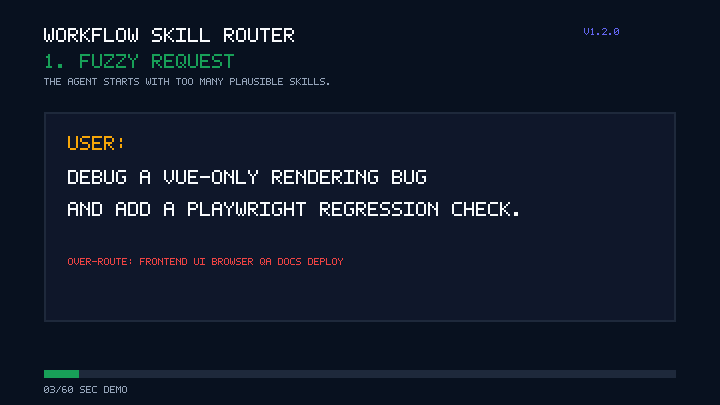

# Workflow Skill Router

[](https://github.com/eric861129/Workflow-skill-router/actions/workflows/validate.yml)
[](https://github.com/eric861129/Workflow-skill-router/releases)
[](https://github.com/eric861129/Workflow-skill-router/releases)
[](https://github.com/eric861129/Workflow-skill-router/stargazers)
[](https://huangchiyu.com/Workflow-skill-router/)
[](LICENSE)
[](README.zh-TW.md)

> A Codex-ready routing layer that helps AI agents choose one primary skill plus focused supporting skills before complex work starts.

**Not another prompt collection. A routing layer for multi-skill AI agents.**

Modern AI coding agents can have dozens of skills, tools, connectors, and workflows. Workflow Skill Router turns that flat list into a small, reviewable decision before execution begins.

## Before And After

Without routing, a frontend bug can trigger every related skill:

```text
frontend, ui, browser, playwright, qa, design-system, github, docs, deployment
```

With routing, the agent selects a small working set:

```text
Route: Frontend / Debugging > Browser reproduction > Single-page app
Use SKILL: vue-expert, systematic-debugging, playwright
Reason: vue-expert handles component behavior; systematic-debugging keeps the investigation causal; playwright captures the regression.
```

Lightweight demo preview:



High-resolution demo: [polished 1280x720 Workflow Skill Router GIF](docs/assets/workflow_skill_rout-GIF.gif)
Short routing output demo: [fuzzy request to route output GIF](docs/assets/fuzzy-to-route-output.gif)
Static preview: [before/after routing SVG](docs/assets/demo-routing-before-after.svg)

## 30 Second Quickstart

Website: `https://huangchiyu.com/Workflow-skill-router/`
Traditional Chinese site: `https://huangchiyu.com/Workflow-skill-router/zh-tw/`

Which package should I download?

| Package | Use it when | Download |
| --- | --- | --- |
| Blank Router | You want to build your own router from your own skills, triggers, exclusions, and routing rules. | [workflow-skill-router-blank.zip](https://huangchiyu.com/Workflow-skill-router/go/readme/blank-router/) |
| Reference Template | You want to study a public-safe example before adapting the blank router to your workflow. | [workflow-skill-router-template-clean.zip](https://huangchiyu.com/Workflow-skill-router/go/readme/reference-template/) |
| Full source archive | You need per-skill README files, source context, or audit material behind the reference template. | [workflow-skill-router-template.zip](https://huangchiyu.com/Workflow-skill-router/go/readme/full-source/) |

Try the framework without installing anything:

```bash
git clone https://github.com/eric861129/Workflow-skill-router.git
cd Workflow-skill-router
python scripts/validate-router.py starter/workflow-skill-router
```

Install the blank skill into Codex on Windows PowerShell:

```powershell
$Repo = "https://github.com/eric861129/Workflow-skill-router"
$Zip = Join-Path $env:TEMP "workflow-skill-router-blank.zip"
$Validator = Join-Path $env:TEMP "workflow-skill-router-validate-router.py"
$Skills = Join-Path $env:USERPROFILE ".codex\skills"
Invoke-WebRequest "$Repo/raw/main/downloads/workflow-skill-router-blank.zip" -OutFile $Zip
Invoke-WebRequest "$Repo/raw/main/scripts/validate-router.py" -OutFile $Validator
New-Item -ItemType Directory -Force -Path $Skills | Out-Null
Expand-Archive -Force -Path $Zip -DestinationPath $Skills
python $Validator (Join-Path $Skills "workflow-skill-router")
```

For macOS and Linux install commands, see the [Quickstart guide](https://huangchiyu.com/Workflow-skill-router/guides/quickstart/).

For a complete blank-router setup, see the [Blank Router walkthrough](https://huangchiyu.com/Workflow-skill-router/guides/blank-router-walkthrough/). If installation or validation fails, open [Troubleshooting](https://huangchiyu.com/Workflow-skill-router/guides/troubleshooting/).

Expected result:

```text
OK: workflow-skill-router passed validation
```

## Proof

- `80` benchmark scenarios in `evaluation/scenarios.example.jsonl`.
- Public routing metrics trend from `v1.2.0` to `v1.3.0`.
- Public-safe Routing Gallery generated from root-level route cases.
- Unit tests for scanner, evaluator, route cases, and metrics behavior.
- Public-readiness audit for community files, downloads, manifests, examples, site entrypoints, and mojibake checks.
- Lighthouse gate across English and Traditional Chinese pages; latest local pass had 100 accessibility, best-practices, and SEO scores.
- Strict CI checks scanner privacy, duplicate skill ids, route violations, and exact routing expectations.

## Download Skill Packages

- [Blank Router package](https://huangchiyu.com/Workflow-skill-router/go/readme/blank-router/): the main download for people who want to build their own router from their own skills, naming conventions, triggers, exclusions, and routing rules.
- [Reference Template package](https://huangchiyu.com/Workflow-skill-router/go/readme/reference-template/): a public-safe example for learning the structure before adapting the blank router to your own workflow.
- [Full source archive](https://huangchiyu.com/Workflow-skill-router/go/readme/full-source/): the larger source archive with per-skill README files, useful only when you need source context or audit material.
- [Template Skill Catalog](examples/template-skill-catalog): the matching route catalog for the Reference Template.
- [Template manifest](downloads/workflow-skill-router-template-manifest.md): included skill folders, excluded private skill count, and sanitization summary.

Direct repository paths for audit and offline use: [Blank Router](downloads/workflow-skill-router-blank.zip), [Reference Template](downloads/workflow-skill-router-template-clean.zip), [Full source archive](downloads/workflow-skill-router-template.zip).

## Project Roadmap And Community

Follow releases or watch the repo to track work on:

- keeping multi-skill agents out of context overload,
- benchmarking routing decisions with repeatable scenarios,
- publishing public-safe skill catalogs without leaking private rules,
- building public-safe reference packages from local skill folders.

## What This Project Helps You Do

- Inventory your available skills into a machine-readable catalog.
- Organize skills by workflow stage, technical domain, triggers, and exclusions.
- Route tasks to one primary skill and a small number of supporting skills.
- Validate that routes are explainable, bounded, and public-safe.
- Evaluate routing quality with repeatable scenarios and predictions.

## Framework Quickstart

```bash
git clone https://github.com/eric861129/Workflow-skill-router.git
cd Workflow-skill-router

python scripts/validate-router.py starter/workflow-skill-router

python scripts/scan-skills.py ./sample-skills \
  --out references/skill-index.example.json \
  --markdown references/skill-index.example.md \
  --warnings references/skill-scan-warnings.example.md \
  --suggest-tree references/suggested-skill-tree.example.md

python scripts/evaluate-routing.py \
  --scenarios evaluation/scenarios.example.jsonl \
  --predictions evaluation/predictions.example.jsonl \
  --report evaluation/report.example.md
```

## Recommended Workflow

1. Copy the starter.
2. Inventory available skills.
3. Define the skill tree.
4. Define routing rules.
5. Add routing scenarios.
6. Generate predictions.
7. Evaluate routing quality.
8. Run validation before publishing.

## Quality Gates

- Max 4 skills per route unless the work is explicitly staged.
- Primary skill must be clear.
- Supporting skills should be minimal and distinct.
- Route explanation should be present.
- Forbidden skills should not be selected.
- Private markers should not appear in public packages or examples.
- Scenario coverage should grow as routing mistakes are discovered.

## Example Report Preview

```text
# Routing Evaluation Report

| Metric | Value |
| --- | ---: |
| Scenario Count | 80 |
| Primary Accuracy | 1.0 |
| Forbidden Skill Violation Rate | 0.0 |
| Max Skill Count Violation Rate | 0.0 |
| Over-routing Rate | 0.0 |
```

Before publishing your own router package or public examples, run the full repository audit:

```bash
python scripts/audit-public-readiness.py .
```

Expected result:

```text
OK: public-readiness audit passed
```

Run the site quality gate before a public launch:

```bash
cd site
npm run audit:lighthouse
```

This builds the Starlight site, runs Lighthouse against key English and Traditional Chinese pages, and writes local reports to `site/lighthouse-reports/`.

Regenerate all three archives locally:

```bash
python scripts/package-downloads.py --skills-root <path-to-local-codex-skills> --exclude-prefix <private-prefix> --exclude-name <private-skill-name> --private-marker <private-text-marker>
```

The package builder refuses to use an implicit local skills directory. It also requires at least one private filter unless you explicitly pass `--allow-no-private-filters` after auditing your source directory.

The Reference Template is generated from a real local `.codex/skills` folder. It excludes organization-specific skills and omits sensitive lines from otherwise public skills. Use it to study the pattern, then adapt Blank Router to your own skill set.

## Practical Routing Examples

### API contract sync

```text
User: Add a new customer settings endpoint, update OpenAPI, and make the frontend client follow it.

Route: API / Contract lifecycle > Backend-to-frontend sync
Use SKILL: api-designer, openapi-contract-generation-skill, openapi-to-typescript, qa-test-planner
Reason: api-designer stabilizes the endpoint; openapi-contract-generation-skill manages schema diff and contract generation; openapi-to-typescript updates the client types; qa-test-planner defines contract coverage.
```

### Database migration with performance risk

```text
User: Add audit tables for account changes and make sure the admin query does not become slow.

Route: Database / Schema and performance > Migration plus query review
Use SKILL: database-schema-designer, sql-pro, database-optimizer, qa-test-planner
Reason: database-schema-designer owns migration shape; sql-pro reviews SQL correctness; database-optimizer checks query plans; qa-test-planner defines regression coverage.
```

### Browser-only frontend bug

```text
User: A customer portal form only fails after a browser refresh. Reproduce it and add a regression check.

Route: Frontend / Vue / UI > Browser regression
Use SKILL: vue-expert, systematic-debugging, playwright
Reason: vue-expert handles component behavior; systematic-debugging keeps the investigation causal; playwright captures the regression.
```

### PR review and CI repair

```text
User: Review this auth PR, address comments, and fix the failing checks.

Route: Review / CI readiness > Security-sensitive change
Use SKILL: receiving-code-review, systematic-debugging, qa-test-planner, commit-work
Reason: receiving-code-review handles review feedback; systematic-debugging isolates failing checks; qa-test-planner defines verification; commit-work keeps the final change clean.
```

### Local development stack

```text
User: Create a Docker Compose setup with PostgreSQL, Redis, and MailDev for local development.

Route: DevOps / Local development > Repeatable service stack
Use SKILL: docker-compose-local-dev-skill, devops-engineer, systematic-debugging
Reason: docker-compose-local-dev-skill owns local service ergonomics; devops-engineer checks infra tradeoffs; systematic-debugging helps when startup order or health checks fail.
```

## What Is Included

- `starter/workflow-skill-router/`: a Codex-ready starter skill with an agent-agnostic routing contract.
- `examples/template-skill-catalog/`: the single public example catalog that mirrors the template download package.
- `sample-skills/`: copyable public `SKILL.md` examples that pair with the template catalog.
- `downloads/`: generated blank and template SKILL zip packages.
- `recipes/`: short practical patterns for API contract sync, frontend debugging, PR/CI work, documentation, and connector-heavy workflows.
- `scripts/validate-router.py`: dependency-free validation for router structure plus a public-readiness audit for community files, downloads, template catalog/manifest parity, site assets, and stale examples.
- `scripts/audit-public-readiness.py`: dedicated release gate for the public repo surface, powered by the same checks as `validate-router.py --public-readiness`.
- `scripts/scan-skills.py`: dependency-free skill inventory scanner that writes JSON, Markdown, warnings, and a suggested tree.
- `scripts/evaluate-routing.py`: dependency-free routing benchmark evaluator for scenarios and predictions.
- `scripts/validate-route-cases.py`: public route case schema and public-safety validator.
- `scripts/build-route-gallery.py`: generator for site gallery data and route-case evaluator scenarios.
- `scripts/render-routing-metrics-trend.py`: generator for release-level metrics trend docs and site data.
- `route-cases/`: canonical public-safe route cases accepted from maintainers and contributors.
- `evaluation/`: benchmark scenarios, predictions, schema docs, generated route-case scenarios, metrics history, and generated report.
- `references/`: generated example scanner outputs.
- `tests/`: standard-library unit tests for scanner, evaluator, route case, and metrics behavior.
- `scripts/package-downloads.py`: dependency-free packaging for downloadable SKILL archives.
- `site/`: Astro Starlight website for GitHub Pages, including Playwright smoke and visual tests.
- `site/scripts/lighthouse-audit.mjs`: formal Lighthouse and accessibility score gate for the public website.
- `prompts/`: copy-paste prompts for creating or updating a personalized router.
- `docs/`: conceptual docs, customization guidance, and validation checklists.

## Example Routers

| Example | Best for |
| --- | --- |
| `examples/template-skill-catalog` | The Reference Template, organized into practical public-safe route categories |

## FAQ

### Is this different from a system prompt?

Yes. A system prompt defines how an agent should behave. Workflow Skill Router decides which skill instructions should be loaded for a specific task. It sits before execution: classify the task, choose 1 primary skill and up to 3 supporting skills, then explain the route.

### Why limit each route to 1-4 skills?

The limit keeps context focused. One primary skill owns the work; supporting skills add domain knowledge, verification, or tooling. If a task truly needs more than 4 skills, split it into stages and route each stage separately.

### Can this work with Claude, Cursor, Gemini, or other agents?

Yes. The pattern is agent-agnostic. The starter is Codex-ready, but the contract is plain text: skill inventory, routing rules, sample routes, and validator. Any agent that can read project instructions or custom rules can adapt it. See the [Claude, Cursor, and Gemini adapter notes](https://huangchiyu.com/Workflow-skill-router/guides/adapters/).

### The install command failed. Where should I look?

Open the [Troubleshooting guide](https://huangchiyu.com/Workflow-skill-router/guides/troubleshooting/). It covers install paths, PowerShell, Python, zip extraction, validator errors, and public-readiness checks.

## Learn More

- [Main README](README.md)
- [Traditional Chinese guide](README.zh-TW.md)
- [Website](https://huangchiyu.com/Workflow-skill-router/)
- [Traditional Chinese site](https://huangchiyu.com/Workflow-skill-router/zh-tw/)
- [Blank Router walkthrough](https://huangchiyu.com/Workflow-skill-router/guides/blank-router-walkthrough/)
- [Troubleshooting](https://huangchiyu.com/Workflow-skill-router/guides/troubleshooting/)
- [Claude, Cursor, and Gemini adapter notes](https://huangchiyu.com/Workflow-skill-router/guides/adapters/)
- [Customization guide](docs/adoption-guide.md)
- [System theory](docs/system-theory.en.md)
- [Validation checklist](docs/validation-checklist.en.md)
- [Roadmap](docs/roadmap.md)
- [Case studies](docs/case-studies.md)
- [Showcase](docs/showcase.md)
- [Anti-over-routing guide](docs/anti-over-routing.md)
- [Forward tests](evaluation/forward-tests/)
- [Shareable demo asset](docs/assets/route-demo-social.svg)

## License

MIT. See [LICENSE](LICENSE).
