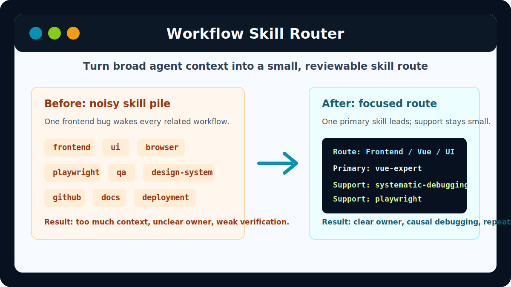

# Workflow Skill Router

[](LICENSE)
[](scripts/validate-router.py)
[](README.zh-TW.md)

> A practical routing pattern that helps AI agents choose the smallest useful skill set before complex work starts.

Modern AI coding agents can have dozens of skills, tools, connectors, and workflows. The hard part is no longer "can the agent do this?" The hard part is:

```text
Which skills should be active for this task?
Which skills are merely related but should stay inactive?
Should planning, implementation, debugging, and verification use the same skills?
```

Workflow Skill Router turns a flat skill list into a decision layer:

```text
Task nature
  -> Work stage
    -> Technical domain
      -> 1 primary skill + up to 3 supporting skills
```

It is not a super skill. It is a small front door that tells an agent what to load next.



## Before And After

Without routing, a frontend bug can trigger every related skill:

```text
frontend, ui, browser, playwright, qa, design-system, github, docs, deployment
```

With routing, the agent selects a small working set:

```text
Route: Frontend / Debugging > Browser reproduction > Single-page app
Use SKILL: vue-expert, systematic-debugging, playwright
Reason: vue-expert handles component behavior; systematic-debugging keeps the investigation causal; playwright captures the regression.
```

## 30 Second Quickstart

Website: `https://huangchiyu.com/Workflow-skill-router/`
Traditional Chinese site: `https://huangchiyu.com/Workflow-skill-router/zh-tw/`

1. Copy the starter into your agent's skill directory:

   ```text
   starter/workflow-skill-router/
   ```

2. Ask your agent to inventory its available skills and fill:

   ```text
   workflow-skill-router/
     SKILL.md
     references/
       skill-tree.md
       routing-rules.md
   ```

3. Validate the router:

   ```bash
   python scripts/validate-router.py starter/workflow-skill-router
   ```

Expected result:

```text
OK: workflow-skill-router passed validation
```

Before publishing your own router package or public examples, run the full repository audit:

```bash
python scripts/validate-router.py --public-readiness .
```

Expected result:

```text
OK: public-readiness audit passed
```

## Download Skill Packages

- [Blank SKILL package](downloads/workflow-skill-router-blank.zip): a ready-to-install `workflow-skill-router/` starter for people who want to fill their own skill tree.
- [Template SKILL package](downloads/workflow-skill-router-template.zip): a public-safe export of the maintainer's real local Codex skills catalog, including the sanitized `workflow-skill-router` and all public skills used in practice.
- [Template Skill Catalog](examples/template-skill-catalog): the matching route catalog for the template package.
- [Template manifest](downloads/workflow-skill-router-template-manifest.md): included skill folders, excluded private skill count, and sanitization summary.

Regenerate both archives locally:

```bash
python scripts/package-downloads.py --skills-root <path-to-local-codex-skills> --exclude-prefix <private-prefix> --exclude-name <private-skill-name> --private-marker <private-text-marker>
```

The package builder refuses to use an implicit local skills directory. It also requires at least one private filter unless you explicitly pass `--allow-no-private-filters` after auditing your source directory.

The template package is generated from a real local `.codex/skills` folder. It excludes organization-specific skills and omits sensitive lines from otherwise public skills.

## Practical Routing Examples

### API contract sync

```text
User: Add a new customer settings endpoint, update OpenAPI, and make the frontend client follow it.

Route: API / Contract lifecycle > Backend-to-frontend sync
Use SKILL: api-designer, openapi-contract-generation-skill, openapi-to-typescript, qa-test-planner
Reason: api-designer stabilizes the endpoint; openapi-contract-generation-skill manages schema diff and contract generation; openapi-to-typescript updates the client types; qa-test-planner defines contract coverage.
```

### Database migration with performance risk

```text
User: Add audit tables for account changes and make sure the admin query does not become slow.

Route: Database / Schema and performance > Migration plus query review
Use SKILL: database-schema-designer, sql-pro, database-optimizer, qa-test-planner
Reason: database-schema-designer owns migration shape; sql-pro reviews SQL correctness; database-optimizer checks query plans; qa-test-planner defines regression coverage.
```

### Browser-only frontend bug

```text
User: A customer portal form only fails after a browser refresh. Reproduce it and add a regression check.

Route: Frontend / Vue / UI > Browser regression
Use SKILL: vue-expert, systematic-debugging, playwright
Reason: vue-expert handles component behavior; systematic-debugging keeps the investigation causal; playwright captures the regression.
```

### PR review and CI repair

```text
User: Review this auth PR, address comments, and fix the failing checks.

Route: Review / CI readiness > Security-sensitive change
Use SKILL: receiving-code-review, systematic-debugging, qa-test-planner, commit-work
Reason: receiving-code-review handles review feedback; systematic-debugging isolates failing checks; qa-test-planner defines verification; commit-work keeps the final change clean.
```

### Local development stack

```text
User: Create a Docker Compose setup with PostgreSQL, Redis, and MailDev for local development.

Route: DevOps / Local development > Repeatable service stack
Use SKILL: docker-compose-local-dev-skill, devops-engineer, systematic-debugging
Reason: docker-compose-local-dev-skill owns local service ergonomics; devops-engineer checks infra tradeoffs; systematic-debugging helps when startup order or health checks fail.
```

## What Is Included

- `starter/workflow-skill-router/`: a Codex-ready starter skill with an agent-agnostic routing contract.
- `examples/template-skill-catalog/`: the single public example catalog that mirrors the template download package.
- `sample-skills/`: copyable public `SKILL.md` examples that pair with the template catalog.
- `downloads/`: generated blank and template SKILL zip packages.
- `recipes/`: short practical patterns for API contract sync, frontend debugging, PR/CI work, documentation, and connector-heavy workflows.
- `scripts/validate-router.py`: dependency-free validation for router structure plus a public-readiness audit for community files, downloads, site assets, stale examples, and privacy leaks.
- `scripts/package-downloads.py`: dependency-free packaging for downloadable SKILL archives.
- `site/`: Astro Starlight website for GitHub Pages.
- `prompts/`: copy-paste prompts for creating or updating a personalized router.
- `docs/`: conceptual docs, customization guidance, and validation checklists.

## Example Routers

| Example | Best for |
| --- | --- |
| `examples/template-skill-catalog` | The downloadable template package, organized into practical public-safe route categories |

## Learn More

- [Main README](README.md)
- [Traditional Chinese guide](README.zh-TW.md)
- [Website](https://huangchiyu.com/Workflow-skill-router/)
- [Traditional Chinese site](https://huangchiyu.com/Workflow-skill-router/zh-tw/)
- [Customization guide](docs/adoption-guide.md)
- [System theory](docs/system-theory.en.md)
- [Validation checklist](docs/validation-checklist.en.md)

## License

MIT. See [LICENSE](LICENSE).
