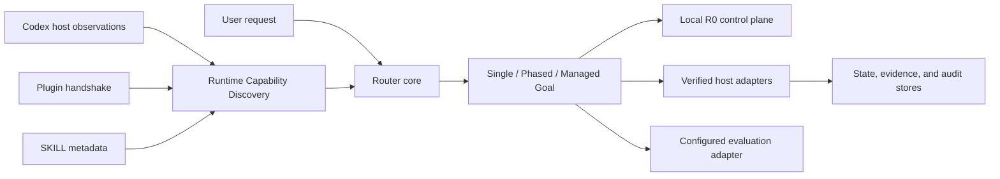

# Workflow Skill Router V2

[繁體中文](README.zh-TW.md) · [Documentation](https://huangchiyu.com/Workflow-skill-router/) · [Routing Flight Recorder](https://huangchiyu.com/Workflow-skill-router/#routing-flight-recorder)

Workflow Skill Router is a runtime-aware planning and routing layer for Codex. It keeps the agent focused on the smallest verifiable execution path, preserves user authority, and exposes what the runtime can actually do.

> Current prerelease: `2.0.0-beta.2`. V2 is the public product direction; immutable V1.3.1 recovery remains available during migration.

## 60-second outcome

Give the Router a request. It returns an execution envelope, a capability plan, the consent boundary, and the evidence needed to continue safely. The public Flight Recorder shows the exact sanitized MCP request and response instead of recreating the decision in the browser.

```text
Request
  -> classify work shape
  -> discover usable runtime capabilities
  -> lock explicit user choices
  -> plan the smallest route
  -> execute, verify, and disclose actual SKILL usage
```

## Plugin + MCP versus Skill-only

| Capability | Plugin + MCP | Skill-only |
| --- | --- | --- |
| Routing instructions | Included | Included |
| Personal Routing Profile | Deterministic load, validation, precedence, and preview | Advisory interpretation of the same fixed JSON contract |
| Local durable R0 planning and scoped consent | `plan_work`, `propose_support_consent`, `transition_support_consent`, `get_router_status` | Not observable |
| Verified-host scheduling and route validation | Available after host integration | Unavailable |
| Cross-process state and compare-and-swap | Host/runtime dependent | Unavailable |
| Sealed model evaluation | Configured adapter required | Manual workflow only |
| Honest runtime label | `bundled-local-r0` or verified profile | `skill-only-fallback` |

Choose the Plugin when Codex supports Plugin/MCP loading. Choose the standalone SKILL when you need instruction-only routing or must run in a host without Plugin support. The `hybrid-full` conformance label is unavailable to the standalone package.

## Five-minute Plugin + MCP quickstart

For a normal installation, pin the immutable `v2.0.0-beta.2` marketplace snapshot:

```powershell
codex plugin marketplace add eric861129/Workflow-skill-router --ref v2.0.0-beta.2
codex plugin add workflow-skill-router@workflow-skill-router
codex plugin list
```

Open a new Codex task and ask it to show the Workflow Skill Router status. Expect the `bundled-local-r0` runtime label, twelve MCP tools, and four local-ready tools.

For contributors who are changing or testing the Router:

```powershell
git clone https://github.com/eric861129/Workflow-skill-router.git
Set-Location Workflow-skill-router
codex plugin marketplace add .
codex plugin add workflow-skill-router@workflow-skill-router
codex plugin list
python plugins/workflow-skill-router/runtime/workflow_skill_router.pyz doctor
```

The released Plugin already contains the MCP bundle and Python runtime. Node.js 24+ and Python 3.11+ are required; npm is needed only when rebuilding from source. See [Plugin installation](site/src/content/docs/guides/install-plugin.md).

## Five-minute Skill-only quickstart

For a normal installation, download [`workflow-skill-router-skill-v2.0.0-beta.2.zip`](https://github.com/eric861129/Workflow-skill-router/releases/download/v2.0.0-beta.2/workflow-skill-router-skill-v2.0.0-beta.2.zip) and extract its inner `workflow-skill-router/` folder into the Codex Skills directory.

For contributors working from a checkout on Windows:

```powershell
$Target = Join-Path $env:USERPROFILE ".codex\skills\workflow-skill-router"
Copy-Item -Recurse -Force "starter\v2\workflow-skill-router" $Target
Get-Content -Encoding UTF8 (Join-Path $Target "SKILL.md") | Select-Object -First 8
```

This package preserves routing instructions and explicit-choice policy, but it cannot prove durable resume, full drift detection, or sealed activation. See [Skill-only installation](site/src/content/docs/guides/install-skill.md).

## Architecture: Runtime Capability Discovery first

Runtime Capability Discovery separates five facts that agents often collapse: installed metadata, host exposure, authentication, policy eligibility, and freshness. A capability becomes routable only when its risk-specific requirements pass.



Maintainers can start with [the V2 architecture overview](docs/architecture/v2-overview.md).

## Single, Phased, and Managed Goal

- **Single** handles one bounded intent with one minimal primary capability.
- **Phased** preserves distinct stages and reroutes each phase from current evidence.
- **Managed Goal** maintains a resumable work graph, respects dependencies, and treats the Codex Goal as host-owned state.

The Router does not force every task into Goal orchestration. Work shape comes from the request, dependencies, risk, and current Goal relation.

## Explicit Skill Lock

When the user names a SKILL, that choice becomes authoritative. The Router may recommend support, but it must explain the purpose, scope, refusal consequence, and context cost before activation. Rejected support stays out of active selections.

In Plugin mode, the proposal is persisted before the question is shown. A follow-up model turn classifies only `approved`, `rejected`, or `unclear`; the deterministic MCP transition preserves the bound route and fails closed if Phase, scope, revision, or material context changed. Skill-only mode keeps the same interaction policy as advisory instructions, but cannot claim durable enforcement.

When the user names no SKILL, the Router chooses the smallest sufficient route without repeatedly asking for consent to its own recommendations. Before execution it declares planned SKILL usage; after execution it reports actual usage and any change.

## Personal Routing Profiles

V2 keeps the most valuable part of V1: you can own the Skill Tree. A Personal Routing Profile maps objective keywords, domains, tags, and work modes to a phased route with one Primary, up to three current-phase support SKILLs, and an exit gate per Phase.

> Personal Routing Profiles ship in `v2.0.0-beta.2`. The 36-attempt beta.1 Model Evaluation is historical runtime evidence and does not cover this Profile feature.

Precedence is deterministic: host hard constraints, the user's explicit SKILL for the current request, workspace profile, personal profile, then built-in routing. A workspace profile lives at `.codex/workflow-skill-router.json`; personal profiles live under the external Router data directory. MCP workspace reads are accepted only under a Client-advertised root or `WORKFLOW_SKILL_ROUTER_WORKSPACE_ROOTS`; a model-supplied arbitrary path fails closed. A matched workspace tree replaces the personal tree as one complete route—no implicit deep merge.

```powershell
Copy-Item starter/v2/workflow-skill-router/assets/personal-routing-profile.example.json ./my-profile.json
python plugins/workflow-skill-router/runtime/workflow_skill_router.pyz profile validate .\my-profile.json
python plugins/workflow-skill-router/runtime/workflow_skill_router.pyz profile install .\my-profile.json
python plugins/workflow-skill-router/runtime/workflow_skill_router.pyz profile list
python plugins/workflow-skill-router/runtime/workflow_skill_router.pyz profile preview --objective "Deliver the API" --work-mode phased --domain api
```

Plugin + MCP mode loads and validates profiles deterministically. Skill-only reads the same contract as `skill-only-fallback` only when the Host grants filesystem access to the fixed Profile locations; otherwise the user must provide the Profile content in the conversation. It cannot claim durable loading or enforcement. In both modes, a profile result is `intended-unverified`: Runtime Capability Discovery still decides whether each SKILL is installed, exposed, compatible, authorized, and eligible. A profile never installs a SKILL or grants permission. See [Personal Routing Profiles](site/src/content/docs/concepts/personal-routing-profiles.md).

## MCP tool surface

The Plugin exposes twelve typed tools:

```text
sync_runtime_context       plan_work                  propose_support_consent
transition_support_consent get_next_work              validate_route
record_work_event          evaluate_gate              get_router_status
run_model_evaluation       compare_evaluations        export_router_artifact
```

Tool schemas, risk, required capabilities, and fallback actions are generated from the same contracts used by the server. See the [generated MCP reference](site/src/content/docs/reference/mcp-tools.mdx).

## Runtime readiness matrix

| Availability in bundled local R0 | Tools | Meaning |
| --- | --- | --- |
| `local-ready` | `plan_work`, `propose_support_consent`, `transition_support_consent`, `get_router_status` | Durable local R0 planning, scoped consent, and status |
| `verified-host-required` | `sync_runtime_context`, `get_next_work`, `validate_route`, `record_work_event`, `evaluate_gate` | Needs verified host authority and stores |
| `configured-adapter-required` | `run_model_evaluation`, `compare_evaluations`, `export_router_artifact` | Needs an authorized evaluation adapter and evidence |

Unavailable calls return a typed `capability-unavailable` response with required capabilities and a fallback action. The Router never fabricates a successful scheduler or evaluation result.

## Real Model Evaluation

**Tier 0 Contract** fixtures prove deterministic compatibility; they are not model behavior. Behavior evidence requires fresh isolated attempts, a sealed case package, paired baseline/candidate manifests, bounded output, zero hard violations, and trusted review before publication. The baseline arm is explicitly `model-only`; the candidate is `hybrid-router`. For consent follow-ups, the fresh model classifies intent and the persisted MCP state machine materializes the final route.

Evaluation contract `2.2.0` separates the current-Phase oracle from a stateful Phase-transition case, binds scoped consent support to the current Phase's concrete exit evidence, and scores every declared turn. Its six-case beta profile remains 36 attempts and 42 model turns; the thirteen-case full gate is 78 attempts and 96 model turns at three repeats per arm. Any `2.1.0` report remains diagnostic, and runs bound to earlier case or instruction digests are never rescored against the new oracle. Before a fresh authorized `2.2.0` run, public evidence remains `manual-required`; after execution it remains `review-required` until trusted attestation.

## Security boundary and local state

Plugin installation, SKILL consent, runtime permission, and production authorization are separate decisions. The model cannot supply executable paths for evaluation, mint host authority, upgrade a fixture into runtime evidence, or mutate the native Codex Goal.

The Plugin stores state outside its cache:

| Platform | Default path |
| --- | --- |
| Windows | `%LOCALAPPDATA%\Codex\workflow-skill-router` |
| macOS | `~/Library/Application Support/Codex/workflow-skill-router` |
| Linux | `${XDG_STATE_HOME:-~/.local/state}/codex/workflow-skill-router` |

Set `WORKFLOW_SKILL_ROUTER_DATA_DIR` to choose another external directory. No telemetry is enabled by default. Read the [security boundary](site/src/content/docs/reference/security-boundaries.md) before integrating host-side R2/R3 actions.

## Contributing

Start with [CONTRIBUTING.md](CONTRIBUTING.md), then run the focused checks for the surface you changed. Release artifacts come from allowlists and deterministic builders; generated outputs are never edited by hand.

```powershell
$env:PYTHONPATH = (Resolve-Path "packages/router-core/src").Path
python -m unittest discover -s packages/router-core/tests -v
python -m unittest discover -s tests -v
python scripts/build-v2-demo-data.py --check
$Version = (Get-Content -Raw -Encoding UTF8 release/version.json | ConvertFrom-Json).v2_version
$Output = Join-Path "dist" "release-$Version"
python scripts/build-release-artifacts.py --output-dir $Output --provenance-mode test --check-determinism
```

The release builder allows repeatable overwrites only for the current manifest. It fails closed if the output directory contains a stale, unexpected, symlinked, or otherwise unmanifested path; use a version-specific directory instead of mixing release generations.

## Version channels

| Channel | Current role | Promotion rule |
| --- | --- | --- |
| `latest` | V1.3.1 compatibility until V2 GA | Moves only after the GA release gate |
| `latest-v1` | Immutable V1 recovery | Remains pinned to V1.3.1 |
| `latest-v2` | V2 alpha/beta prerelease | Tracks reviewed V2 prereleases |

The repository is V2-first even while the compatibility channel remains pinned. Version metadata lives in [`release/version.json`](release/version.json).

## V1 migration

Use the [V1 to V2 migration guide](site/src/content/docs/guides/migrate-v1-to-v2.md) to move from template-based routing to the runtime-aware Plugin or standalone SKILL. V1 source and packages remain recoverable from the immutable [`v1.3.1` tag](https://github.com/eric861129/Workflow-skill-router/tree/v1.3.1) and GitHub Release; they are not primary V2 navigation.

MIT licensed.
