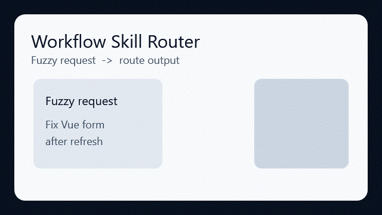

# Workflow Skill Router

[](https://github.com/eric861129/Workflow-skill-router/actions/workflows/validate.yml)
[](https://github.com/eric861129/Workflow-skill-router/releases)
[](https://github.com/eric861129/Workflow-skill-router/releases)
[](https://github.com/eric861129/Workflow-skill-router/stargazers)
[](https://huangchiyu.com/Workflow-skill-router/)
[](LICENSE)
[](README.en.md)

> 一個 Codex-ready 的 routing layer，幫助 AI Agent 在複雜工作開始前，先選出 1 個 Primary SKILL 與聚焦的 Supporting SKILL。

**Not another prompt collection. A routing layer for multi-skill AI agents.**

這不是把 prompt 堆在一起的資料夾，而是讓 Agent 在工作前先做出一個可檢查、可修正的技能選擇。

## 前後對比

沒有 routing 時，一個前端 bug 很容易觸發所有看起來相關的 skills：

```text
frontend, ui, browser, playwright, qa, design-system, github, docs, deployment
```

有 routing 後，Agent 會先選出小而聚焦的工作組合：

```text
Route: Frontend / Debugging > Browser reproduction > Single-page app
Use SKILL: vue-expert, systematic-debugging, playwright
Reason: vue-expert 處理 component 行為；systematic-debugging 維持因果式排查；playwright 固化回歸驗證。
```



靜態預覽：[before/after routing SVG](docs/assets/demo-routing-before-after.svg)

## 30 秒快速開始

英文站台：`https://huangchiyu.com/Workflow-skill-router/`
繁中站台：`https://huangchiyu.com/Workflow-skill-router/zh-tw/`

只想試用，不安裝任何 SKILL：

```bash
git clone https://github.com/eric861129/Workflow-skill-router.git
cd Workflow-skill-router
python scripts/validate-router.py starter/workflow-skill-router
```

在 Windows PowerShell 將空白 SKILL 安裝到 Codex：

```powershell
$Repo = "https://github.com/eric861129/Workflow-skill-router"
$Zip = Join-Path $env:TEMP "workflow-skill-router-blank.zip"
$Validator = Join-Path $env:TEMP "workflow-skill-router-validate-router.py"
$Skills = Join-Path $env:USERPROFILE ".codex\skills"
Invoke-WebRequest "$Repo/raw/main/downloads/workflow-skill-router-blank.zip" -OutFile $Zip
Invoke-WebRequest "$Repo/raw/main/scripts/validate-router.py" -OutFile $Validator
New-Item -ItemType Directory -Force -Path $Skills | Out-Null
Expand-Archive -Force -Path $Zip -DestinationPath $Skills
python $Validator (Join-Path $Skills "workflow-skill-router")
```

macOS 與 Linux 安裝指令請看 [Quickstart guide](https://huangchiyu.com/Workflow-skill-router/zh-tw/guides/quickstart/)。

預期結果：

```text
OK: workflow-skill-router passed validation
```

## Proof

- `30` 個 routing benchmark scenarios。
- `19` 個 scanner / evaluator unit tests。
- Public-readiness audit 會檢查 community files、downloads、manifest、examples、site entrypoints 與 mojibake。
- Lighthouse gate 覆蓋英文與繁中主要頁面；最近本機驗證 accessibility、best-practices、SEO 都是 100。
- Strict CI 檢查 private warnings、duplicate skill ids、route violations 與 strict routing expectations。

## 下載 SKILL 套件

- [空白 SKILL 套件](downloads/workflow-skill-router-blank.zip)：只包含 `workflow-skill-router/` starter，適合從自己的 skill tree 開始。
- [完整範本 SKILL 套件](downloads/workflow-skill-router-template.zip)：公開安全版的完整 reference export。
- [Clean 範本 SKILL 套件](downloads/workflow-skill-router-template-clean.zip)：偏安裝用途，移除非必要 per-skill README。
- [Template Skill Catalog](examples/template-skill-catalog)：對應範本包的 routing catalog。
- [Template manifest](downloads/workflow-skill-router-template-manifest.md)：列出包含的 skill folders、排除的 private skill 數量與 sanitization summary。

## 專案 Roadmap 與社群方向

你可以透過 release 或 watch 追蹤以下方向：

- 讓多技能 Agent 避免 context overload。
- 用 benchmark scenarios 評估 routing 決策。
- 分享 public-safe skill catalog，同時保留私有規則在本機。
- 把本機 skill folders 打包成可安裝的 template package。

## 這個專案可以幫你做什麼

- 將可用 skills 盤點成 machine-readable catalog。
- 依工作階段、技術領域、triggers、exclusions 整理 skills。
- 將任務 routing 到 1 個 Primary skill 與少量 Supporting skills。
- 驗證 routes 是否可解釋、有數量邊界，且適合公開。
- 用 scenarios 與 predictions 量化 routing quality。

## Framework 快速開始

```bash
git clone https://github.com/eric861129/Workflow-skill-router.git
cd Workflow-skill-router

python scripts/validate-router.py starter/workflow-skill-router

python scripts/scan-skills.py ./sample-skills \
  --out references/skill-index.example.json \
  --markdown references/skill-index.example.md \
  --warnings references/skill-scan-warnings.example.md \
  --suggest-tree references/suggested-skill-tree.example.md

python scripts/evaluate-routing.py \
  --scenarios evaluation/scenarios.example.jsonl \
  --predictions evaluation/predictions.example.jsonl \
  --report evaluation/report.example.md
```

## 建議工作流

1. 複製 starter。
2. 盤點可用 skills。
3. 定義 skill tree。
4. 定義 routing rules。
5. 新增 routing scenarios。
6. 產生 predictions。
7. 評估 routing quality。
8. 發布前執行 validation。

## Quality gates

- 除非明確拆階段，單一路由最多 4 個 skills。
- Primary skill 必須清楚。
- Supporting skills 應保持最小且職責不同。
- Route explanation 應存在。
- Forbidden skills 不應被選到。
- Public packages 與 examples 不應包含 private markers。
- Scenario coverage 應隨 routing mistake 持續累積。

如果你準備發布自己的 router package 或公開 examples，請再跑完整 repo audit：

```bash
python scripts/audit-public-readiness.py .
```

預期結果：

```text
OK: public-readiness audit passed
```

公開站台前，請跑正式 Lighthouse / accessibility 品質 gate：

```bash
cd site
npm run audit:lighthouse
```

這會 build Starlight 站台，對英文與繁中主要頁面跑 Lighthouse，並把本機報告輸出到 `site/lighthouse-reports/`。

在本機重新產生三個 zip：

```bash
python scripts/package-downloads.py --skills-root <path-to-local-codex-skills> --exclude-prefix <private-prefix> --exclude-name <private-skill-name> --private-marker <private-text-marker>
```

Package builder 不會偷偷使用預設本機 skills 目錄。除非你明確傳入 `--allow-no-private-filters` 並已自行檢查來源目錄，否則至少需要一個 private filter。

範本套件來自真實 `.codex/skills` 目錄，但已排除組織專屬 skills，並移除 public skills 中可能含有敏感內容的行。

## 實用 Routing 範例

### API 合約同步

```text
使用者：新增 customer settings endpoint，更新 OpenAPI，並讓前端 client 跟上新合約。

Route: API / Contract lifecycle > Backend-to-frontend sync
Use SKILL: api-designer, openapi-contract-generation-skill, openapi-to-typescript, qa-test-planner
Reason: api-designer 穩定 endpoint 設計；openapi-contract-generation-skill 管理 schema diff 與 contract generation；openapi-to-typescript 更新 client types；qa-test-planner 定義合約測試覆蓋。
```

### 資料庫 Migration 與效能風險

```text
使用者：替 account changes 新增 audit tables，並確認 admin query 不會變慢。

Route: Database / Schema and performance > Migration plus query review
Use SKILL: database-schema-designer, sql-pro, database-optimizer, qa-test-planner
Reason: database-schema-designer 負責 migration shape；sql-pro 檢查 SQL 正確性；database-optimizer 檢查 query plans；qa-test-planner 定義回歸覆蓋。
```

### 只在瀏覽器出現的前端 Bug

```text
使用者：customer portal 表單只有在 browser refresh 後會失敗，請重現並補上 regression check。

Route: Frontend / Vue / UI > Browser regression
Use SKILL: vue-expert, systematic-debugging, playwright
Reason: vue-expert 處理 component 行為；systematic-debugging 維持因果式排查；playwright 固化回歸驗證。
```

### PR Review 與 CI 修復

```text
使用者：Review 這個 auth PR，處理 comments，並修好 failing checks。

Route: Review / CI readiness > Security-sensitive change
Use SKILL: receiving-code-review, systematic-debugging, qa-test-planner, commit-work
Reason: receiving-code-review 處理 review feedback；systematic-debugging 隔離 failing checks；qa-test-planner 定義驗證範圍；commit-work 保持最後提交乾淨。
```

### 本機開發環境

```text
使用者：建立 Docker Compose setup，包含 PostgreSQL、Redis 與 MailDev，讓本機開發可以重複啟動。

Route: DevOps / Local development > Repeatable service stack
Use SKILL: docker-compose-local-dev-skill, devops-engineer, systematic-debugging
Reason: docker-compose-local-dev-skill 負責本機服務體驗；devops-engineer 檢查基礎設施取捨；systematic-debugging 協助處理啟動順序與 health checks。
```

## Repo 內容

- `starter/workflow-skill-router/`：Codex-ready starter skill，保留 agent-agnostic routing contract。
- `examples/template-skill-catalog/`：單一公開範例 catalog，對齊 template download package。
- `sample-skills/`：可複製參考的 public `SKILL.md` 範例，搭配 template catalog 使用。
- `downloads/`：產生好的空白與範本 SKILL zip 套件。
- `recipes/`：API 合約同步、前端除錯、PR/CI、文件、connector-heavy workflow 等短指南。
- `scripts/validate-router.py`：無外部依賴的 validator，除了檢查 router 結構，也提供 public-readiness audit，確認 community files、downloads、template catalog/manifest parity、site assets 與舊 examples。
- `scripts/audit-public-readiness.py`：公開前專用的 release gate，使用與 `validate-router.py --public-readiness` 相同的檢查邏輯。
- `scripts/scan-skills.py`：無外部依賴的 skill inventory scanner，可輸出 JSON、Markdown、warnings 與 suggested tree。
- `scripts/evaluate-routing.py`：無外部依賴的 routing benchmark evaluator，可比對 scenarios 與 predictions。
- `evaluation/`：範例 benchmark scenarios、predictions、schema 文件與產生的 report。
- `references/`：scanner 產出的範例索引與報告。
- `tests/`：使用 Python standard library unittest 的 scanner / evaluator 測試。
- `scripts/package-downloads.py`：無外部依賴的 SKILL zip packaging 工具。
- `site/`：部署到 GitHub Pages 的 Astro Starlight 站台。
- `site/scripts/lighthouse-audit.mjs`：公開站台的 Lighthouse 與 accessibility 正式分數 gate。
- `prompts/`：建立或維護個人 router 時可直接複製的 prompts。
- `docs/`：概念文件、自訂指南與驗證 checklist。

## 範例 Routers

| Example | 適用情境 |
| --- | --- |
| `examples/template-skill-catalog` | 將可下載 template package 整理成實用且 public-safe 的 route categories |

## 常見問題

### 這和一般 system prompt 差在哪？

System prompt 定義 Agent 的整體行為；Workflow Skill Router 先判斷這個任務該載入哪些 skill instructions。它站在執行前：分類任務、選 1 個 Primary SKILL、最多 3 個 Supporting SKILL，並用一句話說明原因。

### 為什麼限制 1-4 個 skills？

限制讓 context 保持集中。一個 Primary SKILL 負責主軸；Supporting SKILL 只補足領域、驗證或工具。若任務真的需要超過 4 個 skills，應拆成多個階段，各階段分別 routing。

### 可以用在 Claude / Cursor / Gemini 嗎？

可以。這個 pattern 是 agent-agnostic。starter 對 Codex 友善，但核心契約只是文字：skill inventory、routing rules、sample routes 與 validator。只要 Agent 能讀專案規則或自訂 instructions，就能改成自己的版本。

## 延伸閱讀

- [English guide](README.en.md)
- [Website](https://huangchiyu.com/Workflow-skill-router/)
- [繁中站台](https://huangchiyu.com/Workflow-skill-router/zh-tw/)
- [自訂指南](docs/adoption-guide.zh-TW.md)
- [系統理論](docs/system-theory.zh-TW.md)
- [驗證 checklist](docs/validation-checklist.zh-TW.md)
- [Roadmap](docs/roadmap.md)
- [Case studies](docs/case-studies.md)
- [Showcase](docs/showcase.md)
- [Anti-over-routing guide](docs/anti-over-routing.md)
- [Forward tests](evaluation/forward-tests/)
- [分享用 demo asset](docs/assets/route-demo-social.svg)

## 授權

MIT。請見 [LICENSE](LICENSE)。
