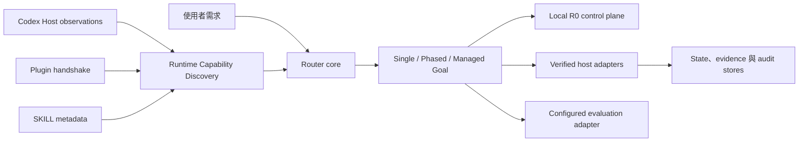

# Workflow Skill Router V2

[English](README.md) · [線上文件](https://huangchiyu.com/Workflow-skill-router/zh-tw/) · [Routing Flight Recorder](https://huangchiyu.com/Workflow-skill-router/zh-tw/#routing-flight-recorder)

Workflow Skill Router 會在 Codex 開始工作前先判斷任務大小、選擇合適的 SKILL，並說明目前哪些能力真的可用。技術上，它是一個 runtime-aware 規劃與路由層；它不會擴大使用者權限，也不會把不可用的功能說成可用。

> 已準備的 prerelease candidate：`2.0.0-beta.4`（尚未發布）。目前已發布的 V2 prerelease 仍是 `2.0.0-beta.3`；遷移期間仍可從 immutable V1.3.1 復原。

## 60-second outcome / 60 秒成果

把需求交給 Router，它會回傳 execution envelope、能力計畫、同意邊界，以及安全繼續工作所需的證據。公開 Flight Recorder 顯示真正經清理的 MCP request／response，不在瀏覽器重算決策。

```text
需求
  -> 判斷工作形狀
  -> 探索可用的 Runtime 能力
  -> 鎖定使用者明確指定
  -> 規劃最小路由
  -> 執行、驗證並揭露實際 SKILL 使用情形
```

## Plugin + MCP 與 Skill-only

| 能力 | Plugin + MCP | Skill-only |
| --- | --- | --- |
| 路由指令 | 內建 | 內建 |
| Personal Routing Profile | deterministic 載入、驗證、優先序與 preview | 依相同固定 JSON contract 做 advisory 解讀 |
| 本機 durable R0 規劃與 scoped consent | `plan_work`、`propose_support_consent`、`transition_support_consent`、`get_router_status` | 無法觀測 |
| verified-host 排程與 route validation | 完成 Host 整合後可用 | 不可用 |
| 跨程序狀態與 compare-and-swap | 取決於 Host／Runtime | 不可用 |
| sealed model evaluation | 需要 configured adapter | 只能人工執行 |
| 誠實的 Runtime 標籤 | `bundled-local-r0` 或 verified profile | `skill-only-fallback` |

Codex 支援 Plugin/MCP 時優先使用 Plugin。若 Host 不支援 Plugin，或只需要 instruction-only routing，再使用獨立 SKILL。Skill-only 絕不等於 `hybrid-full`。

## 五分鐘 Plugin + MCP quickstart

一般使用者請固定安裝不可變的 `v2.0.0-beta.3` marketplace snapshot：

```powershell
codex plugin marketplace add eric861129/Workflow-skill-router --ref v2.0.0-beta.3
codex plugin add workflow-skill-router@workflow-skill-router
codex plugin list
```

開啟新的 Codex 任務，要求它顯示 Workflow Skill Router 狀態。預期結果應包含 `bundled-local-r0` Runtime 標籤、12 個 MCP tools、**4 always local-ready** tools，以及 **3 Router-owned conditional-local** tools。

需要修改 Router 的貢獻者才使用 checkout：

```powershell
git clone https://github.com/eric861129/Workflow-skill-router.git
Set-Location Workflow-skill-router
codex plugin marketplace add .
codex plugin add workflow-skill-router@workflow-skill-router
codex plugin list
python plugins/workflow-skill-router/runtime/workflow_skill_router.pyz doctor
```

正式 Plugin 已包含 MCP bundle 與 Python runtime。執行需要 Node.js 24+ 與 Python 3.11+；只有從原始碼重建時需要 npm。完整說明請看 [Plugin 安裝](site/src/content/docs/zh-tw/guides/install-plugin.md)。

## 五分鐘 Skill-only quickstart

一般使用者請下載 [`workflow-skill-router-skill-v2.0.0-beta.3.zip`](https://github.com/eric861129/Workflow-skill-router/releases/download/v2.0.0-beta.3/workflow-skill-router-skill-v2.0.0-beta.3.zip)，再把內層 `workflow-skill-router/` 資料夾解壓縮到 Codex Skills 目錄。

需要修改 Router 的貢獻者可在 Windows checkout 中執行：

```powershell
$Target = Join-Path $env:USERPROFILE ".codex\skills\workflow-skill-router"
Copy-Item -Recurse -Force "starter\v2\workflow-skill-router" $Target
Get-Content -Encoding UTF8 (Join-Path $Target "SKILL.md") | Select-Object -First 8
```

此套件保留路由指令與使用者指定 SKILL 優先的政策，但無法證明 durable resume、完整 drift detection 或 sealed activation。完整說明請看 [Skill-only 安裝](site/src/content/docs/zh-tw/guides/install-skill.md)。

## 架構：先做 Runtime Capability Discovery

Runtime Capability Discovery 把常被混為一談的五個事實分開：已安裝 metadata、Host exposure、驗證狀態、policy eligibility 與 freshness。只有通過對應風險條件的能力才能進入路由。



Maintainer 可先閱讀 [V2 架構總覽](docs/architecture/v2-overview.md)。

## Single、Phased 與 Managed Goal

- **Single**：處理一個有明確邊界的意圖，只選最小 Primary capability。
- **Phased**：保留不同階段，並依當下證據為每個 Phase 重新路由。
- **Managed Goal**：維護可恢復的 Work Graph、尊重依賴關係，並把 Codex Goal 視為 Host-owned state。

Router 不會把每個任務都塞進 Goal 流程。工作形狀由需求、依賴、風險與目前 Goal relation 共同決定。

`plan_work` 會結合工作包絡的 **deterministic automatic classification**，以及使用者 Skill Tree 的 **optional deterministic Profile**。Classifier 是有界的結構與詞彙規則，不是 semantic model；回應會把分類來源、信心、revision、reason codes 與 Profile match source 分開呈現。Planned Skills 只代表規劃意圖，actual activation 仍是 `unverified`。Explicit Skill Lock 與 consent 邊界持續有效；本機 Router 不會啟用 Skills、不會修改 native Codex Goal，也不會授予 deployment/production authority。

## Explicit Skill Lock

使用者指定 SKILL 時，該選擇具有權威性。Router 可以建議支援能力，但啟用前必須說明用途、scope、拒絕後果與 context cost。被拒絕的支援不得進入 active selections。

Plugin 模式會在詢問前先持久化 proposal。後續 model turn 只分類 `approved`、`rejected` 或 `unclear`；deterministic MCP transition 會保留 bound route，Phase、scope、revision 或 material context 改變時則 fail closed。Skill-only 仍保留相同互動政策，但只能宣稱 advisory instructions，不能宣稱 durable enforcement。

使用者未指定 SKILL 時，Router 直接選擇最小充分路由，不會為自己推薦的支援能力反覆詢問。執行前宣告預計使用的 SKILL，完成後回報實際使用項目與差異。

## Personal Routing Profiles / 個人 Skill Tree

V2 保留了 V1 最重要的精髓：使用者仍能擁有自己的 Skill Tree。Personal Routing Profile 可依 objective keywords、domains、tags 與 work modes，定義每個 Phase 的單一 Primary、最多三個目前 Phase support SKILL，以及 exit gate。

> Personal Routing Profiles 隨 `v2.0.0-beta.2` 提供。beta.1 的 36-attempt Model Evaluation 是歷史 runtime evidence，不涵蓋這項 Profile 功能。

優先序固定為：Host hard constraints、使用者當次明確指定 SKILL、workspace profile、personal profile、built-in routing。Workspace Profile 放在 `.codex/workflow-skill-router.json`；Personal Profile 放在 Router 的外部資料目錄。MCP 只接受 Client 公告 root 或 `WORKFLOW_SKILL_ROUTER_WORKSPACE_ROOTS` 內的 workspace 讀取；模型任意提供的本機路徑會 fail closed。Workspace 命中後採用整棵 tree，不與 personal tree 做隱含 deep merge。

```powershell
Copy-Item starter/v2/workflow-skill-router/assets/personal-routing-profile.example.json ./my-profile.json
python plugins/workflow-skill-router/runtime/workflow_skill_router.pyz profile validate .\my-profile.json
python plugins/workflow-skill-router/runtime/workflow_skill_router.pyz profile install .\my-profile.json
python plugins/workflow-skill-router/runtime/workflow_skill_router.pyz profile list
python plugins/workflow-skill-router/runtime/workflow_skill_router.pyz profile preview --objective "交付 API" --work-mode phased --domain api
python plugins/workflow-skill-router/runtime/workflow_skill_router.pyz profile preview --objective "交付 API" --work-mode phased --domain api --explain
python plugins/workflow-skill-router/runtime/workflow_skill_router.pyz profile lint .\my-profile.json
```

Generated Plugin runtime 支援 `profile preview --explain` 與 `profile lint`；兩者都只是 deterministic diagnostics，不會公開 SKILL instruction body，也不會授予 authority。Plugin + MCP 會 deterministic 載入與驗證 Profile。Skill-only 只有在 Host 授權讀取固定 Profile 位置時，才能依相同契約做 `skill-only-fallback` advisory routing；否則必須由使用者在對話中提供 Profile 內容。Skill-only 不能宣稱 durable loading 或 enforcement。兩種模式下，Profile 結果都只是 `intended-unverified`；Runtime Capability Discovery 仍決定 SKILL 是否 installed、exposed、compatible、authorized 與 eligible。Profile 不會安裝 SKILL，也不會授予權限。完整說明請看 [Personal Routing Profiles](site/src/content/docs/zh-tw/concepts/personal-routing-profiles.md)。

## MCP tool surface

Plugin 提供十二個 typed tools：

```text
sync_runtime_context       plan_work                  propose_support_consent
transition_support_consent get_next_work              validate_route
record_work_event          evaluate_gate              get_router_status
run_model_evaluation       compare_evaluations        export_router_artifact
```

Tool schema、risk、required capabilities 與 fallback actions 都從 Server 使用的相同 contract 產生。請看 [generated MCP reference](site/src/content/docs/zh-tw/reference/mcp-tools.mdx)。

## Runtime readiness matrix

| bundled local R0 可用性 | Tools | 意義 |
| --- | --- | --- |
| `local-ready` | `plan_work`、`propose_support_consent`、`transition_support_consent`、`get_router_status` | durable local R0 planning、scoped consent 與 status |
| `conditional-local` | `get_next_work`、`record_work_event`、`evaluate_gate` | 僅限 Router-owned work graph 的排程、回報式本機進度與 advisory local gate |
| `verified-host-required` | `sync_runtime_context`、`validate_route` | 需要 verified host authority 與 stores |
| `configured-adapter-required` | `run_model_evaluation`、`compare_evaluations`、`export_router_artifact` | 需要授權的 evaluation adapter 與 evidence |

正確說法是 **4 always local-ready + 3 Router-owned conditional-local**，不是 `7/12 local-ready`。Conditional-local 只在已驗證的 Router-owned work graph 且沒有 Native Goal authority 時執行；`get_next_work` 回傳 `authority_mode=router-local` 與 `host_goal_mutated=false`，進度和 local gate 使用 `evidence_class=user-or-agent-reported-local` 與 `host_transition_authorized=false`。Local gate 通過只代表 advisory 本機檢查，不是 Skill activation、Native Goal completion、deployment approval 或 production permission。Native Goal、缺少 graph 或 graph 損毀時一律 fail closed 到 verified Host 路徑。Explicit Skill Lock 與 consent 行為不受影響。

不可用的呼叫會回傳 typed `capability-unavailable`、required capabilities 與 fallback action。Router 不會捏造 scheduler 或 evaluation 成功結果；`latest` compatibility channel 在 V2 通過 GA gate 前仍維持 V1.3.1。

## Real Model Evaluation

**Tier 0 Contract** fixtures 只證明 deterministic compatibility，不是模型行為。Behavior evidence 需要 fresh isolated attempts、sealed case package、paired baseline/candidate manifests、bounded output、零 hard violation，以及公開前的可信任審查。Baseline arm 明確採 `model-only`，candidate 採 `hybrid-router`；consent follow-up 由 fresh model 分類 intent，再由持久化 MCP state machine 產生最終 route。

Evaluation contract `2.2.0` 已將目前 Phase oracle 與有狀態的 Phase-transition case 分開，將 scoped consent support 綁定到目前 Phase 的具體 exit evidence，並逐 turn 評分。六案例 beta profile 維持 36 attempts／42 model turns；十三案例 full gate 在每個 arm 重複三次時是 78 attempts／96 model turns。任何 `2.1.0` report 都只屬診斷證據，綁定舊 case 或 instruction digest 的 run 不得用新 oracle 事後重算。新的 `2.2.0` Behavior run 在授權執行前維持 `manual-required`，執行後則在可信 attestation 前維持 `review-required`。

## Security boundary 與 local state

Plugin 安裝、SKILL 同意、Runtime 權限與 production authorization 是不同決策。Model 不能提供 evaluation executable path、偽造 Host authority、把 fixture 升格成 runtime evidence，或直接修改 native Codex Goal。

Plugin 將 state 存在 cache 外：

| 平台 | 預設路徑 |
| --- | --- |
| Windows | `%LOCALAPPDATA%\Codex\workflow-skill-router` |
| macOS | `~/Library/Application Support/Codex/workflow-skill-router` |
| Linux | `${XDG_STATE_HOME:-~/.local/state}/codex/workflow-skill-router` |

可用 `WORKFLOW_SKILL_ROUTER_DATA_DIR` 指定其他外部目錄。預設不啟用 telemetry。整合 Host-side R2/R3 行動前，先讀 [security boundary](site/src/content/docs/zh-tw/reference/security-boundaries.md)。

## Contributing

先讀 [CONTRIBUTING.md](CONTRIBUTING.md)，再針對修改範圍執行檢查。Release artifacts 由 allowlist 與 deterministic builder 產生，不手動修改 generated outputs。

```powershell
$env:PYTHONPATH = (Resolve-Path "packages/router-core/src").Path
python -m unittest discover -s packages/router-core/tests -v
python -m unittest discover -s tests -v
python scripts/build-v2-demo-data.py --check
$Version = (Get-Content -Raw -Encoding UTF8 release/version.json | ConvertFrom-Json).v2_version
$Output = Join-Path "dist" "release-$Version"
python scripts/build-release-artifacts.py --output-dir $Output --provenance-mode test --check-determinism
```

Release builder 只允許覆寫目前 manifest 內的既有產物。如果 output directory 含有 stale、非預期、symlink 或其他未列入 manifest 的 path，會直接 fail closed；請使用版本專屬目錄，不要混放不同 release generation。

## Version channels

| Channel | 目前用途 | Promotion rule |
| --- | --- | --- |
| `latest` | V2 GA 前維持 V1.3.1 compatibility | 通過 GA release gate 後才移動 |
| `latest-v1` | immutable V1 recovery | 固定 V1.3.1 |
| `latest-v2` | V2 alpha/beta prerelease | 追蹤已審查的 V2 prerelease |

即使 compatibility channel 尚未移動，Repository 的產品方向仍是 V2-first。版本 metadata 位於 [`release/version.json`](release/version.json)。

## V1 migration

使用 [V1 到 V2 遷移指南](site/src/content/docs/zh-tw/guides/migrate-v1-to-v2.md)，從 template-based routing 遷移至 runtime-aware Plugin 或獨立 SKILL。V1 原始碼與套件仍可從 immutable [`v1.3.1` tag](https://github.com/eric861129/Workflow-skill-router/tree/v1.3.1) 與 GitHub Release 復原，但不再放在 V2 primary navigation。

MIT License。
