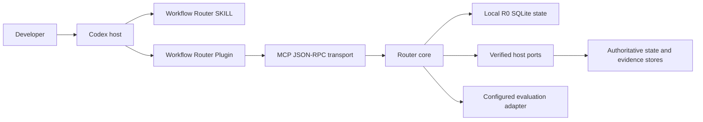

# Workflow Skill Router V2 architecture overview

This document gives maintainers one compact map of the V2 trust and execution boundaries. User-facing tutorials live under `site/src/content/docs/`; this page does not duplicate them.

## Decision records

- [ADR 0001: V2-first public surface](../adr/0001-v2-first-public-surface.md) defines the Plugin/MCP-first product, the supported SKILL-only fallback, and the V1 recovery boundary.
- [ADR 0002: Release assets outside Git](../adr/0002-release-assets-outside-git.md) defines source-built packages, provenance, channel behavior, and the separation between product and persisted-schema versions.
- [ADR 0003: Deterministic support consent](../adr/0003-deterministic-support-consent-state-machine.md) moves explicit-lock support decisions from model route rewriting into a persisted fail-closed MCP state machine.
- [ADR 0003: Explainable classification and runtime modes](../adr/0003-explainable-classification-and-runtime-modes.md) freezes classification provenance, local-versus-Host authority, and runtime readiness boundaries.

## System context



## Containers and authority

| Container | Responsibility | Authority limit |
| --- | --- | --- |
| SKILL fallback | Instruction-only classification, consent policy, usage disclosure | Cannot claim durable state, host exposure, or `hybrid-full` |
| Plugin transport | Loads canonical SKILL, MCP bundle, and Python runtime | Installation does not grant runtime or production permission |
| Router core | Capability merge, envelope policy, phase/Goal state, evidence contracts | Accepts authority only through verified ports and receipts |
| Bundled local R0 control plane | Persists plans, Phase-scoped support proposals, consent transitions, and status | Does not schedule next work or validate protected routes |
| Verified host adapters | Supply authoritative snapshots, scheduler, stores, and activation preflight | Host-owned; model input cannot construct these ports |
| Evaluation adapters | Run sealed fresh attempts and store evidence | Executable configuration is server-owned and quota-gated |

## Runtime Capability Discovery

Discovery merges filesystem metadata, Plugin handshake facts, agent observations, and host evidence without treating them as equally authoritative. The resulting snapshot records availability by risk, provenance, freshness, compatibility, authentication, and content identity. See `site/src/content/docs/concepts/runtime-capability-discovery.md`.

## Routing and state

Classification happens before execution work. Goal status and side questions are control/read-only requests. Native Goal progress or steer establishes the outer `managed-goal` envelope; the Router never mutates native Codex Goal from local state. For a detached request or the current work item, the Router then considers `requested_work_mode`, the deterministic structural analyzer, a deterministic Profile route, and the builtin fallback, in that order.

The analyzer revision is `deterministic-objective-v1`. It records `classification_source` and `classification_reason_codes` so the result is explainable and replayable. It analyzes bounded structural signals; it does not understand every task semantically and never authorizes Skills, tools, or side effects. A semantic adapter may suggest a candidate but cannot directly rewrite a persisted route.

Explicit user-selected SKILLs create a lock; Router-recommended support needs consent only when it falls outside that lock. The phase state machine derives transitions from observations, state versions, plan revisions, evidence digests, and side-effect outcomes.

Support consent uses a narrower local state machine: `pending -> approved | rejected`. The model may classify the user's intent, but it cannot replace the proposal's primary SKILL, support set, Phase scope, Goal revision, plan revision, or context fingerprint during transition.

Managed Goal orchestration maintains a dependency graph but never mutates the native Codex Goal directly. It produces host-safe status candidates backed by evidence. See the routing, phase, and Goal concepts in `site/src/content/docs/concepts/`.

### Runtime readiness matrix

| Readiness | Operations | Authority and fail-closed behavior |
| --- | --- | --- |
| `local-ready` | `plan_work`, consent proposal/transition, `get_router_status` | Four bundled R0 operations are available within documented Router-local scope. |
| `conditional-local` | `get_next_work`, `record_work_event`, `evaluate_gate` | Router-owned graphs and local advisory evidence only; results use `authority_mode=router-local` and `host_transition_authorized=false`. |
| `verified-host-required` | `sync_runtime_context`, `validate_route` | Requires verified Host state, policy, and receipts; local calls fail closed. |
| `configured-adapter-required` | model evaluation, comparison, export | Requires a server-configured adapter, authorization, and applicable attestation. |

Host-authoritative operations use a distinct `authority_mode=verified-host`; evaluation operations use `authority_mode=configured-adapter`. A local gate passing is not Skill activation, a native Goal transition, formal evidence, deployment approval, or production permission. GA is therefore not defined as all 12 tools being locally usable: four are always local-ready, three are conditionally local for Router-owned state, and five intentionally retain stronger authority requirements.

Fail-closed examples:

- A local next-work request bound to native Goal progress returns a verified-Host requirement and leaves Goal state unchanged.
- A missing activation receipt prevents a Host transition even if a Router-local advisory gate passed.
- A semantic route candidate remains advisory and cannot replace the persisted deterministic route.

## Stores and replay

- SQLite event storage uses append-only workflow events, idempotency keys, and compare-and-swap versions.
- Projections rebuild derived workflow, phase, and Goal views from events.
- Artifacts are content-addressed; restricted evidence requires a verified protector. Evaluation raw/checkpoint artifacts use a pre-protected `restricted/` directory, while only sanitized aggregate diagnostics remain in the public output root.
- Local R0 plans store objective digests, not plaintext objectives.
- Plugin state lives outside the Plugin cache so upgrades do not erase audit history.

## Evaluation boundary

Contract fixtures are T0 compatibility evidence. Behavior and Outcome evidence require fresh isolated attempts through a configured adapter, sealed scoring material, paired manifests, and human/trusted attestation. Reference-driver output never becomes real-model proof. See `site/src/content/docs/concepts/evaluation-evidence.md`.

## Version boundaries

The public Plugin and release packages use product SemVer. Persisted artifacts and runtime contracts use independent schema identifiers. Advancing the product from alpha to beta does not silently rewrite stored data or declare a schema migration; a schema version changes only with an explicit compatibility decision and migration path.

## Focused verification

```powershell
$env:PYTHONPATH = (Resolve-Path "packages/router-core/src").Path
python -m unittest discover -s packages/router-core/tests -v
python -m unittest tests/test_runtime_reproducibility.py tests/test_v2_demo_data.py -v
python scripts/check-doc-parity.py
```
