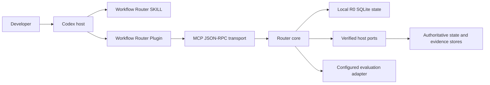

# Workflow Skill Router V2 architecture overview

This document gives maintainers one compact map of the V2 trust and execution boundaries. User-facing tutorials live under `site/src/content/docs/`; this page does not duplicate them.

## System context



## Containers and authority

| Container | Responsibility | Authority limit |
| --- | --- | --- |
| SKILL fallback | Instruction-only classification, consent policy, usage disclosure | Cannot claim durable state, host exposure, or `hybrid-full` |
| Plugin transport | Loads canonical SKILL, MCP bundle, and Python runtime | Installation does not grant runtime or production permission |
| Router core | Capability merge, envelope policy, phase/Goal state, evidence contracts | Accepts authority only through verified ports and receipts |
| Bundled local R0 control plane | Persists `plan_work` and serves `get_router_status` | Does not schedule next work or validate protected routes |
| Verified host adapters | Supply authoritative snapshots, scheduler, stores, and activation preflight | Host-owned; model input cannot construct these ports |
| Evaluation adapters | Run sealed fresh attempts and store evidence | Executable configuration is server-owned and quota-gated |

## Runtime Capability Discovery

Discovery merges filesystem metadata, Plugin handshake facts, agent observations, and host evidence without treating them as equally authoritative. The resulting snapshot records availability by risk, provenance, freshness, compatibility, authentication, and content identity. See `site/src/content/docs/concepts/runtime-capability-discovery.md`.

## Routing and state

The profiler selects `single`, `phased`, or `managed-goal`. Explicit user-selected SKILLs create a lock; Router-recommended support needs consent only when it falls outside that lock. The phase state machine derives transitions from semantic observations, state versions, plan revisions, evidence digests, and side-effect outcomes.

Managed Goal orchestration maintains a dependency graph but never mutates the native Codex Goal directly. It produces host-safe status candidates backed by evidence. See the routing, phase, and Goal concepts in `site/src/content/docs/concepts/`.

## Stores and replay

- SQLite event storage uses append-only workflow events, idempotency keys, and compare-and-swap versions.
- Projections rebuild derived workflow, phase, and Goal views from events.
- Artifacts are content-addressed; restricted evidence requires a verified protector.
- Local R0 plans store objective digests, not plaintext objectives.
- Plugin state lives outside the Plugin cache so upgrades do not erase audit history.

## Evaluation boundary

Contract fixtures are T0 compatibility evidence. Behavior and Outcome evidence require fresh isolated attempts through a configured adapter, sealed scoring material, paired manifests, and human/trusted attestation. Reference-driver output never becomes real-model proof. See `site/src/content/docs/concepts/evaluation-evidence.md`.

## Focused verification

```powershell
$env:PYTHONPATH = (Resolve-Path "packages/router-core/src").Path
python -m unittest discover -s packages/router-core/tests -v
python -m unittest tests/test_runtime_reproducibility.py tests/test_v2_demo_data.py -v
python scripts/check-doc-parity.py
```
