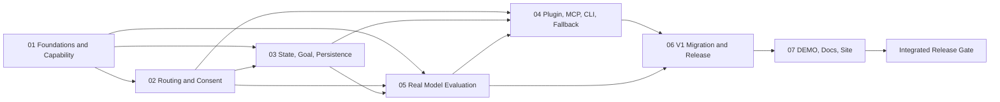

# Workflow Skill Router V2 Master Implementation Plan

> **For agentic workers:** REQUIRED SUB-SKILL: Use `superpowers:subagent-driven-development` to execute this plan one bounded task at a time. Use `superpowers:test-driven-development` for every production-code change and `superpowers:verification-before-completion` before any completion claim.

**Goal:** Deliver Workflow Skill Router V2 as a production-grade hybrid product: a deterministic Python runtime, a thin Plugin/MCP adapter, a pure-SKILL fallback, honest real-model evaluation, V1 compatibility, reproducible release artifacts, and a regenerated bilingual DEMO/documentation site.

**Architecture:** Build one Python 3.11+ standard-library modular monolith under `packages/router-core/src/workflow_skill_router/`. It owns schemas, capability discovery, routing policy, Phase/Goal orchestration, SQLite persistence, evaluation, CLI, and the JSONL bridge. Build `plugins/workflow-skill-router/` as a generated Codex plugin whose Node MCP server transports calls to the same Python core; it must not duplicate routing policy. Preserve V1 scripts as compatibility surfaces until explicit migration adapters and golden subprocess tests prove parity.

**Tech Stack:** Python 3.11+ standard library, SQLite, JSON Schema resources, Python `zipapp`, Node.js 24, TypeScript, `@modelcontextprotocol/sdk@1.29.0`, Zod, esbuild, Astro/Starlight, Playwright, Lighthouse CI, GitHub Actions on Windows/macOS/Linux.

## Global Constraints

- Execute inside a dedicated branch/worktree created according to `superpowers:using-git-worktrees`; use branch prefix `codex/`.
- Keep the native Codex Goal authoritative. Router output may create `completion_candidate` or `blocked_candidate`, but only Codex Goal APIs may complete or block the native Goal.
- Do not push, publish a release, mutate a marketplace, or install the generated plugin globally without explicit user authorization.
- Do not bulk-delete files or directories. A required deletion must target one explicit file per operation.
- Preserve every V1 CLI name, option, environment variable, exit-code meaning, stdout/stderr channel, deterministic order, and public artifact until the migration plan explicitly changes the public channel.
- Runtime capability discovery may read trusted frontmatter or metadata only. It must not read a SKILL instruction body and must not treat discovery as activation.
- A user-specified SKILL always has routing priority. Supporting SKILL activation requires scoped consent; rejection must never be bypassed by silent activation, scope widening, repeated prompting, gate deletion, or substitution.
- Small explicit-SKILL tasks remain `single`; medium explicit-SKILL tasks remain `phased`; large tasks and native Goal work use `managed_goal`.
- Content identities、hashes、transitions and generated artifacts must be deterministic for identical inputs。Opaque event／run／Goal-binding instance IDs may be UUIDs, but must be explicitly typed as non-content identity and excluded from canonical hashes、goldens and exact-byte artifact comparisons；timestamps are likewise excluded only where the schema declares them non-semantic。
- All source comments, fixtures, demo text, and user-facing Traditional Chinese content must remain valid UTF-8 without mojibake.
- Use only sanitized, checked-in data to generate public DEMO and evaluation artifacts. Never package private local SKILL bodies, paths, credentials, consent records, or raw prompts.
- A green Tier 0 contract suite must not be described as real-model quality. Real-model claims require a sealed run manifest, adapter evidence, repeat data, and scorer output.

---

## 1. Delivery Graph and Source Boundaries



### Canonical implementation tree

```text
packages/router-core/
  pyproject.toml
  src/workflow_skill_router/
    __init__.py
    __main__.py
    service.py
    bridge.py
    schemas/
    capabilities/
    routing/
    workflow/
    goals/
    persistence/
    evaluation/
    cli/
  tests/
plugins/workflow-skill-router/
  .codex-plugin/plugin.json
  .mcp.json
  skills/workflow-skill-router/
  mcp/src/
  mcp/server.bundle.mjs
  runtime/workflow_skill_router.pyz
  scripts/
  assets/
demo/v2-scenarios/
evaluation/artifacts/public/
release/
downloads/channels/
site/src/data/router-demo-v2.generated.json
```

### Ownership rule

| Concern | Sole policy owner | Adapters/consumers |
|---|---|---|
| Capability identity and availability | `workflow_skill_router.capabilities` | Filesystem, runtime snapshot, plugin handshake, cache providers |
| Envelope classification and SKILL selection | `workflow_skill_router.routing` | CLI, MCP, pure-SKILL reference workflow |
| Consent and execution leases | `workflow_skill_router.routing` | Router service, event store, MCP tools |
| Phase transitions and evidence gates | `workflow_skill_router.workflow` | Goal projection, status/export tools |
| Goal binding and completion candidates | `workflow_skill_router.goals` | Native Codex Goal boundary, status projection |
| Persistence and replay | `workflow_skill_router.persistence` | All stateful service operations |
| Evaluation execution and scoring | `workflow_skill_router.evaluation` | CLI and MCP evaluation tools |
| MCP transport | `plugins/workflow-skill-router/mcp` | Codex plugin runtime only; no routing policy |
| V1 compatibility | Existing `scripts/*.py` plus explicit adapters | CI, starter, legacy downloads |

---

## 2. Subplan Index and Acceptance Coverage

| Subplan | Primary spec coverage | Concrete exit artifact |
|---|---|---|
| [01 Foundations and Capability](./2026-07-15-workflow-skill-router-v2-01-foundations-capability.md) | Sections 6, 10, 13.1, 20, 21; acceptance 26.4 | Frozen V1 subprocess contracts, schema registry, immutable capability snapshots, safe discovery, merge/drift tests |
| [02 Routing and Consent](./2026-07-15-workflow-skill-router-v2-02-routing-consent.md) | Sections 8, 9, 11.4, 19; acceptance 26.1-26.2 | Request decision, three envelopes, explicit lock, scoped consent, coverage result, execution lease, deterministic route validator |
| [03 State, Goal, Persistence](./2026-07-15-workflow-skill-router-v2-03-state-goal-persistence.md) | Sections 11-13, 17, 20; acceptance 26.3 | Append-only events, Phase state machine, gates/evidence, SQLite replay, Goal work graph, completion/blocked candidates |
| [04 Plugin, MCP, CLI, Fallback](./2026-07-15-workflow-skill-router-v2-04-plugin-mcp-cli-fallback.md) | Sections 15-16, 18-21, 23 | Generated plugin, ten MCP tools, Python `.pyz`, persistent bridge, CLI, degraded status, pure-SKILL fallback |
| [05 Real Model Evaluation](./2026-07-15-workflow-skill-router-v2-05-model-evaluation.md) | Section 14; acceptance 26.5 | Tiered cases, sealed packages, isolated runner/scorer, manifests, repeat/compare reports, hard-violation gate |
| [06 V1 Migration and Release](./2026-07-15-workflow-skill-router-v2-06-v1-migration-release.md) | Section 22, decisions 24, risks 25; acceptance 26.6 | V1 adapters, deterministic archives, checksums/SBOM, `latest`/`latest-v2`/`latest-v1` manifests, three-OS release checks |
| [07 DEMO, Docs, Site](./2026-07-15-workflow-skill-router-v2-07-demo-docs-site.md) | Sections 3-5, 23, 26 and public explanation | Canonical V2 demo data, adaptive router DEMO, regenerated media, bilingual docs/README, Playwright/Lighthouse gates |

### Cross-cutting acceptance matrix

| Required behavior | Owning tests | Public evidence |
|---|---|---|
| Small automatic routing uses a bounded single route | `packages/router-core/tests/routing/test_profiler.py` and `test_route_validator.py` | DEMO preset `small-auto` |
| Small explicit SKILL remains single and rejected support stays inactive | `packages/router-core/tests/routing/test_explicit_skill_scenarios.py` | DEMO preset `small-explicit-reject-support` |
| Medium automatic routing re-evaluates each Phase | `packages/router-core/tests/routing/test_profiler.py` and `test_route_validator.py` | DEMO preset `medium-auto` |
| Medium explicit SKILL lock is inherited while consent stays Phase-scoped | `packages/router-core/tests/routing/test_explicit_skill_scenarios.py` and `test_consent.py` | DEMO preset `medium-explicit-phase-consent` |
| Large/native Goal work uses dependency-aware work graph | `packages/router-core/tests/goals/test_goal_orchestrator.py` | DEMO preset `goal-work-graph` |
| Side questions do not mutate active Goal state | `packages/router-core/tests/goals/test_goal_orchestrator.py` | Goal documentation trace |
| Router cannot complete/block native Goal directly | `packages/router-core/tests/integration/test_router_service.py` and `test_service_authority.py` | MCP authorization documentation |
| Capability discovery does not activate/read SKILL bodies | `packages/router-core/tests/capabilities/test_filesystem_provider.py` | Security documentation and exported snapshot |
| Consent rejection survives replay and suppresses re-prompt in scope | `packages/router-core/tests/routing/test_consent.py` plus `packages/router-core/tests/persistence/test_projection_rebuild.py` | Medium explicit DEMO trace |
| Runner cannot read scoring keys | `packages/router-core/tests/evaluation/test_sealing.py` and `test_runner.py` | Public sealed-package manifest |
| Tier 0 contract and real-model results are visibly distinct | `packages/router-core/tests/evaluation/test_legacy_v1.py` and `test_reporting.py` | Evaluation page and comparison report |
| Plugin and pure-SKILL fallback use equivalent policy fixtures | `packages/router-core/tests/integration/test_transport_equivalence.py` | Plugin/skill package manifests |
| Download artifacts match sources byte-for-byte after regeneration | `tests/test_package_downloads.py` and `tests/test_release_artifacts.py` | SHA-256 manifest and SBOM |
| All DEMO/docs/media are reproducibly generated | `tests/test_v2_demo_data.py`、`tests/test_v2_documentation.py` and site smoke/visual tests | Clean `--check` generation run |

---

## 3. Goal-Mode Execution Contract

### Interfaces

- **Consumes:** the active native Codex Goal; this master plan; the approved V2 design spec; the seven subplans; repository and CI state.
- **Produces:** one validated implementation branch, local commits, regenerated artifacts, a final verification ledger, and a router `completion_candidate` that can support—but never replace—the native Goal completion decision.
- **Authority boundary:** the execution agent may update local plan steps and router events. It may call native Goal status APIs only according to their platform contract and only after all required work is actually complete.

### Task 1: Establish the isolated implementation workspace

**Files:**

- Read: `docs/superpowers/specs/2026-07-15-workflow-skill-router-v2-design.md`
- Read: all seven files in `docs/superpowers/plans/`
- Verify: repository branch, worktree registrations, and clean/known user changes

**Step 1: Record the baseline**

Run:

```powershell
git status --short --branch
git log -1 --oneline
git worktree list --porcelain
```

Expected: the architecture and plan commits are present; every unrelated user change is identified before a worktree is created.

**Step 2: Create the implementation branch/worktree**

Follow `superpowers:using-git-worktrees` exactly. Use branch `codex/workflow-skill-router-v2` and a sibling worktree path selected by that skill's safety checks.

Expected: the implementation worktree starts from the plan commit and `git status --short` is empty.

**Step 3: Re-run the V1 baseline**

Run the repository's current CI-equivalent Python tests, public-readiness checks, generated-data checks, site build, and smoke tests exactly as documented in `.github/workflows/validate.yml`.

Expected: all baseline commands pass before V2 source changes. If a baseline command fails, record it as pre-existing evidence and diagnose it before proceeding.

**Step 4: Commit policy**

Do not create an empty workspace commit. Each subplan owns its own narrow commits. Never combine generated site/media churn with runtime policy code in the same commit.

### Task 2: Execute Plans 01-03 as the deterministic core

**Files:**

- Execute: subplans `01`, `02`, and `03`
- Verify: `packages/router-core/` and its test suite

**Step 1: Run Plan 01**

Expected: legacy subprocess contracts are frozen before new package behavior is introduced; schemas and discovery are deterministic and body-safe.

**Step 2: Run Plan 02**

Expected: all six automatic/explicit × single/phased/managed_goal routing matrix paths have executable tests, including consent rejection and unavailable explicit SKILL behavior.

**Step 3: Run Plan 03**

Expected: legal state transitions, gate evidence, replay, idempotency, concurrency, crash recovery, Goal reconciliation, and candidate rules are green.

**Step 4: Core integration gate**

Run:

```powershell
python -m unittest discover -s packages/router-core/tests -p "test_*.py" -v
python -m compileall -q packages/router-core/src
```

Expected: zero failures and zero compile errors on Python 3.11 semantics. Run the same suite with the configured Python 3.11 interpreter when the host default is newer.

### Task 3: Execute Plan 05, then Plan 04, as evaluation and transport

**Files:**

- Execute: subplans `04` and `05`
- Verify: `plugins/workflow-skill-router/`, runtime `.pyz`, MCP bundle, CLI, and evaluation artifacts

**Step 1: Complete Plan 05 evaluation services before packaging the transport**

Expected: all final evaluation service methods and frozen request/result schemas are available to the Plugin plan；manual/real execution and export authority boundaries are tested。CLI、transport codecs and stdin/file parity are intentionally created in Plan 04 after this step。

**Step 2: Generate, then implement the plugin**

The plugin directory must begin with the official `plugin-creator` scaffold script. Apply repository-specific edits only after the scaffold exists.

Expected: plugin validation passes, the Node MCP layer contains transport and validation only, and the packaged `.pyz` is built from the tested Python core.

**Step 3: Exercise the transport matrix**

Verify native CLI, JSONL bridge, MCP stdio, and pure-SKILL fallback against shared route fixtures.

Expected: the same request and capability snapshot produce semantically equivalent route decisions; degraded modes disclose missing runtime capability instead of fabricating success.

**Step 4: Exercise real-model evaluation isolation**

Run contract Tier 0, manual-required adapter validation, sealed execution, isolated scoring, repeat comparison, and hard-violation tests.

Expected: no execution package contains scoring keys; every result is hash-bound to its manifest and adapter; a fixture-only run is never labeled real-model.

### Task 4: Execute Plans 06-07 as release and public product

**Files:**

- Execute: subplans `06` and `07`
- Verify: `starter/`, `downloads/`, `release/`, `demo/`, `evaluation/artifacts/public/`, all README files, `docs/`, and `site/`

**Step 1: Cut preview artifacts without publishing**

Build the versioned SKILL and Plugin ZIPs, channel manifests, checksums, and SBOM from explicit allowlists.

Expected: two clean builds produce byte-identical archive hashes with fixed metadata；source/archive parity、pinned V1 provenance and plugin validation pass。`latest` continues to point to the approved immutable V1.3.1 release until V2 GA promotion is explicitly authorized；the prerelease is reachable only through `latest-v2`。

**Step 2: Generate the canonical public demo**

Generate all V2 demo JSON, evaluation public artifacts, screenshots, animated assets, poster, WebM, and MP4 from checked-in sanitized scenarios.

Expected: a following `--check` run reports no diff; the MP4 is regenerated by the documented toolchain instead of merely checked for existence.

**Step 3: Rebuild bilingual documentation and site**

Update all three README files with their declared language roles, V2 architecture, task-size matrix, explicit-SKILL rules, install modes, evaluation honesty, compatibility channels, and verified commands. Update Starlight English/Traditional Chinese pages and the interactive adaptive router DEMO.

Expected: internal links, download links, metadata, language switching, six DEMO presets, keyboard accessibility, and reduced-motion behavior pass.

### Task 5: Run the integrated release gate

**Files:**

- Modify only when a gate reveals a verified defect.
- Produce: `release/verification/v2-preview-verification.json` and its generated Markdown summary.

**Step 1: Re-run every repository gate**

Run the final command matrix defined by the seven subplans and `.github/workflows/validate.yml`, including:

```powershell
python scripts/verify-installed-v2-demo.py --check
python -m unittest discover -s tests -p "test_*.py" -v
python -m unittest discover -s packages/router-core/tests -p "test_*.py" -v
python scripts/validate-router.py --self-test
python scripts/validate-router.py --public-readiness
python scripts/check-markdown-links.py .
python -m unittest tests/test_package_downloads.py -v
python scripts/build-release-artifacts.py --check
npm --prefix plugins/workflow-skill-router ci
npm --prefix plugins/workflow-skill-router test
python plugins/workflow-skill-router/scripts/build-runtime.py --check
npm --prefix plugins/workflow-skill-router run check
npm --prefix site ci
npm --prefix site run assets:demo:check
npm --prefix site run assets:social:check
npm --prefix site run build
npm --prefix site run test:site:smoke
npm --prefix site run test:site:visual
npm --prefix site run audit:lighthouse
```

Expected: every command exits `0`；installed-package demo import works in a fresh environment。Generation commands introduce no unexpected drift；the exact clean-worktree assertion runs after the final verification ledger commit in Step 5。

**Step 2: Verify the three operating systems**

Run or confirm CI jobs for Windows, macOS, and Linux covering Python 3.11, Node 24, `.pyz` launch, MCP stdio handshake, SQLite recovery, plugin validation, archive parity, and pure-SKILL fallback.

Expected: all three jobs pass. A missing platform result is a release blocker, not an implied pass.

**Step 3: Perform independent review**

Use `superpowers:requesting-code-review` for findings-first review of security/privacy, consent authority, Goal authority, evaluation leakage, V1 compatibility, packaging provenance, documentation truthfulness, and accessibility.

Expected: all P0/P1 findings are fixed and re-verified; accepted lower-priority findings have explicit rationale in the verification ledger.

**Step 4: Verify regenerated-artifact cleanliness**

Run:

```powershell
git status --short
git diff --check
git diff --stat HEAD
```

Expected: only intentional final changes remain before the last commit; after committing, `git status --short` is empty.

**Step 5: Create the final local commit**

Use `commit-work` to review the full branch history and create a narrow final verification/docs commit only if uncommitted verified changes remain.

After the commit, run the actual cleanliness gate:

```powershell
git diff --exit-code
$Dirty = git status --porcelain
if ($Dirty) { $Dirty; throw "Final worktree is not clean" }
```

Expected: both commands prove tracked and untracked state are clean；local branch contains the complete reviewed implementation。Do not push。

### Task 6: Produce the Goal completion candidate

**Interfaces:**

- **Consumes:** integrated gate results, verification ledger, open findings, native Goal status.
- **Produces:** one `completion_candidate` only when all required work is complete; otherwise a concrete active-work status or policy-valid `blocked_candidate` after the native three-turn rule is satisfied.

**Step 1: Evaluate completion evidence**

Required evidence:

- Core, plugin, CLI, fallback, evaluation, migration, packaging, site, and documentation gates are green.
- DEMO media and generated artifacts were rebuilt and checked.
- No P0/P1 finding remains.
- No requested push or publication is implied.
- The implementation worktree is clean and local commits are identified.

**Step 2: Respect native Goal authority**

If every item above is true, present the completion candidate and then use the native Goal API according to its platform contract. Do not mark the Goal complete because a token budget is low or because only code—not docs/site/artifacts—is finished.

---

## 4. Planned Commit Sequence

Each commit is local and independently testable:

1. `test(compat): freeze workflow router v1 cli contracts`
2. `feat(core): add v2 schemas and capability discovery`
3. `feat(router): add task envelopes and explicit skill consent`
4. `feat(storage): add replayable sqlite event and artifact stores`
5. `feat(workflow): add phase state and goal orchestration on replayable storage`
6. `feat(eval): add isolated real model evaluation and final service composition`
7. `feat(plugin): add mcp transport and python runtime bundle over all ten methods`
8. `feat(release): add reproducible v2 packages and channels`
9. `feat(demo): add adaptive workflow router v2 demo`
10. `docs: publish workflow router v2 guidance`
11. `test(release): add cross-platform v2 verification gates`

Commits may be split further when a subplan produces a logically independent green slice. Do not squash unrelated runtime, generated media, and documentation work into one opaque commit.

---

## 5. Definition of Done

Workflow Skill Router V2 is complete only when all statements are true:

- Runtime discovery reports presence, exposure, authorization, health, provenance, and freshness independently without reading SKILL bodies.
- The router deterministically selects `single`, `phased`, or `managed_goal` and records why.
- Explicit-SKILL priority works for small, medium, and Goal-sized requests, with scoped support consent and honest limited/blocked outcomes.
- Phase and Goal projections recover from SQLite events after crash, reject illegal transitions, and never seize native Goal authority.
- CLI, MCP, and pure-SKILL operation share one policy implementation and disclose degraded capability.
- Real-model evaluation is sealed, reproducible, adapter-aware, repeatable, comparable, and clearly separated from Tier 0 fixtures.
- V1 CLI and `latest`/`latest-v1` channel contracts remain verified while `latest-v2` artifacts are deterministic, checksummed, SBOM-described, and source-identical.
- The DEMO site, media, all README files, bilingual docs, downloads, and evaluation pages are regenerated from canonical public inputs and pass accessibility/visual/performance checks.
- Windows, macOS, and Linux verification is green.
- An independent findings-first review has no unresolved P0/P1 issue.
- The local implementation branch is clean and committed; nothing is pushed or published without explicit authorization.
