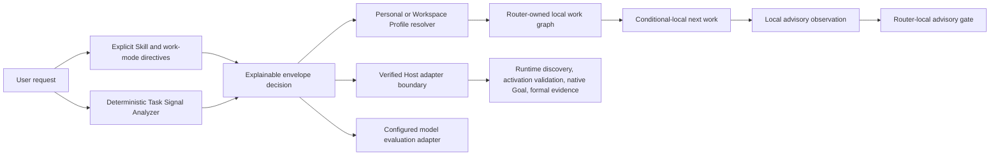

# Workflow Skill Router V2 Intelligence-to-GA Implementation Plan

> **For agentic workers:** REQUIRED SUB-SKILL: Use superpowers:subagent-driven-development (recommended) or superpowers:executing-plans to implement this plan task-by-task. Steps use checkbox (`- [ ]`) syntax for tracking.

**Goal:** 將 Workflow Skill Router 從「可持久化的 Skill Routing Planner」推進成具備可解釋本機分類、Router-owned 本機工作閉環、可實際整合 Host 的穩定 V2 控制層，並以可重現評測與真實 Pilot 證據作為 GA 依據。

**Architecture:** 保留 deterministic、fail-closed、authority separation 三個既有核心。先以 deterministic Task Signal Analyzer 補足 `TaskSignals.small()` 的固定預設，再為 Router 自己擁有的工作圖提供 conditional-local 排程、進度觀察與 advisory gate；原生 Codex Goal、Skill activation、production side effects 與正式 evidence 仍只能由 verified Host 授權。Profile 核心維持規則式，以 explain／lint／template 降低使用門檻；語意推薦只作為日後可選、不可直接啟用 Skill 的 Host adapter。

**Tech Stack:** Python 3.11+、SQLite、TypeScript、Node.js 24+、MCP、Zod、Astro、unittest、Node test runner、GitHub Actions。

## Global Constraints

- 不為了把「4/12」變成漂亮比例而降低 verified-host 或 configured-adapter 的權限邊界。
- Bundled local runtime 只能改變 Router-owned state；不得修改 native Codex Goal、不得宣稱 Skill 已啟用、不得授權檔案／部署／production side effects。
- 使用者明確指定 Skill 時維持 Explicit Skill Lock；只有建議加入額外 Supporting Skill 才詢問同意。自動路由不得產生多餘 consent prompt。
- `requested_work_mode` 保持向後相容；分類結果必須揭露來源、信心等級、classifier revision 與 reason codes。
- Personal／Workspace Profile 保持 non-executable、strict schema、Workspace 完整覆蓋 Personal、不做隱性 deep merge。
- Profile 核心不直接加入 embeddings。先量測 lexical miss；只有達到本計畫的 Decision Gate 才新增 optional semantic recommender。
- 所有 SQLite migration 只能新增版本；已套用 migration 不得修改 checksum。
- 所有公開 schema、MCP tool、Python codec、generated reference、Skill-only 文件與 Plugin bundle 必須同步。
- 真實模型評測會消耗額度，必須在 deterministic gates 全數通過且取得使用者明確授權後才執行。
- Beta、RC、GA 的宣稱只限實際驗證的 evidence class；Unavailable 指標維持 unavailable，不填推測數字。

---

## 1. Current Baseline and Problem Statement

2026-07-21 基線：

- Router Core：250 tests passed，3 tests 因 Windows 無 symlink privilege 而預期 skipped。
- Top-level：138 tests 初次通過；唯一失敗是 fresh worktree 未安裝 Plugin dev dependency `esbuild`。執行 `npm ci` 後，runtime reproducibility test 通過。
- `python scripts/validate-router.py --public-readiness .`：passed。
- 現行 bundled local R0：4 個 `local-ready`、5 個 `verified-host-required`、3 個 `configured-adapter-required`。
- 現行 `LocalControlPlaneService.plan_work()` 在無 Goal／無 explicit work mode／無 Profile 命中時固定使用 `TaskSignals.small()`。

三項問題的產品判斷：

| 問題 | 判斷 | 本計畫處理方式 |
| --- | --- | --- |
| V2 仍為 Beta、Host 整合不普及 | 是成熟度與證據缺口，但「Host 普及率」不是 GA 的合理阻擋條件 | 提供 Host Integration Kit、conformance suite、至少一個 verified pilot；GA 依契約穩定與支援範圍證據決定 |
| Profile 規則式、Local Core 依賴外部 work mode | `TaskSignals.small()` 是真缺口；規則式 Profile 則是可預測性設計，不應直接當缺陷 | 加入 deterministic analyzer 與 explainability；Profile 加 explain／lint；semantic recommender 僅可選且 advisory |
| 本機只有 4/12 tools 可直接使用 | 數字正確但未區分工具權限性質 | 將 Router-owned 的 `get_next_work`、`record_work_event`、`evaluate_gate` 做成 conditional-local；Host／evaluation 工具維持原權限 |

## 2. Target Architecture



### Runtime readiness after beta.5

| Class | Tools | Meaning |
| --- | --- | --- |
| `local-ready` | `plan_work`, consent proposal/transition, `get_router_status` | Bundled R0 always supports the documented operation |
| `conditional-local` | `get_next_work`, `record_work_event`, `evaluate_gate` | Only Router-owned graph and local-advisory evidence; native Goal and formal authority fail closed |
| `verified-host-required` | `sync_runtime_context`, `validate_route` | Requires server-owned Host authority and receipts |
| `configured-adapter-required` | model evaluation, comparison, export | Requires server-configured evaluation adapter and attestation |

不得把 beta.5 行銷成「7/12 全部 local-ready」。正確宣稱是「4 always local-ready + 3 Router-owned conditional-local」。

## 3. Release Train

| Version | Product outcome | Exit gate |
| --- | --- | --- |
| `v2.0.0-beta.4` | Explainable Local Intelligence | 自動 envelope 分類、分類來源／reason codes、Profile explain／lint、contract 2.3.0 offline cases |
| `v2.0.0-beta.5` | Router-owned Local Work Loop | 3 個 conditional-local tools、Host Integration Kit、跨平台 conformance、至少 20 個真實本機任務 Pilot |
| `v2.0.0-rc.1` | Public contract freeze | 無公開 schema 變更、完整 13-case model evaluation、至少 1 個 verified Host pilot、migration rehearsal |
| `v2.0.0` | Stable V2 | RC soak 無 P0/P1、文件／套件／CI／security／release rehearsal 全數通過，`latest` 才由 V1.3.1 切換到 V2 |

## 4. Quantitative Success Criteria

### Deterministic gates

- Analyzer fixture accuracy：100% 命中審核後的中英文 structural cases。
- Explicit Skill Lock、consent scope、CAS、idempotency、安全 authority tests：100% pass。
- Public schemas、Python bundle、MCP bundle、reference data、release ZIP：無 drift。
- Windows／macOS／Linux CI 全數通過。
- Production dependencies 與 Plugin audit：0 known vulnerabilities；site dev-only advisory 依既有 policy 誠實揭露。

### Beta model-smoke gate

- 36 attempts／42 model turns；模型與額度由使用者另行授權。
- Hard violations：0。
- Explicit Skill Lock fidelity：100%。
- Consent transition：100%。
- Auto envelope match：至少 90%。
- Overall Route Contract Match：release gate 至少 85%，目標 90%；任何 case 不得低於 2/3。
- Activation／token／cost／task outcome 若 adapter 無法觀測，必須標記 unavailable。

### Pilot gate

- 至少 20 個本機真實任務：6 single、8 phased、6 goal-like；其中至少 8 個使用自訂 Profile。
- 使用者人工修正 envelope 比例不高於 10%。
- 無 explicit Skill 的任務，非必要 consent prompt 比例不高於 5%。
- Explicit Skill 情境不得暗中增加未同意 support Skill。
- Router-owned local resume 成功率至少 95%。
- 至少一個 Host adapter 通過 conformance suite；若 Host API 尚不可用，RC 不得宣稱 `hybrid-full`。

---

## Task 1: Freeze Classification and Authority Decisions in ADR

**Files:**

- Create: `docs/adr/0003-explainable-classification-and-runtime-modes.md`
- Modify: `docs/architecture/v2-overview.md`
- Modify: `site/src/content/docs/concepts/routing-envelopes.md`
- Modify: `site/src/content/docs/zh-tw/concepts/routing-envelopes.md`
- Modify: `tests/test_v2_documentation.py`

- [ ] **Step 1: Write the failing documentation contract test**

新增 assertions，要求 ADR 與中英文文件同時包含：

```text
deterministic-objective-v1
classification_source
classification_reason_codes
conditional-local
host_transition_authorized
```

Run:

```powershell
python -m unittest tests.test_v2_documentation -v
```

Expected: FAIL，指出 ADR 或文件尚未存在。

- [ ] **Step 2: Write ADR 0003**

ADR 必須固定以下決策：

1. Goal status／side-question 先判斷 execution kind；native Goal progress／steer 決定 outer managed-goal envelope；其後才依 `requested_work_mode`、deterministic analyzer、Profile route、builtin fallback 決定 detached request 或目前 work item 的 envelope，並揭露來源。
2. Analyzer 只分析結構，不授權 Skill、工具或 side effect。
3. Router-owned local state 與 Host-authoritative state 使用不同 `authority_mode`。
4. Profile 保持 deterministic；semantic adapter 不得直接改寫 persisted route。
5. GA 不以「12 tools 全部本機可用」為目標。

- [ ] **Step 3: Update architecture and bilingual concept pages**

加入上述 runtime matrix、資料流與 fail-closed 範例；不要改寫成「AI 能自動理解所有工作」。

- [ ] **Step 4: Run the focused documentation test**

Expected: PASS。

- [ ] **Step 5: Commit**

```powershell
git add docs/adr/0003-explainable-classification-and-runtime-modes.md docs/architecture/v2-overview.md site/src/content/docs/concepts/routing-envelopes.md site/src/content/docs/zh-tw/concepts/routing-envelopes.md tests/test_v2_documentation.py
git commit -m "docs: define explainable routing and runtime modes"
```

## Task 2: Add a Deterministic Task Signal Analyzer

**Files:**

- Create: `packages/router-core/src/workflow_skill_router/routing/task_signal_analyzer.py`
- Create: `packages/router-core/tests/routing/test_task_signal_analyzer.py`
- Modify: `packages/router-core/src/workflow_skill_router/routing/__init__.py`

- [ ] **Step 1: Write fixture-driven failing tests**

至少包含以下 cases：

| Objective | Context | Expected |
| --- | --- | --- |
| `修正登入頁的空白錯誤` | none | single |
| `先盤點 API，再實作、測試並更新文件` | none | phased |
| `更新 backend 與 frontend，完成後建立 PR` | two trusted domains | phased |
| `持續進行跨 repository 遷移，包含 milestones 與相依工作` | cross-repo tags | managed-goal candidate |
| `Review this function` | none | single |
| `Plan, implement, test, and document the release` | none | phased |

測試也必須涵蓋：空字串拒絕、長文字上限、Unicode 正規化、同義結構詞、否定句不誤判、重複 connector 不重複計數。

- [ ] **Step 2: Implement the public analysis types**

```python
from dataclasses import dataclass

from workflow_skill_router.routing.models import TaskSignals


@dataclass(frozen=True, slots=True)
class TaskSignalAnalysis:
    signals: TaskSignals
    confidence: str
    classifier_revision: str
    reason_codes: tuple[str, ...]


def analyze_task_signals(
    objective: str,
    *,
    trusted_domains: tuple[str, ...] = (),
    trusted_tags: tuple[str, ...] = (),
) -> TaskSignalAnalysis:
    """以 deterministic structural signals 分析任務，不做能力授權。"""
```

固定 `classifier_revision = "deterministic-objective-v1"`，`confidence` 只允許 `high|medium|low`，避免不實的浮點精準度。

- [ ] **Step 3: Implement high-precision structural rules**

- 中文／英文列舉、`先…再…`、`then`、明確 action-family 數量可增加 `distinct_stages`。
- `trusted_domains` 決定 `domain_count`；不得從任務文字臆測 repository authority。
- 跨 repo、resume、milestone、dependency 必須有至少兩個獨立強訊號才形成 managed-goal candidate。
- Risk 維持 R0；風險授權留在 Runtime Discovery／Route Validation。
- 預設保守為 single；不確定時輸出 low confidence 與 reason code，不假裝理解。

- [ ] **Step 4: Run focused tests**

```powershell
$env:PYTHONPATH=(Resolve-Path "packages/router-core/src").Path
python -m unittest discover -s packages/router-core/tests/routing -p "test_task_signal_analyzer.py" -v
python -m unittest discover -s packages/router-core/tests/routing -p "test_profiler.py" -v
```

Expected: all PASS。

- [ ] **Step 5: Commit**

```powershell
git add packages/router-core/src/workflow_skill_router/routing packages/router-core/tests/routing/test_task_signal_analyzer.py
git commit -m "feat: analyze task structure before routing"
```

## Task 3: Integrate Explainable Classification into `plan_work`

**Files:**

- Create: `packages/router-core/src/workflow_skill_router/persistence/migrations/0006_local_classification.sql`
- Modify: `packages/router-core/src/workflow_skill_router/local_control.py`
- Modify: `packages/router-core/src/workflow_skill_router/service_models.py`
- Modify: `packages/router-core/src/workflow_skill_router/routing/profiler.py`
- Modify: `packages/router-core/tests/integration/test_local_control_plane.py`
- Modify: `packages/router-core/tests/routing/test_profiler.py`
- Modify: `plugins/workflow-skill-router/mcp/src/tool-output-schemas.ts`
- Modify: `plugins/workflow-skill-router/mcp/test/tool-output.test.ts`

- [ ] **Step 1: Add failing precedence and replay tests**

測試以下 precedence：

1. Native Goal progress/steer。
2. Non-null `requested_work_mode`。
3. Deterministic analysis。
4. Profile route（沒有 work-mode lock 時可選完整 Skill Tree）。
5. Builtin single fallback。

同一 idempotency key 必須 replay 原始 classifier revision；升級 analyzer 不得偷偷改寫舊 plan。

- [ ] **Step 2: Add classification output contract**

```python
@dataclass(frozen=True, slots=True)
class ClassificationDecisionView(ResultCodec):
    source: str
    confidence: str
    classifier_revision: str
    reason_codes: tuple[str, ...]
```

`PlanWorkResult` 新增 `classification: ClassificationDecisionView`。允許的 `source`：

```text
native-goal-binding
caller-work-mode-hint
deterministic-analyzer
profile-route
builtin-fallback
legacy-replay
```

- [ ] **Step 3: Add migration 0006**

新增 non-null columns 並提供既有資料的安全 default：

```sql
ALTER TABLE local_control_plans
ADD COLUMN classification_source TEXT NOT NULL DEFAULT 'legacy-replay';
ALTER TABLE local_control_plans
ADD COLUMN classification_confidence TEXT NOT NULL DEFAULT 'low';
ALTER TABLE local_control_plans
ADD COLUMN classifier_revision TEXT NOT NULL DEFAULT 'pre-beta.4';
ALTER TABLE local_control_plans
ADD COLUMN classification_reason_codes_json TEXT NOT NULL DEFAULT '[]';
```

不得編輯 `0001` 到 `0005`。

- [ ] **Step 4: Replace `TaskSignals.small()` with the analyzer**

`LocalControlPlaneService.plan_work()` 在解出 routing context 後呼叫 analyzer，將結果傳入 `decide_request()`；Profile 改變 envelope 時更新 `classification.source` 為 `profile-route`，但保留 analyzer reason codes 作為前一層 trace。

- [ ] **Step 5: Preserve request idempotency**

Classifier output 不加入 caller request digest；新 analyzer revision 只影響新 plan。Replay 從 SQLite 還原 persisted classification。

- [ ] **Step 6: Run focused Python and MCP tests**

```powershell
$env:PYTHONPATH=(Resolve-Path "packages/router-core/src").Path
python -m unittest discover -s packages/router-core/tests/integration -p "test_local_control_plane.py" -v
python -m unittest discover -s packages/router-core/tests/routing -p "test_profiler.py" -v
Push-Location plugins/workflow-skill-router
npm test
Pop-Location
```

Expected: all PASS；MCP output schema 接受新 classification object，拒絕未知欄位。

- [ ] **Step 7: Commit**

```powershell
git add packages/router-core/src/workflow_skill_router packages/router-core/tests plugins/workflow-skill-router/mcp/src/tool-output-schemas.ts plugins/workflow-skill-router/mcp/test/tool-output.test.ts
git commit -m "feat: persist explainable work classification"
```

## Task 4: Make Deterministic Profiles Easier to Build and Debug

**Files:**

- Modify: `packages/router-core/src/workflow_skill_router/profiles/resolver.py`
- Modify: `packages/router-core/src/workflow_skill_router/cli/profiles.py`
- Modify: `packages/router-core/tests/profiles/test_resolver.py`
- Modify: `packages/router-core/tests/cli/test_cli.py`
- Modify: `starter/v2/workflow-skill-router/assets/personal-routing-profile.example.json`
- Modify: `starter/v2/workflow-skill-router/assets/workspace-routing-profile.example.json`
- Modify: `starter/v2/workflow-skill-router/references/personal-routing-profiles.md`
- Modify: `plugins/workflow-skill-router/skills/workflow-skill-router/assets/personal-routing-profile.example.json`
- Modify: `plugins/workflow-skill-router/skills/workflow-skill-router/assets/workspace-routing-profile.example.json`
- Modify: `plugins/workflow-skill-router/skills/workflow-skill-router/references/personal-routing-profiles.md`
- Modify: `site/src/content/docs/concepts/personal-routing-profiles.md`
- Modify: `site/src/content/docs/zh-tw/concepts/personal-routing-profiles.md`

- [ ] **Step 1: Add failing explainability tests**

`profile preview --explain` 必須回傳每個候選 rule 的 public-safe trace：

```json
{
  "rule_id": "backend-api",
  "matched": false,
  "matched_dimensions": ["work_modes"],
  "unmatched_dimensions": ["objective_keywords"],
  "reason_codes": ["objective-keyword-miss"]
}
```

不得回傳本機絕對路徑、完整原始 objective、Skill instruction body。

- [ ] **Step 2: Add `profile lint`**

```powershell
python -m workflow_skill_router profile lint path\to\profile.json
```

固定檢查：重複／永遠被遮蔽的 rule、同 priority + specificity 的衝突、phased tree 缺 current phase、相同 primary/support、常見 lexical alias 未列入的 advisory。Error exit code 2；advisory 仍 exit code 0。

- [ ] **Step 3: Keep schema 1.0.0 compatible**

不新增 embeddings 或 executable matcher。使用者要讓 `API` 與 `應用程式介面` 同時命中時，直接把兩者都列入既有 `objective_keywords`；更新範例示範中英文 aliases。

- [ ] **Step 4: Sync canonical Skill-only and Plugin copies**

Starter 為 canonical source；執行既有 sync/build 流程產生 byte-identical Plugin Skill，不手動讓兩份內容分叉。

- [ ] **Step 5: Run focused tests**

```powershell
$env:PYTHONPATH=(Resolve-Path "packages/router-core/src").Path
python -m unittest discover -s packages/router-core/tests/profiles -p "test_*.py" -v
python -m unittest discover -s packages/router-core/tests/cli -p "test_cli.py" -v
python -m unittest tests.test_skill_source_sync -v
```

Expected: all PASS。

- [ ] **Step 6: Commit**

```powershell
git add packages/router-core/src/workflow_skill_router/profiles packages/router-core/src/workflow_skill_router/cli/profiles.py packages/router-core/tests starter/v2/workflow-skill-router plugins/workflow-skill-router/skills site/src/content/docs
git commit -m "feat: explain and lint custom skill trees"
```

## Task 5: Synchronize MCP, Demo, Docs, and beta.4 Product Surfaces

**Files:**

- Modify: `plugins/workflow-skill-router/mcp/src/tool-definitions.ts`
- Modify: `plugins/workflow-skill-router/mcp/src/tool-schemas.ts`
- Modify: `plugins/workflow-skill-router/mcp/src/tool-output-schemas.ts`
- Modify: `packages/router-core/src/workflow_skill_router/demo_export.py`
- Modify: `scripts/build-v2-demo-data.py`
- Modify: `site/src/data/router-demo-v2.generated.json`
- Modify: `site/src/scripts/adaptive-router-demo.ts`
- Modify: `README.md`
- Modify: `README.zh-TW.md`
- Modify: `site/src/content/docs/guides/v2-routing.md`
- Modify: `site/src/content/docs/zh-tw/guides/v2-routing.md`
- Modify: `site/src/content/docs/reference/mcp-tools.mdx`
- Modify: `site/src/content/docs/zh-tw/reference/mcp-tools.mdx`
- Modify: `tests/test_mcp_reference_data.py`
- Modify: `tests/test_v2_demo_data.py`
- Modify: `tests/test_release_copy.py`

- [ ] **Step 1: Add failing public-surface tests**

要求 README、MCP reference 與 Demo 同時顯示：自動分類來源、Profile 命中來源、planned Skill、actual activation 仍 unverified 的區別。

- [ ] **Step 2: Update MCP descriptions and schemas**

`plan_work` description 改為「deterministic classification + optional profile」，不得聲稱 local core 是語意模型。

- [ ] **Step 3: Generate rather than hand-author artifacts**

```powershell
node scripts/build-mcp-reference-data.mjs
python scripts/build-v2-demo-data.py
python plugins/workflow-skill-router/scripts/build-runtime.py
Push-Location plugins/workflow-skill-router
npm run build
Pop-Location
```

Expected: generated reference、`.pyz`、`server.bundle.mjs` 與 source 一致。

- [ ] **Step 4: Run focused public checks**

```powershell
python -m unittest tests.test_mcp_reference_data tests.test_v2_demo_data tests.test_release_copy -v
node scripts/build-mcp-reference-data.mjs --check
python plugins/workflow-skill-router/scripts/build-runtime.py --check
```

Expected: all PASS and no generated drift。

- [ ] **Step 5: Commit**

```powershell
git add README.md README.zh-TW.md packages plugins scripts site/src tests
git commit -m "docs: surface explainable routing across v2"
```

## Task 6: Cut `v2.0.0-beta.4` with Offline Contract 2.3.0

**Files:**

- Modify: `evaluation/v2/cases/behavior-routing.jsonl`
- Modify: `evaluation/v2/profiles/beta-smoke.json`
- Modify: `evaluation/v2/profiles/router-v2.json`
- Modify: `evaluation/v2/reference_driver.py`
- Modify: `evaluation/v2/adapters/codex_cli_driver.py`
- Modify: `scripts/run-v2-benchmark.py`
- Modify: `tests/test_v2_benchmark.py`
- Modify: `packages/router-core/src/workflow_skill_router/evaluation/scoring.py`
- Modify: `packages/router-core/tests/evaluation/test_scoring.py`
- Modify: `evaluation/v2/README.md`
- Modify: `tests/test_v2_benchmark.py`
- Modify: `CHANGELOG.md`
- Modify: `release/version.json`
- Create: `release/notes/v2.0.0-beta.4.md`
- Modify: `plugins/workflow-skill-router/package.json`
- Modify: `plugins/workflow-skill-router/package-lock.json`
- Modify: `plugins/workflow-skill-router/mcp/src/server.ts`
- Modify: `site/src/content/docs/contributing/roadmap.md`
- Modify: `site/src/content/docs/zh-tw/contributing/roadmap.md`

- [ ] **Step 1: Add contract 2.3.0 cases and scoring dimensions before beta.4**

新增無 `requested_work_mode` 的 single／phased／managed-goal structural cases，以及 Profile explain miss。新增 `envelope_source_match`、`classification_reason_match`、`local_authority_boundary_match`、`profile_explain_match`、`unnecessary_consent_violation` scoring dimensions；Hard violations 新增 goal-bound local mutation、local output 冒充 activation、semantic candidate 直接 persist。所有 case 先用 deterministic reference driver 驗證，不消耗模型額度。

維持 sealed evaluation isolation：driver 不得讀 scoring oracle；nonce、tool inventory、instruction digest、case payload、model version 全部封存，case-level diagnostics 只能輸出 aggregate matches。

- [ ] **Step 2: Run full deterministic gates**

```powershell
$env:PYTHONPATH=(Resolve-Path "packages/router-core/src").Path
python -m unittest discover -s packages/router-core/tests -p "test_*.py" -v
python -m unittest discover -s tests -p "test_*.py" -v
python scripts/validate-router.py starter/v2/workflow-skill-router
python scripts/validate-router.py --public-readiness .
python scripts/audit-public-readiness.py .
python scripts/check-markdown-links.py .
node scripts/build-mcp-reference-data.mjs --check
```

Expected: all PASS；Windows symlink skip 可接受但要記錄。

- [ ] **Step 3: Build and verify beta.4 artifacts**

```powershell
python scripts/build-release-artifacts.py --output-dir dist/release-2.0.0-beta.4 --check-determinism
Expand-Archive -LiteralPath dist/release-2.0.0-beta.4/workflow-skill-router-plugin-v2.0.0-beta.4.zip -DestinationPath dist/plugin-smoke-2.0.0-beta.4
node plugins/workflow-skill-router/scripts/smoke-plugin.mjs dist/plugin-smoke-2.0.0-beta.4/workflow-skill-router
```

Expected: deterministic ZIP、checksums、SBOM、provenance；Plugin／Skill ZIP smoke pass。

- [ ] **Step 4: Request explicit model-quota authorization**

只在前述 gates 通過後提出 exact digest、source revision、36 attempts／42 turns、模型名稱與預估額度。未授權時停止，不以 reference driver 假裝真實模型證據。

- [ ] **Step 5: Release beta.4 only after attestation**

Sanitized evidence 人工審查後，確認 0 hard violations，完成 attestation、PR、三平台 CI、merge、tag、prerelease；只更新 `latest-v2`，`latest` 維持 V1.3.1。

## Task 7: Persist a Router-Owned Local Work Graph

**Files:**

- Create: `packages/router-core/src/workflow_skill_router/local_work.py`
- Create: `packages/router-core/src/workflow_skill_router/persistence/migrations/0007_local_work_graph.sql`
- Create: `packages/router-core/tests/integration/test_local_work_loop.py`
- Modify: `packages/router-core/src/workflow_skill_router/local_control.py`
- Modify: `packages/router-core/src/workflow_skill_router/service_models.py`
- Modify: `packages/router-core/tests/integration/test_local_control_plane.py`

- [ ] **Step 1: Write failing graph creation and migration tests**

Required behavior：

- Single plan 建立 1 個 Router-owned item。
- Profile phased tree 為每個 phase 建立 1 個 item，依 phase 順序建立 dependency。
- Managed-goal + native `goal_binding_id` 保存 1 個 `host-scheduler-required` boundary item；它不可被本機排程，也不可冒充 Host authoritative graph。
- Phased／managed-goal 沒有 Skill Tree 時建立 `decomposition-required` boundary，不臆造 phase。
- `created_work_items` 等於實際 persisted item 數量。

- [ ] **Step 2: Implement local-only data types**

```python
@dataclass(frozen=True, slots=True)
class LocalWorkItem:
    work_item_id: str
    workflow_run_id: str
    phase_id: str
    dependency_ids: tuple[str, ...]
    primary_skill_id: str | None
    support_skill_ids: tuple[str, ...]
    status: str
    authority_mode: str = "router-local"
```

狀態只允許 `pending|ready|active|verifying|paused|completed|failed|decomposition-required|host-scheduler-required`。

- [ ] **Step 3: Add append-only local transition records**

Migration 建立 `local_work_items` 與 `local_work_transitions`；transition 使用 CAS、idempotency key、request digest、actor、created_at。禁止 UPDATE／DELETE transition rows。

- [ ] **Step 4: Integrate graph creation into plan transaction**

Plan 與 local items 必須在同一 SQLite transaction 完成，避免 plan 存在但 graph 不完整。

- [ ] **Step 5: Run focused tests and migration replay**

```powershell
$env:PYTHONPATH=(Resolve-Path "packages/router-core/src").Path
python -m unittest discover -s packages/router-core/tests/integration -p "test_local_work_loop.py" -v
python -m unittest discover -s packages/router-core/tests/integration -p "test_local_control_plane.py" -v
```

Expected: all PASS，包括 fresh DB、beta.3 DB upgrade、重複 migration、idempotent replay。

- [ ] **Step 6: Commit**

```powershell
git add packages/router-core/src/workflow_skill_router packages/router-core/tests/integration
git commit -m "feat: persist router-owned local work graphs"
```

## Task 8: Make `get_next_work` Conditional-Local

**Files:**

- Modify: `packages/router-core/src/workflow_skill_router/local_control.py`
- Modify: `packages/router-core/src/workflow_skill_router/local_work.py`
- Modify: `packages/router-core/src/workflow_skill_router/runtime_readiness.py`
- Modify: `packages/router-core/src/workflow_skill_router/tool_dispatch.py`
- Modify: `packages/router-core/src/workflow_skill_router/service_models.py`
- Modify: `packages/router-core/tests/integration/test_runtime_readiness.py`
- Modify: `packages/router-core/tests/integration/test_local_work_loop.py`

- [ ] **Step 1: Add failing conditional availability tests**

- Router-owned single／phased graph：return next ready item。
- Native Goal binding：`capability-unavailable`，required capability 為 `verified-host-scheduler`。
- Decomposition boundary：return `status=decomposition-required`，不得假造 work item。
- Completed dependency 才可解鎖下一 item。

- [ ] **Step 2: Extend readiness contract**

`ToolRuntimeReadiness.availability` 接受 `conditional-local`，並新增：

```python
local_conditions: tuple[str, ...] = ()
```

`get_next_work` conditions 固定為 `router-owned-work-graph` 與 `no-native-goal-authority-required`。

- [ ] **Step 3: Decode before conditional dispatch**

`ToolDispatcher` 對 `conditional-local` 先 decode command，再呼叫 local service capability guard；guard 不通過時回傳 dynamic public-safe requirement，不執行 tool body。

- [ ] **Step 4: Add authority fields to output**

`NextWorkResult` 新增 `authority_mode` 與 `host_goal_mutated`；local 固定為 `router-local` 與 `false`。

- [ ] **Step 5: Run focused tests**

Expected: Router-owned cases PASS；Goal-bound cases fail closed；既有 verified Host service tests不變。

- [ ] **Step 6: Commit**

```powershell
git add packages/router-core/src/workflow_skill_router packages/router-core/tests/integration
git commit -m "feat: schedule router-owned work locally"
```

## Task 9: Add Local Advisory Progress and Gate Evaluation

**Files:**

- Create: `packages/router-core/src/workflow_skill_router/workflow/local_observations.py`
- Modify: `packages/router-core/src/workflow_skill_router/workflow/observations.py`
- Modify: `packages/router-core/src/workflow_skill_router/local_control.py`
- Modify: `packages/router-core/src/workflow_skill_router/local_work.py`
- Modify: `packages/router-core/src/workflow_skill_router/service_codecs.py`
- Modify: `packages/router-core/src/workflow_skill_router/service_models.py`
- Modify: `packages/router-core/tests/integration/test_local_work_loop.py`
- Modify: `packages/router-core/tests/workflow/test_coordinator.py`

- [ ] **Step 1: Add failing authority-separation tests**

Local R0 只接受：

```python
@dataclass(frozen=True, slots=True)
class LocalProgressObservation:
    work_item_id: str
    transition: str
    check_ids: tuple[str, ...]
    reported_outcome: str | None
```

`transition` 只允許 `start|submit|pause|resume|fail`。Local R0 必須拒絕 Activation、formal Evidence、SideEffect Intent／Outcome observations。

- [ ] **Step 2: Implement local transitions with CAS and idempotency**

`record_work_event` 在 bundled local 中只寫 Router-owned transition；輸出新增：

```text
authority_mode=router-local
evidence_class=user-or-agent-reported-local
host_transition_authorized=false
```

- [ ] **Step 3: Implement Router-local gate semantics**

`evaluate_gate` 只讀同一 workflow／phase 的 persisted local check ids。Result 新增 `gate_scope=router-local`、`host_transition_authorized=false`。`passed=true` 只表示 Router-local exit gate 通過；文件必須明示不等於 Skill activation、native Goal 或 production approval。

- [ ] **Step 4: Preserve verified Host behavior**

`RouterService.record_work_event()` 仍要求 activation receipt；`RouterService.evaluate_gate()` 仍使用 verified evidence context。Local observation 不得穿越 verified Host composition root。

- [ ] **Step 5: Test unsafe inputs**

加入 forged activation receipt、cross-workflow item、stale version、replayed idempotency key with different payload、goal-bound workflow、unknown check id、phase drift cases。

- [ ] **Step 6: Commit**

```powershell
git add packages/router-core/src/workflow_skill_router packages/router-core/tests
git commit -m "feat: record advisory local progress and gates"
```

## Task 10: Synchronize Conditional-Local MCP Contracts and Public Readiness

**Files:**

- Modify: `plugins/workflow-skill-router/mcp/src/tool-definitions.ts`
- Modify: `plugins/workflow-skill-router/mcp/src/tool-output-schemas.ts`
- Modify: `plugins/workflow-skill-router/mcp/test/runtime-readiness.test.ts`
- Modify: `plugins/workflow-skill-router/mcp/test/tool-output.test.ts`
- Modify: `scripts/build-mcp-reference-data.mjs`
- Modify: `tests/test_mcp_reference_data.py`
- Modify: `tests/test_release_copy.py`
- Modify: `README.md`
- Modify: `README.zh-TW.md`
- Modify: `site/src/content/docs/reference/mcp-tools.mdx`
- Modify: `site/src/content/docs/zh-tw/reference/mcp-tools.mdx`
- Modify: `site/src/content/docs/concepts/managed-goals.md`
- Modify: `site/src/content/docs/zh-tw/concepts/managed-goals.md`

- [ ] **Step 1: Change TypeScript runtime requirement union**

```typescript
type RuntimeRequirement =
  | "local-r0"
  | "conditional-local"
  | "verified-host"
  | "configured-adapter";
```

- [ ] **Step 2: Update three tool descriptions**

每個 description 必須同時描述 local path 與 verified Host path，不使用「現在 7/12 都可用」的模糊文案。

- [ ] **Step 3: Regenerate reference, runtime, and demo**

執行 Task 5 的生成命令並確認無 drift。

- [ ] **Step 4: Run Plugin and public-surface gates**

```powershell
Push-Location plugins/workflow-skill-router
npm ci
npm run check
node ./scripts/smoke-plugin.mjs
Pop-Location
python -m unittest tests.test_mcp_reference_data tests.test_release_copy -v
```

Expected: all PASS。

- [ ] **Step 5: Commit**

```powershell
git add plugins scripts tests README.md README.zh-TW.md site/src/content/docs
git commit -m "docs: expose conditional local work-loop boundaries"
```

## Task 11: Ship a Host Integration Kit and Conformance Suite

**Files:**

- Create: `packages/router-core/src/workflow_skill_router/host_integration/__init__.py`
- Create: `packages/router-core/src/workflow_skill_router/host_integration/contracts.py`
- Create: `packages/router-core/src/workflow_skill_router/host_integration/conformance.py`
- Create: `packages/router-core/tests/host_integration/__init__.py`
- Create: `packages/router-core/tests/host_integration/test_conformance.py`
- Create: `examples/reference-host-adapter/reference_host.py`
- Create: `examples/reference-host-adapter/README.md`
- Create: `docs/integration/verified-host-adapter.md`
- Create: `site/src/content/docs/guides/verified-host-integration.md`
- Create: `site/src/content/docs/zh-tw/guides/verified-host-integration.md`
- Modify: `packages/router-core/src/workflow_skill_router/ports.py`
- Modify: `packages/router-core/src/workflow_skill_router/composition.py`

- [ ] **Step 1: Define the conformance contract**

Adapter 必須 server-side 提供：Runtime Authority、Scheduler、Snapshot／Policy repositories、activation preflight、append-only Event Store、evidence/gate context、artifact protection、evaluation ports。任何 executable path、secret、receipt authority 都不得從 MCP model input 建構。

- [ ] **Step 2: Write failing conformance tests**

包含 happy path、stale snapshot、forged receipt、wrong session、CAS conflict、idempotent replay、Goal refresh requirement、artifact protection failure。

- [ ] **Step 3: Implement the reference adapter**

Reference adapter 只供 integration／development，啟動時清楚輸出 `reference-not-production-authority`。它必須透過 `RouterCompositionPorts`，不得繞過 production composition root。

- [ ] **Step 4: Publish a Host capability manifest**

文件提供每個 port、authority owner、required receipt、freshness、failure mode、public-safe diagnostic。Host 只要通過 conformance 即可宣告 compatible，不綁特定 vendor。

- [ ] **Step 5: Run cross-platform conformance**

```powershell
$env:PYTHONPATH=(Resolve-Path "packages/router-core/src").Path
python -m unittest discover -s packages/router-core/tests/host_integration -p "test_*.py" -v
```

Expected: Windows／macOS／Linux CI all PASS。

- [ ] **Step 6: Commit**

```powershell
git add packages/router-core/src/workflow_skill_router/host_integration packages/router-core/src/workflow_skill_router/ports.py packages/router-core/src/workflow_skill_router/composition.py packages/router-core/tests/host_integration examples/reference-host-adapter docs/integration site/src/content/docs
git commit -m "feat: add verified host integration conformance kit"
```

## Task 12: Run beta.5 Pilot and Decide on Semantic Recommendation

**Files:**

- Create: `evaluation/v2/pilots/local-work-loop-plan.json`
- Create: `evaluation/v2/pilots/host-conformance-plan.json`
- Create: `docs/evidence/v2-beta5-pilot-template.md`
- Modify: `evaluation/v2/README.md`
- Modify: `site/src/content/docs/reference/model-evaluation.md`
- Modify: `site/src/content/docs/zh-tw/reference/model-evaluation.md`

- [ ] **Step 1: Freeze the Pilot protocol before execution**

先固定 task mix、success criteria、sanitization、reviewer、source revision、runtime digest；Pilot 開始後不可改 scoring oracle。

- [ ] **Step 2: Execute 20+ local tasks**

保存 aggregate diagnostics，不公開 objective、repo path、secret、raw prompt 或未審查 transcript。

- [ ] **Step 3: Execute one verified Host integration Pilot**

若當時 Codex Host 未提供必要 API，產生 `capability-unavailable` evidence 並保留 beta claim；不得用 reference adapter 假裝原生 Host 已普及。

- [ ] **Step 4: Apply the semantic recommender Decision Gate**

只有同時符合以下條件才建立後續 experimental PR：

1. Pilot 中至少 10% route corrections 可明確歸因 lexical synonym miss。
2. `profile preview --explain` 證明不是 priority、work mode、domain、tag 或 phase 設定錯誤。
3. Recommender 能由 server-configured adapter 執行，且輸出只作候選，不直接 persist／activate。

若不符合，ADR 記錄「不加入 semantic recommender」，以 deterministic Profile 為正式核心。

- [ ] **Step 5: Cut beta.5**

更新 CHANGELOG、version metadata、release notes、Demo、雙語文件、artifact checksums／SBOM／provenance。PR 與三平台 CI 通過後發布 prerelease，只更新 `latest-v2`。

## Task 13: Execute and Attest Sealed Contract 2.3.0 Model Evidence

**Files:**

- Modify: `evaluation/v2/README.md`
- Modify: `site/src/content/docs/reference/model-evaluation.md`
- Modify: `site/src/content/docs/zh-tw/reference/model-evaluation.md`
- Create only after review: `docs/evidence/v2-contract-2.3.0-attestation.md`

- [ ] **Step 1: Run the frozen reference suite first**

```powershell
$Python = (Get-Command python).Source
python scripts/run-v2-benchmark.py --suite beta-smoke --evidence-class reference-driver --adapter-executable $Python --adapter-arg evaluation/v2/reference_driver.py --repeats 3 --output-dir dist/evaluation/v2/reference-contract-2.3.0
```

Expected: deterministic contract pass，但 evidence class 明確標記 contract-only。

- [ ] **Step 2: Request quota authorization with frozen digest**

使用者授權後才執行 36 attempts／42 turns beta smoke。若 code、cases、driver、Skill instructions 或 model configuration 改變，原授權 digest 失效，必須重新申請。

- [ ] **Step 3: Review and attest**

人工審查 sanitized evidence，確認 0 hard violations 與本計畫門檻；限制必須寫入 release notes，不因結果不好而重寫 case。

- [ ] **Step 4: Commit evidence metadata only**

Raw evidence 保持受保護；repository 只提交 sanitized aggregate、digest、attestation 與已審查限制。

## Task 14: Freeze RC and Promote V2 to Stable

**Files:**

- Modify: `CHANGELOG.md`
- Modify: `release/version.json`
- Create: `release/notes/v2.0.0-rc.1.md`
- Create: `release/notes/v2.0.0.md`
- Modify: `README.md`
- Modify: `README.zh-TW.md`
- Modify: `site/src/content/docs/contributing/release-process.md`
- Modify: `site/src/content/docs/zh-tw/contributing/release-process.md`
- Modify: `site/src/content/docs/contributing/roadmap.md`
- Modify: `site/src/content/docs/zh-tw/contributing/roadmap.md`
- Modify: `tests/test_v2_release_candidate.py`
- Modify: `tests/test_public_surface_policy.py`

- [ ] **Step 1: Freeze public contracts at RC**

RC 後不新增 tool、不改 required input、不更改 persisted semantics。任何 breaking change 退回下一個 beta；只有 bug fix、docs、diagnostics、test hardening 可進 RC。

- [ ] **Step 2: Run full 13-case evaluation**

依 sealed contract 執行 78 attempts／96 model turns；模型額度另行授權。Gate：0 hard violations、Explicit Lock 與 consent 100%、overall route contract >= 90%、每 case 無系統性失敗。

- [ ] **Step 3: Rehearse migrations and install paths**

驗證 fresh install、beta.1／beta.2／beta.3／beta.4／beta.5 upgrade、Plugin ZIP、Skill ZIP、remove/reinstall、state retained、rollback instructions。Windows／macOS／Linux 都需證據。

- [ ] **Step 4: Run final release gates**

```powershell
$env:PYTHONPATH=(Resolve-Path "packages/router-core/src").Path
python -m unittest discover -s packages/router-core/tests -p "test_*.py" -v
python -m unittest discover -s tests -p "test_*.py" -v
python scripts/validate-router.py --public-readiness .
python scripts/audit-public-readiness.py .
python scripts/check-markdown-links.py .
python scripts/build-release-artifacts.py --output-dir dist/release-2.0.0 --check-determinism
node scripts/build-mcp-reference-data.mjs --check
Push-Location plugins/workflow-skill-router
npm ci
npm run check
node ./scripts/smoke-plugin.mjs
Pop-Location
Push-Location site
npm ci
npm run assets:demo:check
npm run assets:social:check
npm run build
npm run test:site:smoke
Pop-Location
```

Expected: all PASS，production／Plugin 0 known vulnerabilities，generated artifacts clean。

- [ ] **Step 5: RC soak and GA decision**

RC 至少維持 7 天或完成 30 個額外真實任務，以較晚者為準。期間無 P0/P1、migration rollback 演練成功、文件 URL 200、GitHub Security 無 Critical／known Vulnerability，才允許 GA。

- [ ] **Step 6: Publish stable V2**

Findings-first review → commit → PR → required contexts across Windows/macOS/Linux → merge → tag `v2.0.0` → GitHub release → deploy docs → verify Personal Profile URL／Plugin URL／Skill ZIP／checksums／SBOM／provenance。完成後才把 `latest` 與 `latest-v2` 都指向 V2；V1.3.1 保留 immutable tag 與 migration guide。

---

## 5. PR and Review Strategy

不要把全部工作塞進單一 PR。建議依下列順序，每個 PR 都保持可獨立 review／rollback：

1. ADR + contract tests。
2. Analyzer + unit tests。
3. `plan_work` integration + migration + MCP output。
4. Profile explain／lint + docs／templates。
5. beta.4 generated surfaces + evaluation + release metadata。
6. Local work graph persistence。
7. Conditional-local scheduler／observation／gate。
8. MCP readiness + docs + Demo。
9. Host Integration Kit + conformance。
10. beta.5 Pilot／release。
11. Contract 2.3.0 real-model evidence。
12. RC／GA-only release PR。

每個 PR 的 description 必須包含：authority boundary、schema/migration impact、focused tests、full gates、generated files、public claim changes、known limitations。

## 6. Main Risks and Mitigations

| Risk | Mitigation |
| --- | --- |
| Heuristics 看似更聰明但誤判更多 | 保守 threshold、reason codes、fixtures、Pilot 人工修正率、explicit hint override |
| Local gate 被誤解成正式驗證 | `authority_mode`、`gate_scope`、`host_transition_authorized=false` 三重標示；Goal-bound fail closed |
| Profile explain 洩漏 objective 或本機路徑 | 只輸出 matcher dimension 和 reason code，不輸出 raw objective/path/instruction body |
| SQLite upgrade 破壞既有狀態 | append-only migrations、upgrade matrix、replay tests、release rollback guide |
| Host adapter 變成 model-controlled executable | Adapter 只能由 server composition root 建立；MCP schema 禁止 executable path、environment、secret fields |
| 為 GA 追求所有 tools 可用而過度擴張 | GA 定義為「支援範圍穩定且有證據」，不是所有部署模式都具備全部 authority |
| 真實模型結果波動 | sealed cases、fresh attempts、版本 digest、case-level minimum、人工 attestation，不挑結果重跑 |

## 7. Effort Estimate

以單一熟悉此 codebase 的 maintainer、包含 review 與文件同步估算：

- beta.4：6–9 engineer-days。
- beta.5：8–12 engineer-days。
- RC evidence／migration／release：5–8 engineer-days。
- GA promotion：2–3 engineer-days，加上至少 7 天 soak time。

總計約 21–32 engineer-days；真實 Host API availability、模型評測額度與 CI／GitHub 外部狀態不含在開發工時內。

## 8. Definition of Done

這個優化計畫只有在以下條件全部成立時才算完成：

- Local Core 不再以固定 `TaskSignals.small()` 處理所有未提示任務。
- 每個 plan 都能說明 envelope 的來源、信心、revision 與 reason codes。
- 開發者能用 Profile template、preview explain、lint 快速建立與除錯自己的 Skill Tree。
- Bundled R0 能在 Router-owned 邊界內完成 plan → next work → advisory progress → local gate → status。
- Native Goal、activation、formal evidence、side effect authority 仍 fail closed。
- Host Integration Kit 有 conformance 證據，至少一次真實 Host pilot 或誠實 capability-unavailable 記錄。
- 新 contract 的 deterministic 與 real-model evaluation 達標且 0 hard violations。
- Plugin、Skill-only、Demo、README、中英文網站、CHANGELOG、release metadata、ZIP、SBOM、checksums、provenance 全部一致。
- RC soak 完成且無 P0/P1，才發布 `v2.0.0` 並更新 stable `latest`。

## 9. Execution Handoff

計畫核准後有兩種執行方式：

1. **Subagent-driven（建議）**：在目前 task 使用 `superpowers:subagent-driven-development`，逐 Task 實作、兩階段 review、完成一個 Task 才進下一個。
2. **Separate execution task**：另開 Codex task，使用 `superpowers:executing-plans` 依 PR 分批執行，於 beta.4、beta.5、RC 三個 release gate 停下確認。

不論採哪一種方式，真實模型評測、GitHub release、更新 stable `latest` 都仍需各自的明確授權與已凍結 digest。
