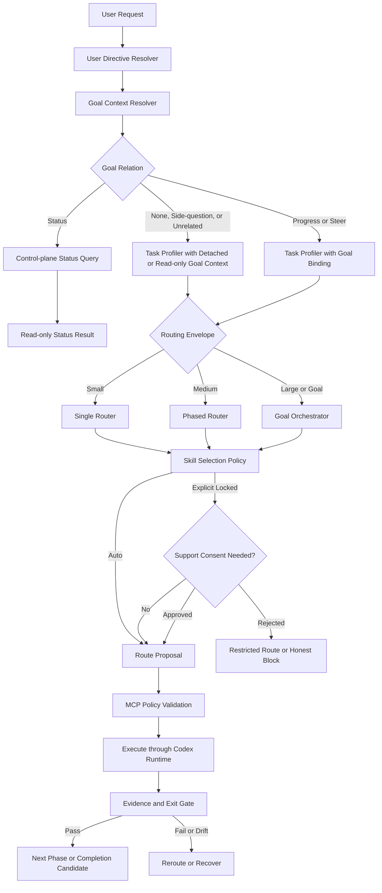

# Workflow Skill Router V2 架構設計

> Status: Approved for specification
> Date: 2026-07-15
> Scope: Workflow Skill Router V2、可選 Plugin/MCP companion、純 SKILL fallback
> Language: 繁體中文
> Decision: 採用方案 B「Hybrid Orchestration Core」

## 1. 決策摘要

Workflow Skill Router V2 不再只是靜態 SKILL 清單與關鍵字路由器。它是一個 Codex-first、schema 可攜的工作編排系統，由兩個互補平面組成：

- Model Semantics Plane：由模型理解意圖、拆解工作、提出路由與語意判斷。
- Deterministic Control Plane：由 Plugin/MCP 管理 capability snapshot、狀態轉移、policy validation、證據、評測與稽核。

V2 必須同時支援：

1. 小型任務：Single Router，只做一次最小路由。
2. 中型任務：Phased Router，每一階段重新判斷最適 SKILL。
3. 大型任務或 Goal 模式：完整 Goal Orchestrator，將目標拆成 Work Graph、Work Item 與 Phase Run。
4. 使用者指定 SKILL：指定項目優先並鎖定；任何 Router 推薦的輔助 SKILL 都必須先取得使用者同意。

第 4 項不是與前三項互斥的任務規模，而是橫跨所有規模的 Skill Selection Policy。指定 SKILL 不得讓中型任務跳過 Phase，也不得讓大型／Goal 任務跳過 Work Graph。

V2 的核心成果不是「推薦更多 SKILL」，而是：

- 只啟用當下真正可用且必要的能力。
- 讓每個工作階段都有可驗證、可恢復、可追蹤的狀態。
- 在真實模型執行環境中證明 Router 有降低過度路由、返工與錯誤完成。

## 2. 背景與問題

V1 已具備公開 starter、skill scanner、route validator、80 個 fixture benchmark、route cases 與文件網站，足以證明路由規則可以被靜態驗證。但它仍有三個根本限制：

- 執行前不知道當前 runtime 真正暴露、授權或可呼叫哪些 SKILL、MCP、Plugin 與工具。
- 多階段或長時間工作沒有正式 state machine，難以安全 resume、reroute、驗證與判定完成。
- fixture 命中率只能證明預先填寫的 prediction 符合 expected route，不能證明新模型在隔離執行中真的會正確選擇並完成任務。

Codex 的 Goal 模式又帶來另一層需求：一個 native Goal 可能包含多個 Work Item，而每個 Work Item 或 Phase 需要不同 SKILL。Router 若只在 Goal 開始時選一次全域 SKILL 組合，會產生 context 浪費、能力誤用與完成狀態失真。

## 3. 目標

- 動態發現目前 runtime 的能力並建立不可變 Capability Snapshot。
- 依任務規模選擇 Single、Phased 或 Managed Goal 編排。
- 對每個 Phase 重新路由，而不是讓一組 SKILL 支配整個任務。
- 尊重 native Goal 的 host ownership，不建立競爭的第二套 Goal。
- 對使用者明確指定的 SKILL 提供可稽核的 lock 與 consent policy。
- 以 event-sourced state、evidence gate 與 optimistic concurrency 支援 crash recovery 與 resume。
- 建立隔離、盲測、可重複的真實模型評測。
- 在 Plugin/MCP 不可用時保留可用但功能較少的純 SKILL fallback。
- 預設 local-first、無 telemetry、無秘密外洩。

## 4. 非目標

- 不取代 Codex sandbox、approval policy、tool permission 或安全政策。
- 不讓 MCP 建立、完成、阻塞、暫停、恢復或清除 native Goal。
- 不自動安裝 Plugin、登入 connector、取得 production credential 或提升權限。
- MVP 不自動建立多個 native Goal，也不自動派生平行 agent。
- 不以單一 model judge 或 composite score 作為 release gate。
- 不在第一版導入微服務、雲端控制平面、向量資料庫或 marketplace。
- 不把任何特定模型名稱或版本寫死為架構前提；實際 model revision 記錄於 evaluation manifest。

## 5. 設計原則與不變量

以下條件是跨元件硬性不變量：

1. 每個 Route 必須綁定一個 immutable Capability Snapshot。
2. 任務規模、Goal 關係、Skill policy、risk 與 runtime mode 是正交維度。
3. 每次 Phase transition 都必須記錄 actor、event、state version 與時間。
4. 沒有有效 evidence，不得通過 mandatory gate。
5. 沒有 consent，不得啟用 Router 推薦的輔助 SKILL。
6. Consent 只代表允許使用 SKILL，不代表 runtime permission。
7. System、developer、安全與 runtime 要求永遠高於 Router policy。
8. MCP 只能產生 native Goal 的狀態候選，不能直接改變 host Goal 狀態。
9. Goal status、side question 與 unrelated message 不得改變 semantic revision。
10. Completed Phase 不可覆寫或 reopen；後續修正必須建立 correction／revalidation Phase。
11. R2／R3 操作前必須重新驗證 capability、approval、state version 與 action digest。
12. Evaluation runner 不得取得 expected answer、rubric 或可洩漏答案的 artifact metadata。

## 6. 系統邊界與所有權

| 元件 | 擁有的責任 | 明確不擁有 |
|---|---|---|
| Codex host/runtime | native Goal、pause/resume/clear、sandbox、approval、最終 Goal status、實際 tool exposure | Router 內部 Work Graph 與評測資料 |
| Agent adapter | 讀取 host context、同步 Goal/runtime snapshot、將候選狀態交回 host | 自行授權或偽造 host state |
| Router SKILL | 意圖理解、任務分類、路由提案、fallback 流程 | 權限提升與持久化真相 |
| Router MCP | snapshot、state machine、policy validation、evidence、evaluation、artifact export | native Goal ownership 與 runtime approval |
| Model | 語意分類、工作拆解、候選路由、有限的主觀評估 | 覆寫 deterministic gate 或 policy |
| Local store | append-only event、projection、metadata、sanitized export | 儲存秘密與未經同意的遙測 |

Runtime permission 是最後權威。即使 Router、使用者或 model 同意某個行動，host 仍可拒絕。

## 7. 架構總覽



Plugin/MCP 是能力增強，不是單點依賴。MCP 不可用時，Router SKILL 使用相同語意 contract 執行簡化版路由，但必須揭露哪些保證變成不可觀測或不支援。

## 8. 統一路由決策模型

```text
RequestDecision =
  goal_relation: none | progress | steer | status | side-question | unrelated
  execution_kind: control-query | routed-work
  routing:
    envelope: single | phased | managed-goal
    skill_policy: auto | explicit-locked
    risk: R0 | R1 | R2 | R3
    runtime_mode: skill-only | hybrid
```

`routing` 只在 `execution_kind=routed-work` 時存在。`goal_relation=status` 使用 `control-query`，不建立 Work Item、Phase 或 Routing Envelope；其餘工作才進入 Task Profiler。

### 8.1 決策優先序

1. System、developer、安全與 runtime policy。
2. 使用者明確指定的 SKILL 與「只使用」限制。
3. 使用者明確指定的工作模式。
4. Native Goal context 與本訊息對 Goal 的關係。
5. Task size classifier。
6. Router 推薦。

低優先序不得靜默覆寫高優先序。若發生衝突，必須揭露原因與可行替代方案。

### 8.2 User Directive Resolver

解析下列指令並保留原文與正規化結果：

- 指定一個或多個 SKILL。
- 指定「只用 X」、「X 優先」、「X 與 Y 都要用」。
- 指定 Single、Phased 或 Goal-like 執行。
- 禁止某個 SKILL、Plugin、外部服務或副作用。
- 要求先詢問再加入支援能力。

多個指定 SKILL 必須辨識語意：

| 模式 | 意義 |
|---|---|
| `required_all` | 所有指定 SKILL 都必須使用 |
| `allowed_set` | 只能從指定集合中選擇 |
| `preferred_primary` | 指定主要 SKILL；支援能力仍受 consent policy 約束 |

預設解析規則：

- 「使用 X」或只點名一個 SKILL：`preferred_primary`，且完成 coverage 必須證明 X 確實被使用。
- 「只用 X」：`allowed_set` + `support_policy=forbid`。
- 「X、Y 都要用」：`required_all`。
- 只列出多個 SKILL、但無法判斷是全部必用或允許集合：執行前詢問使用者，不得自行猜測。

Explicit Skill Lock 的預設 scope 是本次使用者請求所形成的 Workflow Run，因此小型任務涵蓋該次 single route，中型任務涵蓋所有 Phase，大型／Goal 任務則涵蓋由該請求新增或修改的 Work Item。使用者可以明確把 scope 限縮到目前 Phase，或擴大到整個 Goal。

### 8.3 Task Profiler 與 Routing Envelope

Risk 與 size 分開計算；單一步驟的 production 操作仍可能是 R3。

| Envelope | 判斷特徵 | 編排契約 |
|---|---|---|
| `single` | 單一意圖、單一 domain、無跨階段 dependency、可在本次工作驗證 | 一個 Work Item、一個 Phase Run、一次 route |
| `phased` | 同一目標含兩個以上相異階段或 layer，但範圍有界 | 建立 Phase Plan；每個 Phase 都重新 route、驗證與 gate |
| `managed-goal` | 多 milestone、長時間、可 resume、跨 repo、dependency DAG、budget，或 active native Goal 中的 progress／steer 訊息 | 建立 Goal Binding／Managed Goal、Work Graph；每個 Work Item 再分類成 single 或 phased |

使用者指定「小任務模式」只能影響目前 Work Item；若外層已有 native Goal，Goal Binding 仍然存在。

### 8.4 小型任務

- 預設一個 primary SKILL，最多一個經同意的 optional support。
- 不建立多階段 plan 或完整 Goal DAG。
- 為保持 audit 與 evaluation 一致，hybrid mode 仍使用一個 Work Item 與一個 Phase Run。
- 只有 R0、明確標記 `ephemeral=true` 的工作可以不落盤；此時不支援 resume 與完整 behavioral audit。
- 極簡命令可回覆「不需要額外路由」，但仍受安全與 runtime policy 約束。

### 8.5 中型任務

- 先建立有界 Phase Plan。
- 只為 current Phase 啟用所需 SKILL。
- Phase 完成後重新取得 context 與 capability snapshot，再判斷下一階段 route。
- 禁止把整個任務的所有可能 SKILL 一次載入。
- Phase failure、drift、Goal steer、resume 或新 evidence 都可觸發 reroute。

### 8.6 大型任務或 Goal 模式

- 使用完整 Work Graph，節點是 Work Item，邊是 dependency。
- 每個 Work Item 必須再次分類為 `single` 或 `phased`。
- 不建立 nested native Goal；分解留在 Router Work Graph。
- 沒有 active native Goal 的大型任務使用 internal managed-goal flow。
- Router 只能建議切換 native Goal；只有使用者明確要求時，agent 才能呼叫 host Goal 建立能力。
- MVP 可偵測平行機會，但預設 sequential。人工或多 agent 平行時必須取得 resource lock，且 write scope 不得重疊。

### 8.7 任務規模與指定 SKILL 組合矩陣

| 任務情境 | Envelope 保留 | Explicit Skill 行為 | 未核准其他 SKILL |
|---|---|---|---|
| 小型＋未指定 | `single` | Router 自動選最小 route | 不適用 explicit consent |
| 小型＋指定 | `single` | 指定 SKILL 鎖定本次 route | 不得啟用 |
| 中型＋未指定 | `phased` | 每個 Phase 自動重新 route | 不適用 explicit consent |
| 中型＋指定 | `phased` | Lock 跨所有 Phase；每一 Phase 記錄指定 SKILL disposition | 不得因 phase change 偷換 |
| 大型／Goal＋未指定 | `managed-goal` | 每個 Work Item／Phase 自動 route | 不適用 explicit consent |
| 大型／Goal＋指定 | `managed-goal` | Lock 套用到本次請求影響的 Work Item／Phase | 不得讓 Goal 分解繞過 lock |

每個受 lock 影響的 Phase 都必須對每個指定 SKILL 記錄：

- `active-primary`
- `active-required`
- `allowed-not-selected`
- `not-applicable`
- `unavailable`
- `blocked-by-policy`

`required_all` 不允許 `allowed-not-selected` 或無說明的 `not-applicable`。若使用者要求「只用 X」，所有 user-level Router 選擇都只能啟用 X；上層強制能力依第 9.7 節揭露。某階段超出 X 能力時，必須限縮成果或 honest block。若使用者要求「X 為主」，Phase 不適用 X 時不能靜默改用 Y，必須提出新的 support proposal 並取得同意。

### 8.8 指定 SKILL 的實際流程

小型任務：

1. 建立 single envelope 與 explicit lock。
2. 只用 metadata 驗證指定 SKILL 是否 available。
3. 若不需要支援，載入指定 SKILL 並執行。
4. 若 Router 建議支援，先提出一次 consent proposal。
5. 核准後才載入支援；拒絕後只用指定 SKILL，或因能力不足產生 limited／blocked 結果。

中型任務：

1. 先建立 Phase Plan；拆階段不等於獲准載入其他 SKILL。
2. Explicit lock 由 Workflow Run 繼承到每個 Phase。
3. 每個 Phase 先記錄所有指定 SKILL disposition，再提出 route。
4. 某 Phase 需要其他支援時，只能提出預設為該 Phase scope 的 consent proposal。
5. 下一 Phase 重新 route，但不能重用已過期 consent、繞過 rejection 或靜默加入新 SKILL。
6. 使用者拒絕支援後，後續 plan 必須以指定 SKILL 的真實能力重新計算；無法達成的 exit gate 不得被刪除來製造完成。

## 9. Explicit Skill Lock 與 Consent Policy

### 9.1 Policy schema

```text
SkillSelectionPolicy:
  mode: auto | explicit-locked
  explicit_skills: SkillConstraint[]
  explicit_semantics: required_all | allowed_set | preferred_primary
  support_policy: ask | forbid | approved
  approved_support: ConsentGrant[]
  rejected_support: ConsentRejection[]
  consent_scope: route | phase | work-item | workflow | goal
  explicit_lock_scope: route | phase | work-item | workflow | goal
  scope_anchor_id
  plan_revision: integer
```

每個選擇都必須記錄 `selection_origin`：

- `system-required`
- `developer-required`
- `safety-runtime-required`
- `user-explicit`
- `router-recommended`

只有 `router-recommended` 需要 support consent。平台強制要求不能偽裝成「推薦」，也不能讓 consent 否決；Router 必須清楚揭露它是上層必要條件。

```text
SelectionAuthority:
  selection_origin
  authority_ref
  runtime_policy_snapshot_id
  policy_digest
  derived_by: router-core
```

`system-required`、`developer-required` 與 `safety-runtime-required` 只能由 router-core 根據 immutable runtime-policy snapshot 或已驗證 directive event 在 server side 派生。Client／model 不得自行提交 forced origin。若 `validate_route` 無法驗證 authority reference 與 policy digest，該項一律降為 `router-recommended` 並套用 consent，不得簽發免 consent lease。

為避免以工具繞過規則，Router 推薦的 Plugin、MCP tool 或 app 若是完成指定 SKILL 之外的新支援角色，也視為 support capability 並套用相同 consent。只有下列能力可視為指定 SKILL 的既有執行需求：

- Router schema 登錄的版本化 base-runtime primitive。
- 該 SKILL manifest `requirements[]` 宣告，且通過獨立 requirement trust policy 的非 SKILL capability。

Schema validation 不等於 requirement 已受信任。額外 `kind=skill` 永遠受 explicit lock／consent 約束；「只用 X」不能因 X 的 manifest 宣告 dependency 而自動啟用 Y。Plugin／MCP requirement 必須綁定可信 provider provenance、purpose、fingerprint 與 side-effect class；remote 或 privileged requirement 至少要揭露並取得對應 capability consent 與 runtime approval。不可信或超出 allowlist kind 的 requirement 只能讓 X 標記 degraded／blocked，不能自動擴權。

Agent 不能自行把新 MCP／Plugin 宣稱為「一般工具」來免除 consent。即使是已宣告需求，仍受 runtime permission 約束；安裝 Plugin、登入或新增 connector 永遠需要獨立授權。

### 9.2 什麼算啟用 SKILL

以下任一行為都算 activation：

- 讀取完整 `SKILL.md` instruction body。
- 將 SKILL 加入 active route。
- 依照該 SKILL 的工作規則採取行動。
- 呼叫該 SKILL 或 Plugin 專屬能力。

Capability Discovery 只能讀取可信 manifest、frontmatter 或衍生 metadata。它不得讀取完整 instruction body，並把該行為包裝成 discovery。

### 9.3 Support proposal

Router 每個 consent scope 最多提出三個不同的輔助 SKILL，並說明：

- 用途與負責的工作。
- 在該 scope 的 proposed role（primary 或 support）。
- 生效 scope。
- 拒絕後的限制或風險。
- 預估 context cost。

在使用者批准前，不得讀取、載入或使用該輔助 SKILL。

### 9.4 ConsentGrant

```text
ConsentGrant:
  capability_id
  capability_kind
  capability_fingerprint
  purpose
  role
  scope
  scope_anchor_id
  work_item_id
  phase_id
  goal_binding_id
  goal_revision
  plan_revision
  context_fingerprint
  approved_by
  approved_at
  expires_at
```

Support consent 預設只涵蓋 current Phase；小型任務尚無獨立 Phase context 時，預設涵蓋該 single route。跨 Phase、Work Item、Workflow 或 Goal 的批准必須由使用者明確給出。

```text
ConsentRejection:
  capability_id
  purpose
  scope
  scope_anchor_id
  work_item_id
  phase_id
  goal_binding_id
  goal_revision
  plan_revision
  context_fingerprint
  rejected_by
  rejected_at
```

Fingerprint、用途、scope、phase、plan revision 或 Goal revision 發生 material change 時，原 consent 失效。被拒絕的支援能力在相同 scope 不得重問；只有 material context fingerprint 改變時可重新提案，且必須說明改變原因。單純重排未受影響 Phase 的 plan revision 不構成 material change。

### 9.5 Scope inheritance

```text
ScopeAnchor:
  scope_anchor_id
  anchor_kind: route | phase | work-item | workflow | goal
  aggregate_id
  parent_scope_anchor_id
  semantic_scope_digest
  created_revision
```

- Explicit lock 對所有 descendant scope 採 deny-by-default 繼承。
- Replan、reroute 或替換 Phase 必須保留原 semantic scope anchor，不得因產生新 Phase ID 解除 lock。
- Rejection 以 capability、purpose class、scope anchor 與 material context fingerprint 比對，不只看暫時性的 `phase_id`。
- Consent 只能依明確 scope 向下匹配；較窄 consent 不得套用到 sibling／下一 Phase。
- 較廣 consent 必須由使用者明確授予，不能由 Router 自動升級。
- Fingerprint、purpose 或 material context 改變時，既有 consent 失效；是否可重問仍需說明變更。

### 9.6 Explicit skill completion coverage

```text
ExplicitSkillCoverage:
  scope_anchor_id
  explicit_semantics
  skill_id
  required_disposition
  activation_evidence_refs[]
  primary_route_refs[]
  user_exception_confirmation
  status: uncovered | satisfied | waived-by-user | blocked
```

Single、Phased、Managed Goal 的完成 gate 都必須檢查 coverage：

- `required_all`：每個指定 SKILL 都必須在 lock scope 內有實際 activation evidence；否則只能 limited／blocked，或由使用者修改要求。
- `preferred_primary`：指定 SKILL 至少實際成為一次 primary；若整個 scope 都不適用，完成前必須取得使用者確認。
- `allowed_set`：所有非上層強制的 activation 都必須位於集合內，或有有效的 support consent。
- Phase disposition 不能取代 scope-level coverage；全部標記 `not-applicable` 不得自動通過。

### 9.7 拒絕與不可用處理

- 指定 SKILL 足夠：只使用指定 SKILL 繼續。
- 僅能涵蓋部分範圍：限定執行範圍並揭露缺口。
- 無法安全或誠實完成：進入 blocked／limited handoff，不得宣稱完整完成。
- 指定 SKILL 不存在、未暴露或需登入：回報實際狀態，提供安裝、登入或重新選擇選項，不得靜默替代。
- `support_policy=forbid` 時，不得提出 Router support；這就是「只用 X」的 user-level 語意。
- System、developer 或 safety-runtime 強制能力不受 user-level allowed set 限制，但必須揭露 origin，不能偽裝成使用者同意，也不計入未核准 Router support violation。

Consent 永遠不等於寫檔、部署、傳訊、production access 或安裝 Plugin 的 runtime approval。

### 9.8 Execution lease

`validate_route` 通過後產生短效、不可擴權的 execution lease：

```text
ExecutionLease:
  lease_id
  workflow_run_id
  phase_id
  scope_anchor_id
  route_id
  capability_snapshot_id
  policy_revision
  state_version
  allowed_capabilities:
    - capability_id
      capability_fingerprint
      selection_origin
      authority_ref
      policy_digest
      purpose
      consent_grant_ref
  issued_at
  expires_at
```

MCP authorization 分成四類，避免 bootstrap 循環：

1. Bootstrap／control-plane tools：`sync_runtime_context`、`plan_work`、`validate_route`、`get_next_work`、`evaluate_gate`、`get_router_status` 不需要有效 execution lease，但必須驗證 session、runtime-policy snapshot、actor、input schema、expected state version 與 idempotency。`evaluate_gate` 另須綁定 evidence digest 與 plan revision；可引用原 lease 作關聯，但 lease 過期不得阻止評估，且 gate evaluation 不得執行新副作用。
2. Route-selected execution capabilities：每次 invocation 都必須核對 lease、capability、fingerprint、purpose、state version 與 expiry，不能只在 route 建立時驗證一次。
3. Evidence／outcome reporting：必須引用原 execution lease、side-effect intent 與 action digest；lease 過期不得阻止登錄既有結果，但只能追加 observation／outcome，不能藉此執行新行動。
4. Evaluation／export tools：使用獨立 Eval Run authorization、artifact policy 與 review attestation，不使用 route execution lease。

Host-native tool 若不經 Router MCP，仍由 host permission 控制；adapter 必須記錄 invocation observation，evaluation 將未列入 lease 且非上層強制的 route-execution 能力視為 policy violation。

## 10. 核心架構一：Runtime Capability Discovery

### 10.1 Capability 的獨立狀態

Discovery 不得把「磁碟上存在」誤認成「目前可使用」。不同 capability kind 不一定有安裝概念，因此使用可表達 `not-applicable` 的狀態：

- `presence`：`present | absent | not-applicable | unknown`
- `exposure`：`exposed | not-exposed | unknown`
- `auth_state`：`authorized | required | not-required | unknown`
- `eligibility`：`eligible | ineligible | unknown`
- `compatibility`：`compatible | incompatible | unknown`
- `freshness`：觀測時間、期限與 risk-specific freshness result

Filesystem SKILL／Plugin 的 `presence` 來自安裝狀態；host tool 或 runtime app 通常是 `not-applicable`。檔案掃描只能直接證明檔案型 capability 的 presence，不能證明 exposure 或 authorization。

### 10.2 Provider adapters

V2 依序整合：

1. Native Host Provider：若 host 提供正式 capability API，取得 runtime-authoritative exposure。
2. Plugin Handshake Provider：取得 MCP tool schema、server health、authentication state。
3. Agent Runtime Snapshot Provider：由 agent 將本次 task 實際看到的 skills/tools/context 同步進 MCP。
4. Filesystem Metadata Provider：掃描允許範圍內的 SKILL frontmatter 與 manifest。
5. Cached Snapshot Provider：其他來源暫時失效時提供 degraded fallback。

權威不是單一物件覆蓋，而是 field-level merge：

- Runtime exposure 與 approval 以 host 為準。
- MCP tool health 與 schema 以 plugin handshake 為準。
- SKILL metadata 與 content fingerprint 以受信任檔案來源為準。
- Cache 永遠不能把 unavailable 提升為 available。

每個欄位保留 `provider`、`observed_at`、`trust_level` 與 `reason_code`。

### 10.3 Capability schema

```text
Capability:
  canonical_id
  display_name
  kind: skill | mcp-tool | plugin | app | host-tool
  source
  presence
  exposure
  auth_state
  eligibility
  compatibility
  freshness
  availability
  description
  domains[]
  stages[]
  side_effect: none | local | remote | privileged
  requirements[]
  aliases[]
  conflicts[]
  context_cost
  capability_fingerprint
  provenance[]
```

`availability` 使用：

- `available`
- `unavailable`
- `auth-required`
- `degraded`
- `stale`
- `unknown`
- `incompatible`

Availability 以 deterministic precedence 派生，並保留所有次要 reason flags：

1. `incompatible`：已知 schema、runtime 或版本不相容。
2. `unavailable`：presence absent、not-exposed 或 policy ineligible。
3. `auth-required`：其他條件可用，但 authentication 尚未完成。
4. `unknown`：任一必要的 authoritative state 仍未知。
5. `stale`：超過該 risk 的 freshness threshold。
6. `degraded`：只能使用低信任 provider、部分 schema 或 fallback，但仍可有限執行。
7. `available`：presence 為 present／not-applicable、exposed、authorized／not-required、eligible、compatible，且 freshness 符合要求。

Canonical ID 優先使用 provider namespace 與 manifest ID；若只有檔案型 SKILL，使用正規化 skill name 加 source namespace。Alias／rename 必須保存 lineage。Local 與 Plugin 同名時不得只靠 display name 去重。

Fingerprint 必須涵蓋會改變 routing semantics 的 metadata、tool schema 與 policy requirement。純說明文字或時間戳變更可以標記 metadata drift，不必自動中止 active Phase。

### 10.4 Immutable Capability Snapshot

```text
CapabilitySnapshot:
  snapshot_id
  schema_version
  created_at
  runtime_fingerprint
  provider_revisions[]
  capabilities[]
  drift_from_snapshot_id
  freshness
```

- Snapshot 建立後不可修改。
- Route、Gate Decision、Goal Candidate 與 Eval Run 都必須保存 `snapshot_id`。
- Drift 類型包含 add、remove、rename、semantic metadata、tool schema、auth、policy 與 runtime exposure。
- R0／R1 可在明示 degraded 的情況下接受有限 stale snapshot。
- R2／R3 執行前必須取得 fresh preflight。
- Capability 在 validation 後消失時，不得依舊 route 執行，必須 reroute 或 blocked。

### 10.5 Scanner 安全

本機 SKILL 視為不可信輸入。Filesystem provider 必須限制：

- 掃描 root 與檔案大小。
- Path traversal、junction 與 symlink escape。
- 無效 UTF-8、異常 frontmatter、重複 key 與 parser abuse。
- 可能的秘密、credential 與私人 path 不得進入 public artifact。
- Metadata parser 不執行 instruction，也不把 prompt injection 當設定。

### 10.6 Discovery flow

1. 讀取本次 host/runtime context。
2. 平行查詢可用 provider。
3. 依 field authority 合併並保留 provenance。
4. 驗證 schema、identity 與 policy。
5. 產生 immutable snapshot。
6. 與上一 snapshot 比較 drift。
7. 讓 route validator 只接受綁定 snapshot 的 capability。

目標是在 1,000 個 capability 的 warm discovery 下於 2 秒內完成。

## 11. 核心架構二：Phase State Machine

### 11.1 WorkflowRun 與 PhaseRun

```text
WorkflowRun:
  workflow_run_id
  parent_workflow_run_id
  objective
  scope
  constraints
  envelope
  status
  plan_revision
  capability_snapshot_id
  current_phase_id
  paused_from_status
  awaiting_from_status
  pause_reason
  state_version

PhaseRun:
  phase_id
  work_item_id
  name
  status
  routing_query
  route
  capability_snapshot_id
  risk
  entry_conditions[]
  exit_gate
  evidence_refs[]
  inserted
  sequence_source
  supersedes_phase_id
  paused_from_status
  awaiting_from_status
  pause_reason
  state_version
```

Workflow status enum：

- 可推進：`draft`、`discovering`、`planned`、`running`、`gate-evaluating`、`rerouting`
- 可等待／恢復：`awaiting-approval`、`paused`、`blocked`
- 終止：`completed`、`cancelled`、`failed`

常見 happy path 是 `draft → discovering → planned → running → gate-evaluating → completed`，但等待、reroute 與失敗只能依顯式 transition table 進出，不得把 enum 視為任意可互換狀態。

Phase status enum：

- 可推進：`pending`、`ready`、`active`、`verifying`、`rerouting`
- 可等待／恢復：`awaiting-approval`、`paused`
- 終止：`completed`、`skipped`、`failed`

### 11.2 核心 transition contract

Workflow transition：

| From | To | Actor | Guard／必要條件 | 恢復／失敗 |
|---|---|---|---|---|
| draft | discovering | orchestrator | objective 與 directive 已解析 | draft／failed |
| discovering | planned | orchestrator | capability snapshot 與初始 plan 有效 | discovering／blocked |
| planned | running | scheduler/agent | next Phase ready，route／lock／approval 可執行 | rerouting／awaiting-approval |
| running | gate-evaluating | agent | current Phase 進入 verifying | running／failed |
| gate-evaluating | running | gate evaluator | current Phase 完成，仍有 required work | rerouting／awaiting-approval |
| gate-evaluating | completed | gate evaluator | acceptance coverage 完整且 complete candidate 有效 | running／blocked |
| any non-terminal | awaiting-approval | policy validator | 缺 consent 或 runtime approval；保存 `awaiting_from_status` | 原狀態／blocked |
| any non-terminal | rerouting | orchestrator | drift、steer、resume、failure 或新 evidence | planned／running／blocked |
| any non-terminal | paused | host/agent adapter | 保存 `paused_from_status` 與 reason | 原狀態／rerouting／cancelled |
| any non-terminal | blocked | orchestrator/host adapter | 符合對應 workflow／Goal blocked contract | running／cancelled |
| any non-terminal | failed/cancelled | policy/host/agent | 不可恢復錯誤或明確取消 | 終止；新建 correction workflow |
| awaiting-approval | rerouting | policy validator | 所需 consent／approval 已取得且仍有效 | planned／running／blocked |
| paused | rerouting | host/agent adapter | host resume；先 refresh context | planned／running／cancelled |
| blocked | rerouting | host/agent adapter | blocker material change 或 resumed Goal 重啟 audit | planned／running／cancelled |
| rerouting | planned/running | orchestrator | 新 plan／route 通過 validation 與 revision guard | awaiting-approval／blocked |

Phase transition：

| From | To | Actor | Guard／必要條件 | Evidence／Consent／Approval | 恢復路徑 |
|---|---|---|---|---|---|
| pending | ready | orchestrator | dependencies 與 entry conditions 滿足 | dependency evidence fresh；不消耗 consent | 保持 pending |
| ready | active | scheduler/agent | route 已驗證、snapshot 符合 freshness、resource lock 成功 | 所需 support consent 有效；R2/R3 runtime preflight 通過 | rerouting／awaiting-approval |
| active | verifying | agent | 執行結果與必要 evidence 已登錄 | 所有必要 side-effect outcome 必須已知；unknown 禁止進入 verifying | active／failed／awaiting-approval |
| verifying | completed | gate evaluator | 所有 mandatory gate 通過，CAS 成功 | evidence digest 與 workspace revision 相符 | active／rerouting／failed |
| ready/active | awaiting-approval | policy validator | consent 或 runtime approval 缺少，或 side-effect outcome 未知；保存 `awaiting_from_status` | 保存 proposal／intent，不得視為已批准 | active／blocked |
| any non-terminal | rerouting | orchestrator | drift、steer、failure、resume 或新 evidence | 原 consent 需重新驗證，不自動擴大 scope | ready／blocked |
| any non-terminal | paused | host/agent adapter | host pause 或 reconciliation；保存 `paused_from_status` | 不產生新的 runtime approval | 原狀態／rerouting／cancelled |
| any non-terminal | failed | policy/agent | 不可恢復錯誤或 retry exhaustion | 保存 failure evidence | correction Phase／blocked |
| pending/ready | skipped | orchestrator/user | Phase 因新 revision 不再需要，且未產生 side effect | 記錄 skip reason；不得偽裝為 gate pass | correction Phase |
| awaiting-approval | rerouting | policy validator | consent／approval 已取得，或 unknown outcome 已人工確認 | 重新驗證 lease 與 evidence | ready／blocked |
| paused | rerouting | host/agent adapter | host resume 或 reconciliation 完成 | refresh snapshot／evidence | ready／skipped／cancelled |
| rerouting | ready | orchestrator | replacement route 通過 validation，無 lock conflict | 新 execution lease | awaiting-approval／blocked |
| verifying | active/rerouting/failed | gate evaluator | mandatory gate 未通過 | 保存 gate failure evidence | verifying／correction Phase |

只有允許 actor 可以提出 transition；真正寫入使用 compare-and-swap：

```text
expected_state_version
expected_evidence_digest
expected_plan_revision
next_state
```

若任一值改變，transition 失敗並重新評估，避免 gate 通過後發生 TOCTOU。

### 11.3 Active Phase 與平行工作

MVP 中，每個 Workflow Run 同一時間最多一個 active Phase Run；每個 managed Goal 可以有多個 ready Work Item，但預設 scheduler 只啟動一個。若由 host 或多 agent 進行平行工作，每個 Work Item 必須建立獨立 child Workflow Run，並遵守：

- 每個 Work Item 宣告 read/write resource scope。
- Write scope 不得重疊。
- 建議使用獨立 worktree 或等價隔離。
- Resource lock 失效時不得繼續寫入。

### 11.4 Risk model

| 等級 | 定義 | 例子 |
|---|---|---|
| R0 | 只讀、無外部副作用 | 分析、搜尋、解釋 |
| R1 | 本機且可逆 | 編輯檔案、執行測試、本機 commit |
| R2 | 遠端但通常可逆 | 建立 PR、更新 issue、上傳 draft |
| R3 | 高影響或難逆 | 部署、production data、發送訊息、刪除、權限變更 |

R2／R3 必須有 intent 與 outcome 雙事件。Side-effect attempt 另有 `pending`、`confirmed-success`、`confirmed-failure`、`unknown` 狀態，不混入 Phase status：

1. 執行前記錄 action digest、target、approval reference。
2. 執行後記錄 confirmed success 或 confirmed failure。
3. Crash 後無法確認結果時，將 outcome 標記 `unknown`，Phase 進入 `awaiting-approval`；不得自動重試可能非冪等操作。

### 11.5 Gate contract

```text
ExitGate:
  aggregation: all | any | expression
  checks:
    - type
      mandatory
      freshness
      timeout
      retry_policy
      expected_result
      evidence_ref
```

支援 check type：

- command、test、build
- artifact、diff、workspace revision
- runtime health
- model assessment
- user confirmation
- runtime approval

規則：

- Mandatory check 失敗不得被 advisory check 抵銷。
- Hard test、runtime 與 approval gate 不得被 model judge 覆寫。
- Model assessment 必須附 confidence、reason 與 evidence reference。
- Evidence 必須綁定 workspace revision／commit hash、產生時間與 digest。
- 過期 evidence 不得用於完成 transition。
- Command evidence 必須記錄 exit code、timeout 與 retry 次數。

### 11.6 Workflow completion candidate

所有 routed-work，不論是否屬於 Goal，都使用通用完成候選：

```text
WorkflowCompletionCandidate:
  workflow_completion_candidate_id
  workflow_run_id
  objective_digest
  envelope
  plan_revision
  workflow_state_version
  capability_snapshot_id
  acceptance_coverage_digest
  explicit_skill_coverage_digest
  evidence_digest
  side_effect_outcome_digest
  unresolved_blocker_count
  pending_approval_count
  generated_at
```

Single workflow 至少從正規化使用者請求與限制建立一個 acceptance criterion；Phased workflow 則把 criterion 映射到 Phase gate。只有 mandatory coverage 完整、Explicit Skill Coverage 有效、side-effect outcome 已知、沒有 blocker／待 approval，且所有 digest 與 state version 仍相符時，才能讓 Workflow 進入 `completed`。

Goal completion 不另發明工作完成語意；它聚合 required Work Item 的有效 `WorkflowCompletionCandidate`，再檢查 Goal-level acceptance coverage。

### 11.7 Reroute 與防震盪

Reroute 觸發條件：

- capability drift
- Goal steer 或 Goal edit
- Phase failure
- resume
- 新 evidence 改變前提
- explicit skill availability／fingerprint 改變
- consent 失效

每次 reroute 保存 input fingerprint 與原因。相同 fingerprint 的重複 reroute 有上限；超過上限後進入人工判斷或 blocked，不得無限震盪。

### 11.8 Completed Phase 不可變

Completed Phase 只可追加 annotation，不得修改原 state、route 或 evidence。若 Goal revision、workspace drift 或新資訊讓舊結果失效：

- 建立新的 correction／revalidation Phase。
- 使用 `supersedes_phase_id` 指向原 Phase。
- 保留原始完成歷史與 evidence。

## 12. Goal-aware Orchestration

### 12.1 層級模型

```text
Codex Native Goal (host-owned)
  -> Goal Binding (Router projection)
    -> Goal Work Graph (DAG)
      -> Milestone
        -> Work Item
          -> Single or Phased Route
            -> Phase Run
```

若沒有 native Goal，大型任務可由 internal managed-goal 承載相同 Work Graph，但不得偽裝成 Codex native Goal。

### 12.2 Goal Binding

```text
GoalBinding:
  goal_binding_id
  host_goal_id
  goal_revision
  host_goal_revision
  objective_digest
  objective_snapshot
  status_snapshot
  budget_snapshot
  synced_at
  source: native | managed
```

Agent adapter 負責讀取 host Goal 並呼叫 `sync_runtime_context`。MCP 不假設能直接呼叫 host Goal API。Native binding 必須有 `host_goal_id` 與 `host_goal_revision`；managed binding 的兩個 host 欄位為 null，但仍有 Router 自己遞增的 `goal_revision`。

### 12.3 Goal message relation

每個新訊息先分類：

- `progress`：提供執行結果或允許繼續，可能推進 Work Graph。
- `steer`：修改目標、限制或優先序，產生新 Goal／plan revision。
- `status`：只詢問狀態，不改變 semantic revision。
- `side-question`：Goal 相關但不屬於工作推進，不改變 semantic revision。
- `unrelated`：獨立工作，不變更 Goal。

`GOAL_SIDE_QUERY_OBSERVED` 可以寫入 append-only audit event，但不可改變 Goal、Work Graph、Phase 或 plan revision。評測指標檢查的是 semantic mutation 為零，而不是資料庫完全零寫入。

Goal Context Resolver 必須在 Task Profiler 前套用短路規則：

| Relation | Routing 行為 | Semantic mutation |
|---|---|---|
| `progress` | 進入既有 managed-goal，更新 evidence 或推進下一工作 | 允許，需 event 與 revision guard |
| `steer` | 進入 Goal reconciliation，再重新 plan／route | 允許，建立新 revision |
| `status` | Control-plane query，直接讀取 projection，不建立 Routing Envelope／Work Item／Phase | 禁止 |
| `side-question` | 以獨立 read-only side workflow route；只帶必要 Goal snapshot | 禁止 |
| `unrelated` | 建立與 Goal 分離的 Workflow Run，再依其大小分類 | 禁止 |
| `none` | 一般 Task Profiler | 不適用 |

因此 active native Goal 不代表每則訊息都強制使用 `managed-goal` envelope。只有 `progress` 與 `steer` 進入該 Goal 的完整編排；其他 relation 不得被主題相似度誤併。

### 12.4 Goal edit reconciliation

Goal text 或約束改變時：

1. 建立新的 Goal Binding revision。
2. 已完成歷史保持不變。
3. 未開始 Work Item 可重新規劃。
4. Active Work Item 先 pause，再判斷保留、取消或替換。
5. 新驗證需求使用 correction Work Item／Phase。
6. 不覆寫舊 evidence，也不把舊 evidence 自動套到新 revision。

### 12.5 Completion candidate

MCP 只在以下條件都滿足時產生 `complete-candidate`：

- 所有 required Work Item 完成。
- 原始 Goal 的所有 mandatory acceptance criterion 都被 coverage map 覆蓋。
- Explicit Skill Coverage 全部 satisfied 或具有效 user waiver。
- Final verification gate 通過。
- 沒有 unresolved blocker、unknown outcome 或待 approval。
- Candidate 綁定的 revision 與 evidence 仍有效。

```text
GoalStatusCandidate:
  candidate_type: complete | blocked
  goal_binding_id
  host_goal_id
  goal_revision
  host_goal_revision
  objective_digest
  plan_revision
  workflow_state_version
  capability_snapshot_id
  workflow_completion_candidate_refs[]
  work_item_completion_digest
  evidence_digest
  acceptance_coverage_digest
  explicit_skill_coverage_digest
  generated_at
```

```text
AcceptanceCoverage:
  criterion_id
  source_digest
  mandatory
  work_item_ids[]
  gate_ids[]
  evidence_refs[]
  status: uncovered | planned | evidenced | passed
```

Coverage map 從原始 objective、使用者限制與後續 Goal revision 建立，不能只從 planner 自己生成的 Work Item 反推；否則漏掉的要求永遠不會被檢查。Agent 在呼叫 host 的最終 Goal status 更新前，必須重新比對 candidate。任何 binding、objective、revision、state、snapshot、coverage 或 evidence digest 改變都使 candidate 過期。Managed Goal 只更新 Router workflow status，不呼叫 host Goal API。

### 12.6 Blocked candidate

只有同一 blocker 在三個連續、與 Goal 工作推進有關的 turn 中持續存在，且已耗盡安全替代方案，才可產生 `blocked-candidate`：

- Blocker identity 由 category、target、required authority 與 dependency digest 組成。
- `status`、`side-question`、`unrelated` 不計入三次。
- 仍有其他可執行 required Work Item 時，不得把整個 Goal 判定 blocked。
- Host resume 後重新開始 blocked audit。
- MCP 仍只產生 candidate；最終 blocked 狀態由 host 控制。

### 12.7 Budget、pause 與 parallelism

- Native Goal budget 是 host-owned，Router 不修改。
- Router 可以對 Milestone／Work Item 維護 internal soft budget envelope。
- Pause／resume／clear 由 host 決定；resume 時必須 refresh Goal、workspace、capability 與 evidence freshness。
- MVP 只標示可平行節點，不自動建立 agent 或 task。

## 13. Append-only Event Model

### 13.1 Shared data contracts

Route、Work Graph 與 Evidence 使用版本化 schema，讓 validator、state machine、Goal candidate 與 evaluation 共用同一語意。

```text
ArtifactEnvelope:
  schema_id
  schema_version
  artifact_kind
  artifact_id
  created_at
  payload

Route:
  route_id
  workflow_run_id
  work_item_id
  phase_id
  envelope
  capability_snapshot_id
  primary_selection:
    capability_id
    selection_origin
    authority_ref
    policy_digest
    purpose
    consent_grant_ref
  support_selections:
    - capability_id
      selection_origin
      authority_ref
      policy_digest
      purpose
      consent_grant_ref
  skill_policy_revision
  explicit_skill_dispositions[]
  explicit_skill_coverage_ref
  consent_grant_refs[]
  risk
  context_cost
  validation_status
  validation_reasons[]
  created_at

WorkGraph:
  work_graph_id
  goal_binding_id
  objective_digest
  plan_revision
  acceptance_coverage_ref
  work_item_ids[]
  dependency_edges[]
  resource_conflicts[]

WorkItem:
  work_item_id
  milestone_id
  title
  required
  status
  envelope
  scope
  dependency_ids[]
  read_resources[]
  write_resources[]
  skill_policy_ref
  phase_ids[]

Evidence:
  evidence_id
  evidence_type
  content_digest
  artifact_ref
  produced_at
  source_actor
  source_tool
  workspace_revision
  capability_snapshot_id
  freshness_policy
  sensitivity
  verification_status
```

`primary_selection` 與每個 `support_selections` 都要保存 selection origin、authority reference 與用途；只有 `router-recommended` 項目強制需要 consent reference。`user-explicit` 的 authority 指向已驗證 directive event；上層強制 origin 指向 immutable runtime-policy snapshot。`user-explicit` 的 secondary SKILL 與上層強制能力不需要 support consent，但必須保存 provenance。不得只存 capability ID。Evidence payload 存在 content-addressed artifact store，event 只保存 reference 與 digest。

### 13.2 Event contract

所有 semantic mutation 都從 event 投影，SQLite projection 只用於查詢效率。

必要事件包括：

- `WORKFLOW_CREATED`
- `WORKFLOW_TRANSITIONED`
- `RUNTIME_CONTEXT_SYNCED`
- `CAPABILITY_SNAPSHOT_CREATED`
- `CAPABILITY_DRIFT_DETECTED`
- `ROUTING_ENVELOPE_SELECTED`
- `USER_MODE_OVERRIDE_RECORDED`
- `WORK_GRAPH_CREATED`
- `WORK_GRAPH_REVISED`
- `WORK_ITEM_CREATED`
- `WORK_ITEM_TRANSITIONED`
- `EXPLICIT_SKILL_LOCKED`
- `SUPPORT_SKILL_PROPOSED`
- `SUPPORT_SKILL_APPROVED`
- `SUPPORT_SKILL_REJECTED`
- `CONSENT_INVALIDATED`
- `ROUTE_VALIDATED`
- `EXECUTION_LEASE_ISSUED`
- `EXECUTION_LEASE_REJECTED`
- `EXECUTION_LEASE_USED`
- `CAPABILITY_ACTIVATION_OBSERVED`
- `EXPLICIT_SKILL_COVERAGE_EVALUATED`
- `EVIDENCE_RECORDED`
- `EVIDENCE_INVALIDATED`
- `RESOURCE_LOCK_ACQUIRED`
- `RESOURCE_LOCK_RELEASED`
- `RESOURCE_LOCK_EXPIRED`
- `PHASE_TRANSITIONED`
- `GATE_EVALUATED`
- `SIDE_EFFECT_INTENT_RECORDED`
- `SIDE_EFFECT_OUTCOME_RECORDED`
- `GOAL_REVISION_RECONCILED`
- `GOAL_SIDE_QUERY_OBSERVED`
- `WORKFLOW_COMPLETION_CANDIDATE_CREATED`
- `GOAL_STATUS_CANDIDATE_CREATED`
- `EVENT_PAYLOAD_TOMBSTONED`
- `ARTIFACT_CRYPTO_ERASED`

每個 event 至少包含：

```text
schema_id
schema_version
artifact_kind: workflow-event
event_id
workflow_run_id
aggregate_id
aggregate_type
event_type
actor
occurred_at
state_version_before
state_version_after
plan_revision
payload_digest
payload_ref
inline_payload
idempotency_key
correlation_id
causation_id
```

Enforcement event 的 payload 另有硬性欄位：

- Activation：capability、fingerprint、phase、scope anchor、route、lease、selection origin、authority reference、purpose。
- Consent invalidation：grant、失效原因、舊／新 context fingerprint、revision。
- Lease issuance／rejection／use：route、snapshot、policy digest、state version、expiry 與 validation result。
- Explicit coverage：semantics、scope anchor、activation evidence、coverage status 與 user waiver。

寫入使用 optimistic concurrency 與 idempotency key。Projection 可以重建；event envelope 與非敏感索引欄位不可就地修改。

敏感或具 retention 限制的 payload 不直接內嵌 event，而是存入加密、content-addressed artifact。到期或依法刪除時：

1. 逐一依 artifact ID 清除 payload 或銷毀其 encryption key。
2. 追加 `EVENT_PAYLOAD_TOMBSTONED`／`ARTIFACT_CRYPTO_ERASED`。
3. 保留最小 event envelope、digest、刪除原因與時間，讓序列與稽核仍可驗證。
4. 重建 projection 時不得恢復已 tombstone 的敏感內容。

## 14. 核心架構三：Real Model Evaluation

### 14.1 評測分層

V1 的 80 個 scenario 保留，但重新定義為 Contract Tests，而不宣稱是真實模型能力證明。

| Mode | 目的 | 執行方式 | 可證明 |
|---|---|---|---|
| Contract | 檢查 schema、policy、expected route 與 hard invariant | deterministic fixture | Router contract 沒有回歸 |
| Behavior | 觀察 fresh model 是否正確分類、詢問 consent、選擇與 reroute | 隔離新 task/thread | 模型使用 Router 的真實行為 |
| Outcome | 驗證 route 是否改善可執行任務成果 | sandbox workspace | 任務品質與流程治理 |
| Live Shadow | 在 opt-in 真實使用下只觀察、產生建議 | 不改變實際 route | field evidence，不含因果保證 |

Live Shadow 不得執行 side effect、改變 active route 或靜默收集內容。

### 14.2 Authoring case 與 sealed packages

Dataset authoring 可以在同一個 case 中維護 execution input 與 expected result，但封裝時必須拆成兩個具不同存取權限的 artifact：

```text
ModelExecutionPayload:
  opaque_run_case_id
  task
  context
  goal_trace[]
  runtime_snapshot

InteractionDriverSpec:
  driver_case_id
  opaque_run_case_id
  consent_script[]
  trigger_conditions[]
  max_turns
  driver_revision

ScoringSpec:
  scoring_case_id
  dataset_split
  acceptable_primary_sets[]
  required_capability_roles[]
  forbidden_capabilities[]
  max_context_cost
  expected_envelope
  expected_goal_relations[]
  risk_constraints[]
  outcome_checks[]
  rubric_ref
```

Candidate model 只看得到 `ModelExecutionPayload`。`InteractionDriverSpec` 由隔離的 interaction driver 持有；driver 只有在 trace 出現指定詢問／狀態後才注入當回合使用者回覆，絕不能把完整 consent script、未來回覆或 trigger condition 預先放進 model context。只有 scoring orchestrator 持有 opaque ID 對照，並在 execution 完全結束後把 raw result 與 `ScoringSpec` 送給 scorer。Expected route 不必強迫唯一 skill ID；可用多組 acceptable primary 或 capability role，避免把評測過度擬合到名稱。

Execution package 保存 `execution_payload_hash`；私有 ScoringKey 保存相同 hash 與 `scoring_spec_hash`。Scorer 必須驗證 hash 對應後才能評分，避免輸出與答案錯配。Execution runner 看不到 ScoringKey。

### 14.3 Execution 與 scoring 隔離

```text
Dataset Builder
  -> Model Payload -----------> Execution Runner <-> Isolated Interaction Driver
  -> Driver Package --------------------------------^
  -> Sealed Scoring Package -------------------------> Scoring Orchestrator
  Raw Trace and Artifacts -> Sanitizer -> Scoring Orchestrator -> Scoring Runner -> Report
```

硬性隔離規則：

- Execution runner 看不到 expected answer、rubric、scenario label 與 scoring prompt。
- Candidate model 看不到 interaction-driver script 或未來 consent 回覆。
- Artifact path、filename 與 environment variable 不得洩漏答案。
- 每次 Behavior run 使用 fresh thread／agent context。
- Outcome run 使用 clean worktree、container 或等價 sandbox。
- Judge 看到 blinded output order。
- Judge prompt、model、provider 與 revision 完整記錄。
- Hard invariant 使用 deterministic instrumentation，不只靠 judge。

### 14.4 Execution adapters

MCP 不得假設自己能建立 fresh Codex task。Behavior／Outcome execution 必須透過明確 adapter：

| Adapter | 使用條件 | 能力 |
|---|---|---|
| Host Task Adapter | Host 正式暴露建立隔離 task/thread 的 API | 自動 fresh-context execution |
| External Provider Adapter | 已設定相容 model API 與 sandbox runner | 自動 Behavior／Outcome execution |
| Manual Import Adapter | 無可用執行 API | 產生 sealed execution package，等待人工執行後匯入 trace |

Execution status 使用 `scheduled`、`running`、`manual-required`、`unsupported`、`completed`、`invalid`。若 host 沒有建立 task 的能力，`run_model_evaluation` 必須回傳 `manual-required` 或改用已設定的 external adapter，不能假裝已執行真實模型。

### 14.5 Run manifest

```text
EvaluationRunManifest:
  run_id
  suite_revision
  dataset_hash
  dataset_split
  router_skill_revision
  plugin_revision
  schema_revision
  execution_adapter_kind
  execution_adapter_revision
  interaction_driver_revision
  sandbox_runner_digest
  model_provider
  model_revision
  system_prompt_hash
  developer_prompt_hash
  tool_inventory_hash
  capability_snapshot_id
  workspace_image
  runtime_policy_hash
  consent_script_hash
  manual_import_provenance
  import_trust_level
  sampling_settings
  started_at
  artifact_root
```

Manual import provenance 至少包含 source、collection method、trace digest、imported by、imported at 與 attestation。缺少 provenance 或 trust level 不足的 run 可供診斷，但不得作為 release-quality Behavior／Outcome 證據。

Baseline 與 candidate 必須固定相同的 execution adapter、interaction driver、sandbox runner、model/provider、prompts、tool inventory 與順序、capability snapshot、workspace image、runtime policy、consent script，以及 runtime 可提供的 temperature／seed。無法固定的差異必須在報告中揭露。

### 14.6 可觀測 activation

Harness 應記錄：

- 完整 SKILL instruction body read。
- Active route 加入／移除。
- SKILL 專屬規則開始生效。
- 專屬 Plugin/MCP tool invocation。

若純 SKILL fallback 缺少 instrumentation，`unapproved activation` 必須標記 `not-observable`，不得當成通過。

`unapproved support activation` 只計算 `router-recommended` 且沒有有效 consent 的項目。System／developer／safety-runtime 強制能力分開報告並驗證 provenance；不得把它誤算成 Router support，也不得用偽造 origin 規避違規。

### 14.7 Metrics

| Tier | 指標 |
|---|---|
| T0 Hard invariants | unavailable substitution、未核准 activation、安全／權限越界、Goal semantic mutation |
| T1 Routing | envelope accuracy、primary/role precision、forbidden violation、over-routing、context cost |
| T2 Governance | phase decomposition、reroute correctness、gate honesty、resume、completion／blocked candidate |
| T3 Outcome | tests、artifact correctness、review findings、rework、task completion |
| T4 Developer impact | correction turns、elapsed time、interruptions、subjective utility |

T4 若只來自 sandbox，必須標記為 lab proxy。只有經明確 opt-in、獨立資料治理的真實使用資料，才能宣稱 developer impact。

### 14.8 Goal trace evaluation

Goal suite 必須包含多 turn trace，測量：

- Work Item decomposition 與 dependency。
- 每個 Work Item／Phase 的 skill rerouting。
- Goal steer reconciliation。
- Status、side question 與 unrelated message 不造成 semantic mutation。
- Budget envelope 與 resume。
- Complete candidate 的證據誠實性。
- Blocked 三-turn contract。
- 平行 resource conflict。

### 14.9 重複與比較

- 重要 scenario 至少重跑三次；三次只是最低限度，不宣稱統計顯著。
- 報告每個 scenario 的分布、variance、failure count 與 paired baseline/candidate difference。
- Dataset 分為 `dev`、`holdout`、`adversarial` 與 `live-private`。
- Candidate 不得在看到 holdout scoring 後反覆調參。
- 先以 deterministic rules 評 hard invariant，再用 outcome check，最後才是 model judge 或 human review。

### 14.10 Release gates

V2 release 至少要求：

- Hard violations = 0。
- Explicit skill preservation = 100%。
- Unapproved support activation = 0，且必須 observable。
- Unavailable skill silent substitution = 0。
- Goal status／side question semantic mutation = 0。
- Holdout 與 adversarial 指標達到版本化 threshold。
- Context、latency 與成本不得出現未核准的重大回歸。
- Baseline comparison 不得只呈現單一 composite score。

Outcome evaluation 預設離線 sandbox、無 production credential、無外部副作用。

Conformance 分成兩個 profile：

- `hybrid-full`：要求 activation instrumentation 可觀測，unapproved activation 必須為零，才可宣稱通過完整 V2 release gate。
- `skill-only-fallback`：要求 routing／consent protocol、contract fixtures 與 disclosure 通過；activation 若不可觀測必須標記 `not-observable`，不得宣稱等同完整 V2 conformance。

### 14.11 Artifact pipeline

1. Raw artifact 只存本機受限目錄。
2. 掃描 secrets、私人 path、hostname、repo、prompt 與 user content。
3. 自動 redact 並標記 redaction manifest。
4. 產生 local review draft。
5. 人工 review 並簽發綁定 digest 的 review attestation。
6. 只把具有效 attestation 的 sanitized JSON／HTML 標記為 publishable。

## 15. Plugin/MCP 模組架構

V2 採 Python 3.11+ modular monolith 起步，延續現有 Python scanner、validator 與 evaluator 投資。公開 contract 使用版本化 JSON Schema，未來可以用其他語言實作 adapter，不提前重寫 TypeScript。

建議 package：

```text
packages/
  router-schemas/
  router-core/
  router-mcp/
  router-cli/
  router-evaluation/
```

責任：

- `router-schemas`：跨 runtime DTO、event 與 JSON Schema。
- `router-core`：discovery merge、task profile、state machine、policy、projection。
- `router-mcp`：精簡公開工具面與 transport adapter。
- `router-cli`：掃描、驗證、狀態、eval、export、migration。
- `router-evaluation`：sealed runner、scorer、baseline compare、report。

這些是預定實作路徑，不建立無效 Markdown link。

## 16. 公開 MCP 工具面

公開工具控制在約十個；細粒度操作留在 core 內部，避免模型面對三十個以上相似工具。

| Tool | 目的 | 重要輸入／輸出 |
|---|---|---|
| `sync_runtime_context` | 同步 host、Goal、tool 與 workspace context | immutable snapshot、drift |
| `plan_work` | 分類 envelope、建立 Phase Plan／Work Graph | plan revision、routing query |
| `get_next_work` | 取得可安全執行的下一個 Work Item／Phase | locks、entry conditions |
| `validate_route` | 驗證 availability、explicit lock、consent、risk，並簽發 execution lease | valid／violations／approval needs／lease |
| `record_work_event` | 提交 typed work observation／command，由 core 驗證後產生 server-owned event | accepted observation、new state version |
| `evaluate_gate` | 依 evidence 評估 exit gate | CAS-bound decision |
| `get_router_status` | 讀取 projection、blocker、drift 與候選狀態 | semantic read model |
| `run_model_evaluation` | 依可用 Execution Adapter 啟動或封裝 Contract／Behavior／Outcome run | run ID、manifest、execution status |
| `compare_evaluations` | paired baseline/candidate 比較 | metrics、hard violations |
| `export_router_artifact` | 產生經清理的 report／JSON；public export 需 review attestation | draft 或 publishable sanitized artifact |

`record_work_event` 不是 raw event append API：client 不可指定 event ID、任意 event type、state after 或跳過 transition；core 只接受 allowlist observation／command，驗證 actor、schema、state version、idempotency 與 policy 後自行產生 event。

`export_router_artifact` 沒有有效的人工作業 attestation 時，只能產生本機 review draft。Publishable export 的 attestation 必須綁定 artifact digest、reviewer、review time 與 redaction manifest；model 不得自行冒充 human reviewer。

任何 tool 都不能授予 runtime permission。需要 host approval 時，只能回傳 `requires_runtime_approval`。

## 17. Local Persistence

SQLite 是 MVP 的 local transactional store，啟用 schema migration。建議資料表：

- `schema_migrations`
- `capability_snapshots`
- `capabilities`
- `goal_bindings`
- `goal_revisions`
- `goal_acceptance_coverage`
- `work_graphs`
- `work_items`
- `phase_runs`
- `workflow_completion_candidates`
- `goal_status_candidates`
- `workflow_events`
- `evidence_metadata`
- `consent_grants`
- `consent_rejections`
- `resource_locks`
- `side_effect_attempts`
- `evaluation_suites`
- `evaluation_runs`
- `evaluation_scores`

大型 trace、log、screenshot 與 artifact 使用 content-addressed file store；SQLite 只保存 digest、大小、媒體類型、敏感度、產生者與路徑 reference。

不得儲存：

- Access token、password、cookie、private key。
- 未清理的秘密值。
- 不必要的完整 prompt 或 user content。

## 18. Pure SKILL Fallback

Plugin/MCP 不存在或故障時，Router 必須：

- 使用相同的 RequestDecision、Routing Envelope 與 explicit skill policy。
- 從 agent 可見的 capability list 與本機 metadata 建立 ephemeral snapshot。
- 以文字化 Phase／Goal checklist 維持最小狀態。
- 明確標示無 durable resume、CAS、完整 drift detection 或 sealed instrumentation。
- 對 R2／R3 仍遵守 host approval，不以 fallback 降低安全要求。
- 不把不可觀測指標記成通過。
- 只能宣稱 `skill-only-fallback` conformance，不能宣稱 `hybrid-full` conformance。

Public starter 保留為 fallback reference implementation；Plugin/MCP 是增強能力，不是安裝 V2 的強制門檻。

## 19. Failure 與 Degraded Behavior

| 失敗 | 行為 |
|---|---|
| MCP unavailable | 切換 skill-only，揭露功能差異 |
| Provider timeout | 使用其他 provider；snapshot 標示 degraded/stale |
| Snapshot drift | 停止舊 route，重新 validate |
| Explicit skill unavailable | 不替代；提供安裝、登入或重選 |
| Consent rejected | 限縮範圍、honest block 或 handoff |
| State version conflict | 拒絕寫入，refresh 後重新評估 |
| Evidence stale | Gate 不通過，重新驗證 |
| R2/R3 unknown outcome | 停止自動 retry，要求確認 |
| Goal revision changed | Candidate 失效，執行 reconciliation |
| Eval leak detected | 該 run 無效，不得納入 release |
| Artifact sanitization failed | 禁止 public export |

## 20. Security、Privacy 與 Permission

- Local-first，預設 telemetry 關閉。
- 任何 field data 收集都必須 opt-in，且與 lab dataset 分離。
- Runtime context 同步採最小揭露，只傳 capability metadata 與必要 fingerprint。
- Public export 執行 secret scanning、path redaction 與人工 review。
- Plugin manifest、SKILL metadata 與 evaluation artifact 都視為不可信輸入。
- 所有副作用由 Codex runtime 執行並受其 sandbox／approval 控制。
- Router policy 可以更嚴格，不能比 host policy 更寬鬆。
- Audit payload 需要 retention policy、逐 artifact tombstone／crypto-erasure 與 projection scrub；最小 immutable event envelope 保留刪除證明。

## 21. Non-functional Requirements

| 類別 | 要求 |
|---|---|
| Performance | 1,000 capabilities warm discovery < 2s；status/gate p95 < 200ms |
| Reliability | Crash 後可由 event 重建；idempotent write；未知副作用不重試 |
| Scale | 每個 Goal 至少 500 Work Items、10,000 events |
| Portability | Windows、macOS、Linux 安裝與基本流程驗證 |
| Compatibility | Versioned schema、migration、adapter capability negotiation |
| Privacy | 無預設 telemetry、無秘密持久化、sanitized export |
| Degradation | MCP 故障仍可使用純 SKILL fallback |
| Encoding | 所有 schema、event、文件與 artifact 使用 UTF-8 |
| Observability | 每個 route、transition、gate、consent、candidate 可追溯 |

## 22. V1 到 V2 的遷移

| V1 資產 | V2 角色 |
|---|---|
| `scan-skills.py` | 保留為 legacy inventory／public-safety audit CLI；只借用 metadata parser 經驗，另建 frontmatter-only runtime provider |
| `validate-router.py` | 保留 legacy package／release validator；V2 Schema／Policy Validator 另建並由 compatibility shim 串接 |
| `evaluate-routing.py` | Legacy V1 Contract loader／scorer／reporter |
| `evaluation/scenarios.example.jsonl` 與 predictions | `legacy-v1-route-contract` suite；人工 enrich envelope、risk、consent、Goal trace 後才能成為 V2 scenario |
| `route-cases/*.json` | Canonical public Gallery／Contract source；curated generated copy 才匯入 V2 `dev` split |
| `validate-route-cases.py`、`build-route-gallery.py`、`route_case_tools.py` | 保留現有 Gallery generation 與 review contract，新增 versioned V2 adapter |
| Installed private `golden-prompts.md` | Private Behavior seed；先清理、改寫 consent cases，再匯入 |
| Installed private `phase-routing.md` | Private Phase policy seed；先清理再匯入 |
| 各種 skill tree | 分開辨識 blank starter、public template、scanner output 與 private policy tree；只作 fallback seed |
| Astro site 與 generated site data | 現有 static consumer；用 versioned adapter 增加 sanitized V2 report |
| Public starter | V2 pure-SKILL fallback 的 upgrade target；目前不視為已實作 Phased／Goal／Consent |
| Private installed router | Private policy pack，不直接覆寫 public starter |
| Templates、examples、downloads、agent metadata、metrics history | 維持 public release surface 與既有生成／manifest contract |
| 現有 tests 與 CI workflow | Legacy compatibility suite；V2 測試新增而不取代 |

現有 V1 scenario 只表達單一 primary、supporting skills 與有限的 stage hint，不能直接證明 V2 envelope、Goal trace 或 consent。V2 artifact 必須同時具有：

```text
schema_id: workflow-skill-router/<artifact-family>
schema_version: <semantic version>
artifact_kind: <specific kind>
```

Adapter registry 以 `schema_id + schema_version + artifact_kind` 選擇 parser，不能只看版本數字。現有無 `schema_version` 的 evaluator fixture、scanner index，以及已有 `schema_version: 1.0` 的 Gallery／metrics JSON，都依其 artifact family 映射到明確 legacy adapter，不能被誤認為 V2。

### 22.1 Scanner 與 consent 的 breaking boundary

- V1 scanner 會讀取完整 `SKILL.md` body 作 fallback 與 public-safety audit；它不能直接成為 V2 runtime discovery，因為 discovery 不得在 consent 前讀取 instruction body。
- Public-safety full-text audit 與 runtime frontmatter-only discovery 必須是不同 code path。
- V1 starter 允許保留指定 SKILL 後直接加入 supporting skills；V2 改為先詢問，屬於明確 behavior breaking change。
- 升級時必須同步 starter、routing rules、private golden prompts、consent evaluator cases、release notes 與 upgrade guide，避免 skill-only 與 hybrid mode 行為分裂。

### 22.2 CLI compatibility contract

Migration 必須用 CLI golden tests 凍結每個 legacy entry point 的完整 argparse、environment variables、stdout/stderr、exit code、failure mode、deterministic ordering 與 generated file shape，而不只保留命令名稱。涵蓋：

- `scan-skills.py PATH...`
- `validate-router.py [path]`、`--public-readiness`、`--self-test`
- `evaluate-routing.py --scenarios --predictions --report`
- `evaluate-routing.py --json-report`、`--fail-on-violations`、`--strict`
- `validate-route-cases.py`
- `build-route-gallery.py --check`
- `render-routing-metrics-trend.py --check`
- `audit-public-readiness.py`
- `check-markdown-links.py`
- `smoke-release-assets.py`
- `package-downloads.py`，包含 `--skills-root`、private filter／environment contract，以及拒絕無 filter 打包的安全語意

`--fail-on-violations` 與 `--strict` 的既有 exit behavior 不得被 V2 wrapper 偷換。需要新語意時新增 versioned command／flag。

### 22.3 Identity、frontmatter 與 dependency compatibility

- V1 slug 與 namespace ID 可能不同；V2 identity adapter 必須保存 legacy alias，不能只以冒號轉連字號後的 slug 作 canonical ID。
- Canonical capability ID 永遠 source-qualified。Alias 一對多時必須回傳 `ambiguous` validation violation，不得依 provider order 靜默挑選；Legacy fixture collision 由 suite-local resolution map 明確解析。
- 現有 validator 對 frontmatter key 有嚴格限制；在 validator version-aware 前，不得直接把 `schema_version` 加進既有 public SKILL frontmatter。
- Legacy public scripts 維持 Python standard library、fresh clone 可執行。MCP SDK 與其他依賴只能存在 optional Plugin package。
- Distribution 名稱使用 `workflow-skill-router-*`，Python import namespace 使用合法的 `workflow_skill_router.*`，console executable 使用 `workflow-skill-router`；不得把含連字號的 distribution 名稱直接當 Python module。

遷移順序是新增 V2 schema／adapter／suite，再由 shim 共存，最後才考慮 deprecated。不得以一次性 rewrite 破壞現有 validator、fixture、download package、site generation 或 public release flow。

### 22.4 Public starter cutover

V2 consent 是 behavior breaking change，不能以「CLI/data backward compatible」包裝成 SKILL 行為相容。採 versioned channel：

- V1 tagged artifacts 與文件持續可取得。
- Alpha／beta 先發佈 versioned V2 archive 與 `latest-v2` channel；既有 `latest` 暫時維持 V1。
- GA 前提供 upgrade guide、release note、consent 行為差異與 rollback 路徑。
- `latest` 只有在明確 major cutover 後才切到 V2；`latest-v1` 仍保留。
- V1 與 V2 可以維持相同安裝後 SKILL ID，但 archive、manifest 與 channel 必須讓使用者知道版本，且不得在同一安裝目錄假裝可同時存在。

## 23. MVP 範圍

MVP 必須包含：

- Capability provider、snapshot、drift 與 route validator。
- RequestDecision、Goal relation short-circuit 與 Single／Phased／Managed Goal envelope。
- Explicit Skill Lock、ConsentGrant、rejection scope 與 activation audit。
- Goal Binding、revision、sequential Work Graph 與 message relation。
- Phase state、evidence gate、resume、correction Phase。
- Complete／blocked candidate，且不直接改 host Goal。
- Contract eval、Execution Adapter negotiation、可用 adapter 的 fresh-model dry route、手動 artifact import、baseline compare。
- SQLite event store、migration、sanitized export。
- Pure SKILL fallback 與 UTF-8 validation。

MVP 明確不包含：

- 自動建立 native Goal 或平行 agent。
- 跨所有 agent host 的完整 adapter。
- Cloud telemetry、marketplace、vector search。
- 自動 Plugin install／authentication。
- 自訂 permission system。
- 修改 native Goal budget。
- Judge-only release。
- Live Shadow 自動改變 route。

## 24. Architecture Decisions

| ADR | 決策 | 理由 |
|---|---|---|
| ADR-001 | Hybrid SKILL + Plugin/MCP | 同時保留可攜 fallback 與 deterministic control |
| ADR-002 | Model proposes, MCP validates | 語意交給模型，狀態與硬規則保持可重現 |
| ADR-003 | Native Goal 由 host 擁有 | 避免雙重真相與權限越界 |
| ADR-004 | SQLite event store + projection | Local-first、可恢復、可稽核且部署簡單 |
| ADR-005 | Eval execution 與 scoring 隔離 | 防止 expected answer 洩漏與自我評分 |
| ADR-006 | Codex-first、platform-neutral schema | 先把目前 runtime 做好，不把資料模型綁死 |
| ADR-007 | 公開 MCP 約十個工具 | 降低工具選擇成本與模型混淆 |
| ADR-008 | Explicit Skill 是 policy overlay | 保留 Phase／Goal 編排，不把指定技能誤當 size |
| ADR-009 | Python modular monolith 起步 | 重用現有程式與測試，降低過早分散式複雜度 |

## 25. 主要風險與緩解

| 風險 | 緩解 |
|---|---|
| 把 presence 當 available | 分離 presence/exposure/auth/eligibility/compatibility、runtime-authoritative exposure |
| Goal 與 MCP 形成雙重真相 | Goal Binding projection、candidate-only update |
| Explicit lock 被 Router 偷偷繞過 | activation 定義、selection origin、consent audit、hard eval gate |
| Consent 被誤當 runtime permission | 分離 contract，host approval 永遠最後權威 |
| Phase 完成後因 drift 被竄改 | immutable completed Phase、correction/revalidation |
| Gate 評估與 transition 競態 | state version + evidence digest + CAS |
| 遠端操作 crash 後重做 | intent/outcome event、unknown outcome 進入等待且停止 retry |
| Model eval 看見答案 | sealed runner、blind artifact、分離 scorer |
| 三次重跑被誤認為顯著 | 顯示分布、variance 與限制 |
| Plugin 變成必要單點 | pure SKILL fallback、degraded disclosure |
| Tool surface 過大 | 公開工具約十個，內部 API 細分 |
| 私人資料進入公開報告 | local raw、redaction、人工 review、sanitized export |

## 26. 驗收準則

### 26.1 Routing

- Small task 不建立不必要的 Goal／多階段編排。
- Medium task 每個 Phase 都可選擇不同 SKILL。
- Large／Goal task 的每個 Work Item 都再分類，而不是共用全域 SKILL 清單。
- Risk 不因任務小而自動降低。
- False Goal escalation 與 phase collapse 都可被 benchmark 測量。

### 26.2 Explicit Skill

- 使用者指定 SKILL preservation = 100%。
- `required_all`、`preferred_primary` 與 `allowed_set` 的 scope-level coverage gate 全部符合。
- 未核准 Router support activation = 0。
- 拒絕後相同 scope 不重問。
- Replan／reroute 不能藉由更換 Phase ID 解除 lock 或 rejection。
- 不可用指定 SKILL 不會被靜默替代。
- 只使用指定 SKILL 無法完整覆蓋時，系統會揭露限制或 honest block。

### 26.3 Goal 與 Phase

- Goal status／side question 不改變 semantic revision。
- Goal edit 不覆寫 completed history。
- Resume 會 refresh Goal、workspace、capability 與 evidence。
- 沒有證據不得產生 complete candidate。
- Blocked candidate 遵守三個有效 Goal turn、同一 blocker 與無其他可執行工作。
- R2／R3 approval 與 side-effect outcome 可追溯。

### 26.4 Capability

- Route 不包含 snapshot 中 unavailable／ineligible capability。
- Drift 能使過期 route 失效。
- Hybrid mode 的 route-execution MCP／Plugin invocation 都能對應有效 execution lease；control-plane、reporting 與 evaluation/export 依各自 authorization contract 驗證。
- Filesystem scanner 不把 metadata 解析變成 instruction execution。
- 1,000 capability warm discovery 達到效能目標。

### 26.5 Evaluation

- Runner 無法存取 expected result。
- Baseline／candidate 的執行條件可比較。
- Holdout／adversarial 與 hard invariant 都有獨立報告。
- Pure SKILL 不可觀測項目標示 `not-observable`，並只依 `skill-only-fallback` profile 判定。
- Public artifact 不含 secrets、私人 path 或未經同意內容。

### 26.6 Fallback 與相容性

- MCP 不可用時仍能做基本 Single／Phased／Managed Goal 路由。
- Fallback 清楚揭露 durable state、resume、instrumentation 與 evaluation 限制。
- V1 validator、public starter 與 fixture benchmark 在遷移期持續可用。

## 27. 實作切片邊界

此文件批准架構，不直接批准完整實作。後續 implementation plan 應按可垂直驗證的切片拆分：

1. Schema、event 與 capability discovery。
2. RequestDecision、explicit lock 與 consent validator。
3. Phase state、evidence gate 與 SQLite projection。
4. Goal Binding、Work Graph 與 host adapter。
5. Sealed model evaluation 與 report。
6. MCP public tools、CLI、fallback 與 migration。

每個切片都必須包含 contract tests、failure path、UTF-8、privacy 與 cross-platform 驗證，不應先建立空 package 再到最後才整合。

## 28. 參考

- Codex long-running work 與 Goal mode：[OpenAI Learn - Long-running work](https://learn.chatgpt.com/docs/long-running-work.md)
- 現有系統定位：[Workflow Skill Router 系統論](../../system-theory.zh-TW.md)
- 現有評測方法：[Evaluation Guide](../../evaluation-guide.md)
- 現有驗證清單：[驗證清單](../../validation-checklist.zh-TW.md)

## 29. 核准後的下一步

本規格核准後，才進入 implementation planning。實作計畫需要：

- 將每個切片對應到實際檔案、migration 與 test。
- 定義 v2 alpha schema 與向後相容策略。
- 先建立可失敗的 acceptance tests，再完成 core implementation。
- 保持 public starter、private policy pack 與 Plugin package 的邊界。
