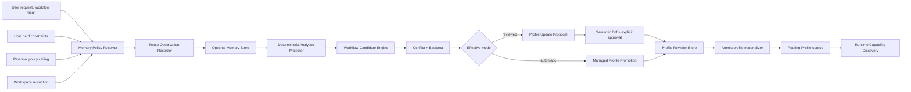

# Adaptive Workflow Memory：產品與技術設計規格

- **Status:** Proposed
- **Date:** 2026-09-03
- **Review branch:** `codex/adaptive-workflow-memory-spec`
- **Change type:** Documentation and architecture proposal only
- **Primary scope:** Plugin + MCP runtime
- **Compatibility target:** Preserve V2 Explicit Skill Lock, deterministic routing, fail-closed behavior, and authority separation

Related documents:

- [Workflow Memory Policy Configuration Contract](../../architecture/workflow-memory-configuration.md)
- [ADR 0005: Opt-in adaptive workflow memory](../../adr/0005-opt-in-adaptive-workflow-memory.md)
- [Disabled YAML example](../../architecture/examples/workflow-memory.disabled.yaml)
- [Reviewed YAML example](../../architecture/examples/workflow-memory.reviewed.yaml)
- [Automatic JSON example](../../architecture/examples/workflow-memory.automatic.json)

## 1. 摘要

本規格定義 Workflow Skill Router 的下一階段能力：**Adaptive Workflow Memory**。

目標不是讓模型在背景偷偷學習，也不是讓 Router 自動取得更多權限，而是把實際成功的路由流程轉換成可控、可解釋、可版本化的記憶：

```text
執行 Workflow
  -> 記錄最小化 Route Observation
  -> 分析重複且成功的路由模式
  -> 產生 Workflow Candidate
  -> 依記憶模式進入人工審核或受控自動套用
  -> 建立 Profile Revision、Diff 與 Rollback Point
  -> 下一次命中時仍經 Runtime Capability Discovery 驗證
```

所有記憶功能預設關閉。未建立有效 Memory Policy 時，Router 的行為與現行 V2 相同：

- 不建立記憶資料庫；
- 不保存新的 Workflow History；
- 不產生 Workflow Candidate；
- 不修改 Personal 或 Workspace Routing Profile；
- 不因專案內的設定檔而自行開啟記憶；
- 不新增任何 Skill、Runtime 或 Side Effect 權限。

本規格定義四種使用模式：

| Mode | 中文定位 | 保存歷史 | 產生分析 | 產生候選 | Profile 回寫 |
| --- | --- | ---: | ---: | ---: | --- |
| `disabled` | 不記憶 | 否 | 否 | 否 | 永不 |
| `observe` | 只觀察、不回寫 | 最小化 | 是 | 否 | 永不 |
| `reviewed` | 半自動記憶 | 最小化 | 是 | 是 | 每次需核准 |
| `automatic` | 無互動自動記憶 | 最小化 | 是 | 是 | 僅限 Router-managed Profile 自動回寫 |

`automatic` 的「自動」代表不必逐次詢問，但**不代表取消安全門檻**。它仍須遵守資料最小化、成功條件、信心門檻、衝突檢查、Explicit Skill Lock、Profile 優先序及 Runtime Authority。

---

## 2. 問題陳述

現行 V2 已能：

- 保存 Personal／Workspace Routing Profile；
- 根據關鍵字、Domain、Tag 與 Work Mode 套用既有 Skill Tree；
- 自動判斷 `single`、`phased`、`managed-goal`；
- 在每個 Phase 重新路由；
- 使用嚴格 JSON Contract、Digest、Runtime Capability Discovery 與 Explicit Skill Lock。

但它不會：

- 根據多次成功執行辨識常見 Workflow；
- 記錄使用者接受、修正或拒絕 Router 路由的情形；
- 將成功流程整理成可審核的 Profile 更新；
- 版本化由 Router 產生的 Profile 變更；
- 對 Profile 變更提供語意 Diff、Compare-and-Swap 與 Rollback；
- 在不犧牲使用者控制權的前提下，提供可選的自動記憶。

若直接讓模型修改 `.codex/workflow-skill-router.json` 或 Personal Profile，會導致：

- 偶發流程被錯誤固化；
- Profile 規則逐漸膨脹；
- 使用者不清楚變更來源；
- 專案設定可以反向提高個人資料收集程度；
- 自動產生的規則覆蓋人工規則；
- 記憶、Skill Activation、Runtime 權限與 Production 權限被混為一談；
- 無法完整刪除可選記憶資料。

因此需要一個獨立、預設關閉、可審核、可回滾的記憶子系統。

---

## 3. 設計目標

### 3.1 必須達成

1. **Default-off**：沒有有效 Personal Memory Policy 時，不記憶。
2. **Local-first**：記憶預設只保存在 Router 外部資料目錄，不啟用遙測。
3. **Data minimization**：預設不保存 Raw Prompt、完整 Objective、絕對路徑、檔案內容、Tool Arguments、Secrets 或 Skill Instruction Body。
4. **Deterministic-first**：第一版使用規則式 Pattern Mining，不依賴 LLM 或 Embedding 自動改寫 Profile。
5. **User authority**：使用者的明確 Skill 選擇與 `no-memory` 指令優先。
6. **Reviewable change**：任何使用者擁有的 Profile 變更都必須先產生 Proposal 與 Diff。
7. **Safe automatic mode**：自動模式只能回寫 Router-managed Profile。
8. **Versioned writes**：所有 Router-mediated Profile Write 必須採用 Digest、CAS、Atomic Replace 與 Revision。
9. **Rollback**：回滾建立新的 forward revision，不直接抹除歷史。
10. **Workspace cannot elevate**：Repository 內的 Workspace Policy 只能降低個人允許的自動化程度，不能自行開啟記憶。
11. **Capability remains unverified**：被記住的 Skill Tree 仍是 `intended-unverified`。
12. **Purgeable**：可選記憶資料必須可依類型與範圍刪除。

### 3.2 非目標

第一個實作週期不包含：

- 自動安裝 Skill、Plugin 或 MCP；
- 自動授權檔案、網路、Subprocess、Secrets、部署或 Production Side Effects；
- 讓 Workspace 設定越過 Personal Policy；
- 將 Raw Prompt 作為長期記憶；
- 使用 LLM 直接產生並套用 Profile；
- 跨裝置雲端同步；
- 團隊共享的中央 Workflow Marketplace；
- 修改 Native Codex Goal；
- 將 Skill-only 模式宣稱為可持久化記憶模式。

---

## 4. 核心設計決策

### 4.1 Memory Policy 與 Routing Profile 分離

Memory Policy 決定：

- 是否記錄；
- 記錄多少；
- 何時產生候選；
- 是否需要人工核准；
- 可回寫到哪一種 Profile；
- 保存期限；
- 版本與回滾政策。

Routing Profile 只描述：

- Matcher；
- Work Mode；
- Phase；
- Primary Skill；
- Supporting Skills；
- Exit Gate。

不得把 `usage_count`、`confidence`、`history`、`retention` 或記憶開關加入既有 `workflow-skill-router/routing-profile@1.0.0`。這可保留 Routing Profile 的 strict、non-executable 與穩定契約。

### 4.2 Canonical JSON，支援 JSON／YAML Policy

Memory Policy 內部一律正規化成 Canonical JSON，再計算 Policy Digest。

Plugin + MCP 可以接受：

- `workflow-memory.json`
- `workflow-memory.yaml`
- `workflow-memory.yml`

同一個 Scope 只能存在一種格式；同時存在時視為 `ambiguous-memory-policy`，該 Scope 記憶功能 fail closed。

YAML 僅接受安全子集合：

- 單一文件；
- 禁止 Anchor、Alias、Merge Key 與自訂 Tag；
- 禁止重複 Key；
- 禁止可執行型別；
- 最終資料模型只能是 JSON-compatible scalar、array 與 object。

Skill-only 不提供 durable memory。即使讀到 Policy，也只能標示為 advisory，不能宣稱已保存歷史或回寫 Profile。

### 4.3 獨立 Memory Store

Optional Memory History 不寫入既有 append-only `workflow_events` 作為唯一儲存來源。

原因：

- 記憶預設可關閉；
- 使用者需要 Retention 與 Purge；
- Operational Audit 與 Optional Learning History 的生命週期不同；
- Append-only Event Store 不適合承擔完整刪除語意。

建議新增獨立的本機資料庫：

```text
<router-data-dir>/memory/workflow-memory.sqlite3
```

只有在有效模式為 `observe`、`reviewed` 或 `automatic` 時才建立。`disabled` 模式不得因查詢狀態而建立此檔案。

### 4.4 Manual Profile 永遠優先於 Managed Profile

新增 Profile Layer 後，固定優先序為：

```text
Host / system / developer / safety constraints
  -> User explicit Skill Lock
  -> User-owned Workspace Profile
  -> Router-managed Workspace-local Profile
  -> User-owned Personal Profile
  -> Router-managed Personal Profile
  -> Built-in routing
```

Router-managed Profile 不得用 Priority 技巧覆蓋同 Scope 的 User-owned Profile。

### 4.5 Workspace Policy 只能收斂，不得擴權

Personal Policy 是記憶能力上限。Workspace Policy 是目前專案的限制條件。

有效模式採 Autonomy Intersection：

```text
disabled < observe < reviewed < automatic
effective_mode = min(personal_mode, workspace_requested_mode)
```

若沒有 Personal Policy，Personal Mode 視為 `disabled`。因此 Repository 內即使放入 `mode: automatic`，也不能自行開啟記憶。

---

## 5. 使用模式

### 5.1 `disabled`：不記憶

這是內建預設。

行為：

- 不新增 Route Observation；
- 不建立 Memory Store；
- 不提示「記住這次 Workflow」；
- 不記錄 Route Feedback；
- 不執行 History Analytics；
- 不建立 Candidate；
- 不回寫任何 Profile；
- `memory status` 仍可顯示有效模式與停用原因。

停用不代表自動刪除既有資料。刪除需使用明確的 Purge 操作，避免停用設定被誤解成刪除授權。

### 5.2 `observe`：只觀察、不回寫

用途是先量測是否真的存在可重複流程。

行為：

- 保存最小化 Route Observation；
- 記錄 Deterministic Feedback Signals；
- 提供本機 Summary Analytics；
- 不產生可套用 Candidate；
- 不提示核准；
- 不修改 Profile。

適合先進行 Pilot，確認重複率、成功率與修正率。

### 5.3 `reviewed`：半自動記憶

行為：

- 保存最小化歷史；
- 自動分析重複路由；
- 在符合門檻後建立 Candidate；
- 可以在成功完成時顯示 Remember This Workflow；
- 產生 Profile Update Proposal；
- 顯示 Semantic Diff、Backtest 與 Conflict；
- 只有明確核准後才寫入；
- 所有寫入建立 Profile Revision。

### 5.4 `automatic`：受控自動記憶

行為：

- 每個符合 Eligibility 的完成流程都可自動形成 Observation；
- 符合自動門檻時，自動建立與套用 Candidate；
- 不逐次詢問；
- 只能寫入 Router-managed Personal 或 Workspace-local Profile；
- 不直接修改 User-owned Personal Profile；
- 不直接修改 `.codex/workflow-skill-router.json`；
- 每次自動變更仍建立 Diff、Revision 與 Audit Summary；
- 自動規則若與人工規則衝突，必須 Suppress 或 Block，不能覆蓋。

「無條件自動記憶」在本規格中的精確定義是：

> 對所有符合 Eligibility 與 Privacy Policy 的成功 Workflow，不要求互動式核准即可記錄；對所有通過 Automatic Promotion Gate 的 Candidate，不要求互動式核准即可寫入 Router-managed Profile。

它不是「不檢查就記住任何內容」。

---

## 6. Policy Resolution 與 Override

### 6.1 固定位置

Personal Policy：

```text
<router-data-dir>/config/workflow-memory.json
<router-data-dir>/config/workflow-memory.yaml
<router-data-dir>/config/workflow-memory.yml
```

Workspace Policy：

```text
<workspace-root>/.codex/workflow-memory.json
<workspace-root>/.codex/workflow-memory.yaml
<workspace-root>/.codex/workflow-memory.yml
```

Workspace Root 必須由 Client 公告，或位於 `WORKFLOW_SKILL_ROUTER_WORKSPACE_ROOTS` 允許範圍。模型提供的任意路徑不得成為 Policy Source。

### 6.2 決策優先序

1. Host hard disable 或 privacy policy；
2. 使用者本次明確 `no-memory`；
3. Personal Policy autonomy ceiling；
4. Workspace Policy restriction；
5. Typed one-shot request，例如 `remember-once`；
6. Mode defaults 與 feature overrides。

`no-memory` 永遠可以降低到 `disabled`。

`remember-once` 不能高於 Effective Mode 的能力上限。例如 Effective Mode 為 `observe` 時，只能保留 Observation，不能回寫 Profile。

### 6.3 Invalid Policy

Policy 無效時：

- Router 主工作仍可繼續；
- 該 Scope 的 Memory Mode 降為 `disabled`；
- 不回退到較寬鬆 Policy；
- `get_memory_status` 回傳安全的 Reason Code；
- 不在錯誤訊息輸出完整檔案內容或本機敏感路徑。

---

## 7. 功能規格

## 7.1 Remember This Workflow

### 7.1.1 觸發方式

支援三種觸發：

1. **Explicit action**：使用者要求「記住這次 Workflow」；
2. **Reviewed prompt**：`reviewed` 模式在符合條件的 Workflow 完成後提出建議；
3. **Automatic capture**：`automatic` 模式對所有 Eligible Completion 自動記錄。

### 7.1.2 Eligibility Gate

預設必須同時滿足：

- Workflow 進入成功 Terminal State；
- 必要 Exit Gate 已通過；
- 不存在未知 Side Effect Outcome；
- 沒有 Explicit `no-memory`；
- Route 有可正規化的 Primary Skill／Phase／Exit Gate；
- Planned 與 Actual Route 差異已有明確結果；
- 同一次 Resume 不重複計數；
- 沒有 Hard Contract Violation；
- 設定允許該 Risk Class；
- Sensitive Input 未被要求保存。

預設排除：

- 未完成或取消的流程；
- 仍在等待 Consent 的流程；
- Corrupt Work Graph；
- 含未解析 Skill Identity 的路由；
- R3 Production Workflow；
- 使用者拒絕記憶的流程。

### 7.1.3 Route Signature

Observation 不保存完整 Objective。建議 Signature 包含：

```text
envelope
phase order
primary skill IDs
support skill IDs
exit gate IDs
domain IDs
tag IDs
profile source class
planned-vs-actual delta class
capability requirement classes
```

每個 Signature 使用 Canonical JSON 後計算 Digest。

### 7.1.4 狀態機

```text
observed
  -> ineligible
  -> eligible
       -> candidate
            -> proposed
                 -> approved
                 -> rejected
                 -> expired
            -> auto-promoted
            -> suppressed
            -> superseded
```

`rejected` Candidate 在沒有 Materially New Evidence 前不得重複提示。

### 7.1.5 輸出

Remember 結果至少回傳：

- `observation_id`
- `route_signature_digest`
- `eligibility_status`
- `eligibility_reason_codes`
- `candidate_id`，若有
- `target_profile_class`
- `approval_required`
- `profile_write_status`
- `memory_policy_digest`
- `authority_mode`

---

## 7.2 Profile Versioning、Diff 與 Rollback

### 7.2.1 Profile Target Class

| Target | 用途 | `reviewed` | `automatic` |
| --- | --- | ---: | ---: |
| `managed-personal` | Router 管理、跨專案使用 | 允許 | 允許 |
| `managed-workspace-local` | Router 管理、只對 Workspace Digest 生效 | 允許 | 允許 |
| `user-personal` | 現有 Personal Profile | 核准後允許 | 禁止 |
| `workspace-file` | `.codex/workflow-skill-router.json` | 核准且 Host Write 允許後 | 禁止 |

### 7.2.2 Revision Contract

每次 Router-mediated Write 必須建立：

- `revision_id`
- `profile_target`
- `profile_id`
- `previous_profile_digest`
- `new_profile_digest`
- `proposal_id` 或 `candidate_id`
- `memory_policy_digest`
- `actor`
- `created_at`
- `write_authority`
- `semantic_diff_digest`
- `backtest_summary_digest`
- `status`

Profile Snapshot 使用 Canonical JSON 保存。Revision Metadata 不得包含 Raw Prompt。

### 7.2.3 Semantic Diff

Diff 以 Routing Contract 結構呈現，不只顯示文字行差異：

```text
Rule added / removed / changed
Matcher added / removed
Priority changed
Work mode changed
Phase added / removed / reordered
Primary Skill changed
Support Skill added / removed
Exit Gate changed
```

Review 畫面必須同時顯示：

- Human-readable Semantic Diff；
- Canonical JSON Diff；
- 受影響的歷史 Observation 數量；
- 新增命中、失去命中與衝突數量；
- Capability Gap；
- Profile Lint 結果。

### 7.2.4 Compare-and-Swap

Apply Proposal 時必須攜帶 `expected_profile_digest`。

若目前檔案 Digest 已改變：

- 回傳 `profile-drift`;
- 不覆寫；
- Proposal 狀態改為 `stale`;
- 重新產生 Diff 與 Backtest 後才能再次核准。

### 7.2.5 Atomic Write

沿用現有安全寫入原則：

- 目標必須是固定位置的 Regular Non-link File；
- 在相同目錄建立 Temporary File；
- Flush 與 fsync；
- 使用 Atomic Replace；
- 寫入後重新讀取、驗證 Schema 與 Digest；
- 驗證失敗時保持前一版本。

### 7.2.6 Rollback

Rollback 不直接移動歷史指標，而是：

1. 選擇既有 Revision Snapshot；
2. 對目前 Profile 建立新的 Proposal；
3. 顯示從 Current 到 Selected Snapshot 的 Diff；
4. 通過 CAS；
5. 寫入一個新的 `rollback` Revision。

因此 Audit History 保持單調前進。

---

## 7.3 Route Feedback

### 7.3.1 Feedback 類型

- `accepted`：使用者接受 Router 路由；
- `corrected`：使用者修改 Envelope、Phase 或 Skill；
- `rejected`：使用者拒絕 Candidate 或 Route；
- `support-rejected`：Explicit Skill Lock 外的 Support 被拒絕；
- `capability-unavailable`：預計 Skill 無法啟用；
- `gate-failed`：Exit Gate 失敗；
- `completed`：成功完成；
- `abandoned`：流程中止；
- `no-memory`：使用者禁止本次保存。

### 7.3.2 自動與人工 Feedback

Automatic Signals 可由既有狀態轉換確定性產生，不需模型猜測。

人工 Feedback 可以包含標準 Reason Code。自由文字預設不保存；只有 Policy 明確允許時才可保留，且不得進入自動 Profile Matcher。

### 7.3.3 修正資料

`corrected` 必須保存：

- 原本 Route Signature Digest；
- 修正後 Route Signature Digest；
- 修正 Dimension；
- Reason Code；
- 是否由使用者明確指定；
- 是否影響 Profile Candidate。

不保存完整對話。

---

## 7.4 History Analytics

Analytics 必須以 distinct `workflow_run_id` 或等價的去重執行單位計算，Resume 不得膨脹樣本數。

至少提供：

- Eligible Workflow Count；
- Route Signature Frequency；
- Completion Rate；
- Required Gate Pass Rate；
- Manual Correction Rate；
- Consent Rejection Rate；
- Capability Unavailable Rate；
- Planned/Actual Consistency；
- Distinct Active Days；
- Workspace Distribution；
- Profile Source Distribution；
- Candidate Approval／Rejection Rate。

Confidence 使用 Category，不顯示虛假的高精度機率：

- `insufficient-evidence`
- `low`
- `medium`
- `high`

---

## 7.5 Workflow Candidate Engine

第一版使用 Deterministic Pattern Mining。

### 7.5.1 分群維度

- Scope；
- Domain／Tag；
- Envelope；
- Phase Sequence；
- Primary／Support Skill Sequence；
- Exit Gate Sequence；
- Workspace Digest，若為 Workspace-local；
- Profile Source Class。

### 7.5.2 預設 Reviewed Gate

- 至少 3 個 distinct Eligible Runs；
- 至少 2 個不同日期；
- Completion Rate `>= 0.80`；
- Required Gate Pass Rate `>= 0.80`；
- Manual Correction Rate `<= 0.20`；
- Route Consistency `>= 0.75`；
- 0 Hard Contract Violations。

### 7.5.3 預設 Automatic Promotion Gate

- 至少 5 個 distinct Eligible Runs；
- 至少 3 個不同日期；
- Completion Rate `>= 0.90`；
- Required Gate Pass Rate `>= 0.90`；
- Manual Correction Rate `<= 0.10`；
- Route Consistency `>= 0.85`；
- Candidate Backtest 無新增 Equal-rank Conflict；
- 0 Hard Contract Violations；
- 所有 Skill Identity 均為 Canonical ID；
- Target 必須是 Router-managed Profile。

門檻可以變得更嚴格，但不能越過 Hard Safety Invariant。

### 7.5.4 Backtest

Candidate 必須對保留的最小化歷史執行：

- Positive Match Coverage；
- Unexpected Match Estimate；
- Shadowed Rule Detection；
- Equal-rank Conflict Detection；
- Manual Profile Precedence Check；
- Capability Gap Summary；
- Planned-vs-Actual Regression；
- Workspace Isolation Check。

Backtest 是本機決策證據，不代表真實模型 Outcome Evidence。

---

## 8. 架構



### 8.1 元件

#### Memory Policy Resolver

負責：

- 固定位置讀取；
- JSON／YAML Safe Parsing；
- Canonicalization；
- Personal Ceiling 與 Workspace Restriction；
- Feature Override 驗證；
- 產生 Effective Policy Snapshot 與 Digest。

#### Route Observation Recorder

負責：

- Eligibility；
- Redaction；
- Signature Normalization；
- Resume 去重；
- Idempotency；
- 寫入 Optional Memory Store。

#### Analytics Projector

負責從 Observation 與 Feedback 建立可重建的 Pattern Summary。

#### Workflow Candidate Engine

負責把穩定 Pattern 轉換成 Candidate，不直接修改 Profile。

#### Profile Promotion Service

負責：

- Target Policy；
- Managed/User-owned Boundary；
- Lint；
- Conflict；
- Backtest；
- Proposal；
- Approval State Machine；
- CAS；
- Materialization。

#### Profile Revision Store

負責 Snapshot、Metadata、Diff、Retention 與 Rollback。

#### Memory Control Plane

提供 CLI 與 MCP Typed Operation，不依賴模型自由格式內容完成 State Transition。

---

## 9. 資料模型

建議新增獨立 Artifact Contract：

| Schema ID | Artifact Kind | 用途 |
| --- | --- | --- |
| `workflow-skill-router/memory-policy@1.0.0` | `memory-policy` | 記憶開關與限制 |
| `workflow-skill-router/memory-policy-snapshot@1.0.0` | `memory-policy-snapshot` | Effective Policy 與來源證據 |
| `workflow-skill-router/route-observation@1.0.0` | `route-observation` | 最小化執行紀錄 |
| `workflow-skill-router/route-feedback@1.0.0` | `route-feedback` | 接受、修正、拒絕與結果 |
| `workflow-skill-router/workflow-pattern@1.0.0` | `workflow-pattern` | 可重建分析 Projection |
| `workflow-skill-router/workflow-candidate@1.0.0` | `workflow-candidate` | 尚未套用的 Workflow 建議 |
| `workflow-skill-router/profile-update-proposal@1.0.0` | `profile-update-proposal` | Profile 變更提案 |
| `workflow-skill-router/profile-revision@1.0.0` | `profile-revision` | 版本、Diff 與 Rollback |

Routing Profile Contract 維持原版本，Candidate 核准後才 Materialize 成合法的 Routing Profile JSON。

---

## 10. 儲存與目錄

建議目錄：

```text
<router-data-dir>/
  config/
    workflow-memory.json | workflow-memory.yaml
  memory/
    workflow-memory.sqlite3
    exports/
  profiles/
    personal/
      <user-owned>.json
    managed/
      personal/
        adaptive-memory.json
      workspace/
        <workspace-digest>/
          adaptive-memory.json
    revisions/
      personal/
      workspace/
      managed/
```

Workspace User-owned Profile 仍位於：

```text
<workspace-root>/.codex/workflow-skill-router.json
```

### 10.1 Memory Store Table

建議最小表面：

- `memory_policy_snapshots`
- `route_observations`
- `route_feedback`
- `workflow_patterns`
- `workflow_candidates`
- `candidate_suppressions`
- `profile_update_proposals`
- `profile_revision_index`
- `memory_command_receipts`

所有 Migration 必須新增版本，不修改已套用 Migration。

### 10.2 Retention

預設：

- Observation：90 天；
- 最大 Observation：1,000；
- Candidate：最後 Material Evidence 後 30 天；
- Rejected Candidate Suppression：180 天或直到 Material Evidence 改變；
- Profile Revisions：每個 Target 最多 20 個；
- Current Profile Snapshot 不因 Retention 被刪除。

### 10.3 Purge

支援：

```text
history-only
candidates-only
analytics-only
revisions-only
managed-profiles-only
all-memory-data
```

`all-memory-data` 預設不刪 User-owned Profile。刪除 Managed Profile 或 Revision Snapshot 必須額外指定。

---

## 11. 安全與權限邊界

### 11.1 記憶不等於授權

即使 Candidate 已被核准或自動回寫：

- 不代表 Skill 已安裝；
- 不代表 Skill 已啟用；
- 不代表 MCP Tool 可用；
- 不代表允許檔案、網路或 Subprocess；
- 不代表允許部署、Publication 或 Production；
- 不代表可以修改 Native Goal。

下一次命中仍為 `intended-unverified`，並經 Runtime Capability Discovery。

### 11.2 Automatic Mode Hard Invariants

Automatic Mode 不得：

- 寫入 User-owned Personal Profile；
- 寫入 `.codex/workflow-skill-router.json`；
- 提升 Personal Policy Ceiling；
- 覆蓋 Explicit Skill Lock；
- 把 rejected support Skill 加回；
- 保存 Raw Prompt；
- 保存 Secrets；
- 啟用 Telemetry；
- 自動安裝或授權 Skill；
- 使用 Model Output 直接 Materialize Profile；
- 把 Low／Insufficient Evidence Candidate 升級。

### 11.3 Workspace Trust

Workspace Policy 來自 Repository，因此只被視為 restriction，不被視為使用者同意。

任何 User-owned Workspace Profile Write 仍需要：

- 明確 Proposal Approval；
- Current Workspace Root Verification；
- Host File Write Authority；
- Expected Profile Digest；
- Atomic Write；
- Post-write Validation。

---

## 12. 錯誤與 Fail-closed

建議 Reason Code：

- `memory-disabled`
- `personal-policy-missing`
- `invalid-memory-policy`
- `ambiguous-memory-policy`
- `workspace-policy-exceeds-ceiling`
- `workspace-root-unverified`
- `explicit-no-memory`
- `workflow-not-terminal`
- `required-gate-not-passed`
- `unknown-side-effect-outcome`
- `sensitive-route-excluded`
- `insufficient-evidence`
- `candidate-conflict`
- `candidate-suppressed`
- `profile-drift`
- `profile-target-not-allowed`
- `automatic-user-profile-write-forbidden`
- `revision-store-unavailable`
- `memory-store-corrupt`
- `purge-requires-explicit-scope`

Memory Failure 不應中止一般 Routing，除非使用者當次主要目的就是 Memory Operation。一般工作改以記憶停用繼續，並誠實回報狀態。

---

## 13. 建議 CLI

```text
workflow-skill-router memory status
workflow-skill-router memory policy validate <file>
workflow-skill-router memory policy explain --workspace <root>
workflow-skill-router memory remember --workflow-run <id> --target managed-personal
workflow-skill-router memory history summary
workflow-skill-router memory history export
workflow-skill-router memory history purge --scope history-only
workflow-skill-router memory candidates list
workflow-skill-router memory candidates show <candidate-id>
workflow-skill-router memory candidates approve <candidate-id>
workflow-skill-router memory candidates reject <candidate-id> --reason <code>
workflow-skill-router profile revisions list <profile-id>
workflow-skill-router profile revisions diff <from> <to>
workflow-skill-router profile rollback <profile-id> --to <revision-id>
```

CLI 不接受模型提供的任意 Executable 或任意 Profile Target Path。

---

## 14. 建議 MCP Tool Surface

| Tool | 目的 | 最低權限邊界 |
| --- | --- | --- |
| `get_memory_status` | 讀取 Effective Policy 與狀態 | Router-local read |
| `remember_workflow` | 對已知 Workflow Run 建立 Observation／Candidate | Router-local，受 Policy 限制 |
| `record_route_feedback` | Typed Feedback Transition | Router-local |
| `list_workflow_candidates` | 列出 Sanitized Candidate | Router-local read |
| `preview_profile_update` | Diff、Lint、Backtest | Router-local read |
| `transition_profile_update` | Approve／Reject Proposal | Router-local managed target；User-owned target 另需 Host Authority |
| `rollback_profile_revision` | 建立 Rollback Proposal／Revision | 依 Target Authority |
| `purge_workflow_memory` | 明確範圍刪除 | Router-local destructive confirmation |

MCP Schema 必須限制列舉值、ID 格式、Scope、Expected Digest 與 Idempotency Key。模型不得在 Transition 時替換 Bound Candidate、Target、Diff 或 Profile Content。

---

## 15. Flight Recorder 與可解釋性

Flight Recorder 建議新增：

- Effective Memory Mode；
- Personal Ceiling；
- Workspace Restriction；
- Policy Digest；
- Capture Decision；
- Eligibility Reason Codes；
- Candidate Evidence Summary；
- Profile Target Class；
- Approval State；
- Diff Summary；
- Revision ID；
- Automatic Promotion Gate；
- Purge／Retention 狀態。

公開 Demo 只能使用 Fixture 或 Sanitized Runtime Trace，不能展示真實個人記憶資料。

---

## 16. 驗收標準

### 16.1 Default-off

- 無 Policy 時 Effective Mode 必為 `disabled`；
- 不建立 Memory DB；
- 不建立 Managed Profile；
- 不出現 Remember Prompt；
- Router 現有功能不受影響。

### 16.2 Policy

- JSON 與等價 YAML 產生相同 Canonical Digest；
- Duplicate Key、Alias、Tag、多文件 YAML 被拒絕；
- 同 Scope 多種 Policy File 被拒絕；
- Workspace 不可提升 Personal Ceiling；
- Invalid Workspace Policy 不回退到更寬鬆 Personal 行為。

### 16.3 Privacy

- 預設 Observation 不含 Raw Prompt、Objective、Path、File Content、Tool Argument、Secret；
- Export 套用相同 Redaction；
- `no-memory` 不產生 Observation；
- Purge 可實際移除指定 Optional Memory Data。

### 16.4 Remember This Workflow

- Resume 不重複計數；
- 未完成／Gate 未通過不成為 Eligible；
- Reviewed Mode 不經核准不得 Apply；
- Automatic Mode 只寫 Managed Profile；
- Rejected Candidate 不會無新證據重複提示。

### 16.5 Versioning

- 每次寫入都有 Previous／New Digest；
- Drift 時 CAS 失敗；
- Atomic Write 後重新驗證；
- Rollback 建立新 Revision；
- User-owned Profile 優先於 Managed Profile。

### 16.6 Analytics

- Pattern Mining 完全 Deterministic；
- 同一 Fixture 重播產生相同 Candidate Digest；
- Insufficient Evidence 不被升級；
- Automatic Gate 比 Reviewed Gate 更嚴格；
- Hard Contract Violation 永遠阻止 Promotion。

### 16.7 Authority

- 記憶不產生 Skill Activation Receipt；
- 記憶不授權 Runtime／Side Effect；
- Explicit Skill Lock 仍是當次最高使用者選擇；
- User-owned Workspace Write 仍需要 Host File Authority。

---

## 17. 建議分階段交付

### M0：Contract 與 Default-off Foundation

- Memory Policy Schema；
- Policy Loader；
- Safe JSON／YAML Canonicalization；
- Effective Policy Resolver；
- `memory status`；
- Default-off Contract Tests。

### M1：Observe-only History

- Optional Memory Store；
- Route Observation；
- Route Feedback；
- Retention／Purge；
- History Summary；
- 無 Candidate、無 Profile Write。

### M2：Reviewed Memory

- Remember This Workflow；
- Candidate Engine；
- Semantic Diff；
- Profile Update Proposal；
- CAS、Atomic Write；
- Versioning 與 Rollback；
- User Review Flow。

### M3：Automatic Managed Memory

- Managed Personal／Workspace-local Profile；
- Automatic Promotion Gate；
- Manual-over-managed Precedence；
- Suppression、Conflict 與 Backtest；
- Promotion Notification。

### M4：Public Documentation 與 Flight Recorder

- 中英文文件；
- Configuration Guide；
- Privacy／Security Update；
- Fixture Scenario；
- Migration Guide；
- Pilot Evidence。

### M5：Semantic Recommendation Decision Gate

只有真實 Pilot 證明 Lexical／Structural Pattern 無法涵蓋重要案例時，才評估 Advisory-only Semantic Recommender。它仍不得直接 Persist、Activate 或 Authorize。

---

## 18. 預期程式影響範圍

本規格核准後，實作計畫預計涉及：

```text
packages/router-core/src/workflow_skill_router/memory/
packages/router-core/src/workflow_skill_router/profiles/
packages/router-core/src/workflow_skill_router/persistence/
packages/router-core/src/workflow_skill_router/schemas/json/v2/
plugins/workflow-skill-router/mcp/src/
plugins/workflow-skill-router/mcp/test/
starter/v2/workflow-skill-router/references/
site/src/content/docs/
site/src/content/docs/zh-tw/
tests/
scripts/
```

不應直接修改已發布的 Migration、Release Asset 或 Generated Archive。

---

## 19. Reviewer 決策摘要

本提案要求審查者確認以下產品立場：

1. 記憶預設為 `disabled`；
2. 提供 `observe`、`reviewed`、`automatic` 三種 Opt-in 等級；
3. Workspace 設定不能自行提高記憶權限；
4. Automatic Mode 只能寫 Router-managed Profile；
5. User-owned Profile Write 永遠需要 Proposal、Diff、CAS 與明確核准；
6. 記憶資料使用獨立可清除 Store；
7. 第一版只做 Deterministic Pattern Mining；
8. Routing Profile Contract 不混入歷史與統計欄位；
9. Skill Activation、Runtime Authority 與 Side Effect Authority 維持分離；
10. Profile Revision 與 Rollback 是任何 Router-mediated Write 的必要條件。

核准本規格不等於核准完整實作；後續應再建立逐任務 Implementation Plan 與對應驗證門檻。
